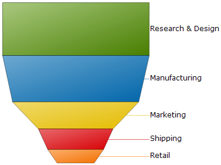

////

|metadata|
{
    "name": "chart-about-2d-funnel-charts",
    "controlName": ["{WawChartName}"],
    "tags": [],
    "guid": "{F4980785-52EB-4DFE-861B-A577B81E1C50}",  
    "buildFlags": [],
    "createdOn": "0001-01-01T00:00:00Z"
}
|metadata|
////

= About 2D Funnel Charts

image::Images/Chart_About_2D_Funnel_Charts_02.png[The icon used to represent this chart type in the ChartType drop-down in Visual Studio's properties window.]

A  pick:[win-forms=" link:{ApiPlatform}win.ultrawinchart{ApiVersion}~infragistics.ultrachart.shared.styles.charttype.html[2D funnel chart]"]  pick:[asp-net=" link:{ApiPlatform}webui.ultrawebchart{ApiVersion}~infragistics.ultrachart.shared.styles.charttype.html[2D funnel chart]"]  pick:[aspnet-old=" link:{ApiPlatform}webui.ultrawebchart{ApiVersion}~infragistics.ultrachart.shared.styles.charttype.html[2D funnel chart]"]  is a type of chart that displays quantities as percentages of a whole, much like a link:chart-pie-chart-2d.html[pie chart]. Funnel charts are commonly used to display quantitative data in relation to stages of a process. For example, a funnel chart might display expenses of a product from the manufacturing stage to the actual sale of that product.

