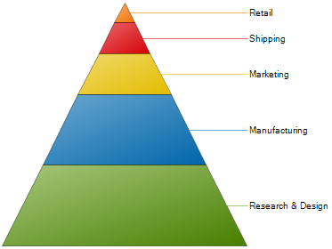

////

|metadata|
{
    "name": "chart-about-2d-pyramid-charts",
    "controlName": ["{WawChartName}"],
    "tags": [],
    "guid": "{A9B9D7C6-1E91-46A2-A950-4C186181F6EF}",  
    "buildFlags": [],
    "createdOn": "0001-01-01T00:00:00Z"
}
|metadata|
////

= About 2D Pyramid Charts

image::Images/Chart_About_2D_Pyramid_Charts_02.png[The icon used to represent this chart type in the ChartType drop-down in Visual Studio's properties window.]

A  pick:[win-forms=" link:infragistics4.win.ultrawinchart.v{ProductVersion}~infragistics.ultrachart.shared.styles.charttype.html[pyramid chart]"]  pick:[asp-net=" link:infragistics4.webui.ultrawebchart.v{ProductVersion}~infragistics.ultrachart.shared.styles.charttype.html[pyramid chart]"]  pick:[aspnet-old=" link:infragistics4.webui.ultrawebchart.v{ProductVersion}~infragistics.ultrachart.shared.styles.charttype.html[pyramid chart]"]  is a type of chart that displays quantities as percentages of a whole, much like a link:chart-pie-chart-2d.html[pie chart]. Pyramid charts are commonly used to display quantitative data in relation to stages of a process. For example a pyramid chart might display expenses of a product from the manufacturing stage to the actual sale of that product.

