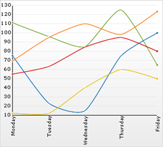

////

|metadata|
{
    "name": "chart-about-2d-spline-charts",
    "controlName": ["{WawChartName}"],
    "tags": [],
    "guid": "{335DB166-90D0-4278-B9C0-95A0546810DC}",  
    "buildFlags": [],
    "createdOn": "2006-02-03T00:00:00Z"
}
|metadata|
////

= About 2D Spline Charts

image::Images/Chart_About_2D_Spline_Charts_01.png[The icon used to represent this chart type in the ChartType drop-down in Visual Studio's properties window.]

A  pick:[win-forms=" link:infragistics4.win.ultrawinchart.v{ProductVersion}~infragistics.ultrachart.shared.styles.charttype.html[spline chart]"]  pick:[asp-net=" link:infragistics4.webui.ultrawebchart.v{ProductVersion}~infragistics.ultrachart.shared.styles.charttype.html[spline chart]"]  pick:[aspnet-old=" link:infragistics4.webui.ultrawebchart.v{ProductVersion}~infragistics.ultrachart.shared.styles.charttype.html[spline chart]"]  is a form of a link:chart-line-chart-2d.html[line chart]. It has all the features and characteristics of a link:chart-line-chart-2d.html[line chart], with the added feature of spline interpolation and smoothing for improved presentation of data.

