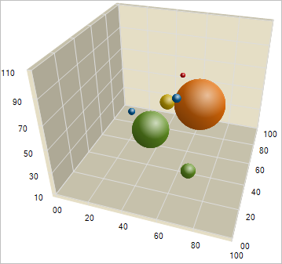

////

|metadata|
{
    "name": "chart-about-3d-bubble-charts",
    "controlName": ["{WawChartName}"],
    "tags": [],
    "guid": "{51FEAD11-673A-4C80-BE81-5606235593D2}",  
    "buildFlags": [],
    "createdOn": "0001-01-01T00:00:00Z"
}
|metadata|
////

= About 3D Bubble Charts

image::Images/Chart_About_3D_Bubble_Charts_02.png[The icon used to represent this chart type in the ChartType drop-down in Visual Studio's properties window.]

A  pick:[win-forms=" link:{ApiPlatform}win.ultrawinchart{ApiVersion}~infragistics.ultrachart.shared.styles.charttype.html[3D bubble chart]"]  pick:[asp-net=" link:{ApiPlatform}webui.ultrawebchart{ApiVersion}~infragistics.ultrachart.shared.styles.charttype.html[3D bubble chart]"]  pick:[aspnet-old=" link:{ApiPlatform}webui.ultrawebchart{ApiVersion}~infragistics.ultrachart.shared.styles.charttype.html[3D bubble chart]"]  is a type of link:chart-bubble-chart-2d.html[2D bubble chart] that adds another dimension by plotting values in 3D space using X/Y/Z coordinates, plus an extra coordinate for the bubble radius.

== Related Topics:

link:chart-working-with-3d-bubble-chart-data.html[Working with 3D Bubble Chart Data]

link:chart-modify-the-default-bubble-size.html[Modify the Default Bubble Size]