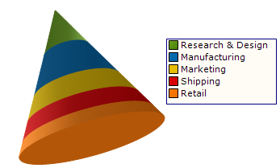

////

|metadata|
{
    "name": "chart-about-3d-cone-charts",
    "controlName": ["{WawChartName}"],
    "tags": [],
    "guid": "{C6D001A0-A7B8-437B-ABA1-37B8284C7F53}",  
    "buildFlags": [],
    "createdOn": "0001-01-01T00:00:00Z"
}
|metadata|
////

= About 3D Cone Charts

image::Images/Chart_About_3D_Cone_Chart_02.png[The icon used to represent this chart type in the ChartType drop-down in Visual Studio's properties window.]

A  pick:[win-forms=" link:infragistics4.win.ultrawinchart.v{ProductVersion}~infragistics.ultrachart.shared.styles.charttype.html[3D cone chart]"]  pick:[asp-net=" link:infragistics4.webui.ultrawebchart.v{ProductVersion}~infragistics.ultrachart.shared.styles.charttype.html[3D cone chart]"]  pick:[aspnet-old=" link:infragistics4.webui.ultrawebchart.v{ProductVersion}~infragistics.ultrachart.shared.styles.charttype.html[3D cone chart]"]  is a type of link:chart-pyramid-chart-2d.html[pyramid chart] with an enhanced 3D look.

