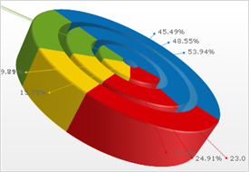

////

|metadata|
{
    "name": "chart-about-3d-doughnut-charts",
    "controlName": ["{WawChartName}"],
    "tags": [],
    "guid": "{6A312E2A-A612-4DED-836E-24A8618F0761}",  
    "buildFlags": [],
    "createdOn": "2006-02-03T00:00:00Z"
}
|metadata|
////

= About 3D Doughnut Charts

image::Images/Chart_About_3D_Doughnut_Charts_01.png[The icon used to represent this chart type in the ChartType drop-down in Visual Studio's properties window.]

A  pick:[win-forms=" link:{ApiPlatform}win.ultrawinchart{ApiVersion}~infragistics.ultrachart.shared.styles.charttype.html[3D doughnut chart]"]  pick:[asp-net=" link:{ApiPlatform}webui.ultrawebchart{ApiVersion}~infragistics.ultrachart.shared.styles.charttype.html[3D doughnut chart]"]  pick:[aspnet-old=" link:{ApiPlatform}webui.ultrawebchart{ApiVersion}~infragistics.ultrachart.shared.styles.charttype.html[3D doughnut chart]"]  is a form of link:chart-pie-chart-3d.html[pie chart]. Like a pie chart, a doughnut chart shows the size of items that make up a data series proportional to the total of the items in the series.

