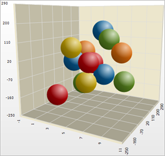

////

|metadata|
{
    "name": "chart-about-3d-point-charts",
    "controlName": ["{WawChartName}"],
    "tags": [],
    "guid": "{2A855C70-38D0-4BC1-A002-F8B895EF6805}",  
    "buildFlags": [],
    "createdOn": "0001-01-01T00:00:00Z"
}
|metadata|
////

= About 3D Point Charts

image::Images/Chart_About_3D_Point_Charts_02.png[The icon used to represent this chart type in the ChartType drop-down in Visual Studio's properties window.]

A  pick:[win-forms=" link:{ApiPlatform}win.ultrawinchart{ApiVersion}~infragistics.ultrachart.shared.styles.charttype.html[3D point chart]"]  pick:[asp-net=" link:{ApiPlatform}webui.ultrawebchart{ApiVersion}~infragistics.ultrachart.shared.styles.charttype.html[3D point chart]"]  pick:[aspnet-old=" link:{ApiPlatform}webui.ultrawebchart{ApiVersion}~infragistics.ultrachart.shared.styles.charttype.html[3D point chart]"]  is a type of link:chart-scatter-chart.html[scatter chart] that adds another dimension by plotting values in 3D space using X/Y/Z coordinates.

