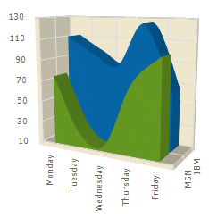

////

|metadata|
{
    "name": "chart-about-3d-spline-area-charts",
    "controlName": ["{WawChartName}"],
    "tags": [],
    "guid": "{1587C8A8-F451-45B6-AF85-8BDA3941DEDE}",  
    "buildFlags": [],
    "createdOn": "0001-01-01T00:00:00Z"
}
|metadata|
////

= About 3D Spline Area Charts

image::Images/Chart_About_3D_Spline_Area_Charts_02.png[The icon used to represent this chart type in the ChartType drop-down in Visual Studio's properties window.]

A  pick:[win-forms=" link:infragistics4.win.ultrawinchart.v{ProductVersion}~infragistics.ultrachart.shared.styles.charttype.html[3D spline area chart]"]  pick:[asp-net=" link:infragistics4.webui.ultrawebchart.v{ProductVersion}~infragistics.ultrachart.shared.styles.charttype.html[3D spline area chart]"]  pick:[aspnet-old=" link:infragistics4.webui.ultrawebchart.v{ProductVersion}~infragistics.ultrachart.shared.styles.charttype.html[3D spline area chart]"]  is a form of area chart. It has all the features and characteristics of a link:chart-area-chart-3d.html[3D area chart], with the added feature of spline interpolation and smoothing for improved representation of data.

