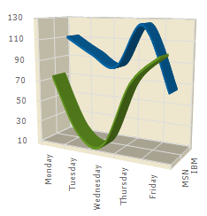

////

|metadata|
{
    "name": "chart-about-3d-spline-charts",
    "controlName": ["{WawChartName}"],
    "tags": [],
    "guid": "{82FE7A82-24E3-4233-91D4-9BCE457FE816}",  
    "buildFlags": [],
    "createdOn": "0001-01-01T00:00:00Z"
}
|metadata|
////

= About 3D Spline Charts

image::Images/Chart_About_3D_Spline_Charts_02.png[The icon used to represent this chart type in the ChartType drop-down in Visual Studio's properties window.]

A  pick:[win-forms=" link:infragistics4.win.ultrawinchart.v{ProductVersion}~infragistics.ultrachart.shared.styles.charttype.html[3D spline chart]"]  pick:[asp-net=" link:infragistics4.webui.ultrawebchart.v{ProductVersion}~infragistics.ultrachart.shared.styles.charttype.html[3D spline chart]"]  pick:[aspnet-old=" link:infragistics4.webui.ultrawebchart.v{ProductVersion}~infragistics.ultrachart.shared.styles.charttype.html[3D spline chart]"]  is a form of line chart. It has all the features and characteristics of a link:chart-line-chart-3d.html[3D line chart], with the added feature of spline interpolation and smoothing for improved representation of data.

