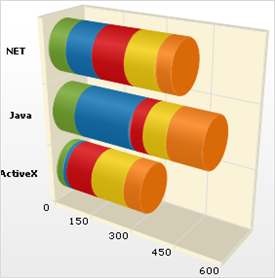

////

|metadata|
{
    "name": "chart-about-3d-stacked-bar-charts",
    "controlName": ["{WawChartName}"],
    "tags": [],
    "guid": "{3B6B0AE0-C690-43E4-99AB-8A7F0844046F}",  
    "buildFlags": [],
    "createdOn": "2006-02-03T00:00:00Z"
}
|metadata|
////

= About 3D Stacked Bar Charts

image::Images/Chart_About_3D_Stacked_Bar_Charts_01.png[The icon used to represent this chart type in the ChartType drop-down in Visual Studio's properties window.]

pick:[win-forms=" link:infragistics4.win.ultrawinchart.v{ProductVersion}~infragistics.ultrachart.shared.styles.charttype.html[3D stacked bar charts]"]  pick:[asp-net=" link:infragistics4.webui.ultrawebchart.v{ProductVersion}~infragistics.ultrachart.shared.styles.charttype.html[3D stacked bar charts]"]  pick:[aspnet-old=" link:infragistics4.webui.ultrawebchart.v{ProductVersion}~infragistics.ultrachart.shared.styles.charttype.html[3D stacked bar chart]"]  show the relationship of individual items in a series to the whole.

