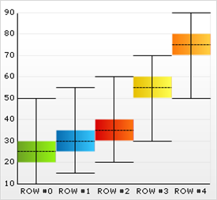

////

|metadata|
{
    "name": "chart-about-box-charts",
    "controlName": ["{WawChartName}"],
    "tags": [],
    "guid": "{2006BAD5-37F6-42C0-802F-38E522AA3AD5}",  
    "buildFlags": [],
    "createdOn": "0001-01-01T00:00:00Z"
}
|metadata|
////

= About Box Charts

image::Images/Chart_About_Box_Charts_01.png[The icon used to represent this chart type in the ChartType drop-down in Visual Studio's properties window.]

pick:[win-forms=" link:{ApiPlatform}win.ultrawinchart{ApiVersion}~infragistics.win.ultrawinchart.ultrachart~charttype.html[Box charts]"]  pick:[asp-net=" link:{ApiPlatform}webui.ultrawebchart{ApiVersion}~infragistics.webui.ultrawebchart.ultrachart~charttype.html[Box charts]"]  pick:[aspnet-old=" link:{ApiPlatform}webui.ultrawebchart{ApiVersion}~infragistics.ultrachart.shared.styles.charttype.html[Box charts]"] , also known as box and whisker charts, are used to illustrate distribution of numeric data points in groups. These charts illustrate the total range of distribution, along with the range within which most points fall, in each group. They are normally used to display stock data.

