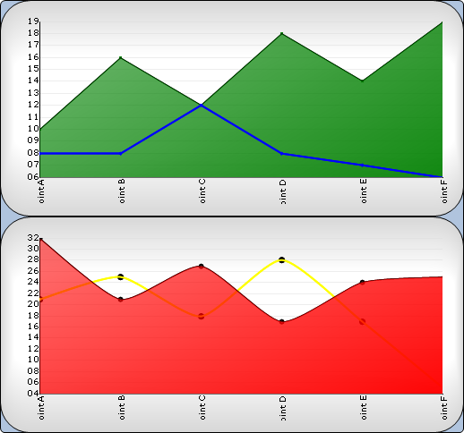

////

|metadata|
{
    "name": "chart-about-composite-charts",
    "controlName": ["{WawChartName}"],
    "tags": [],
    "guid": "{E7344A93-613B-4E88-B350-6C0AB235ECED}",  
    "buildFlags": [],
    "createdOn": "2006-02-03T00:00:00Z"
}
|metadata|
////

= About Composite Charts

image::Images/Chart_About_Composite_Charts_01.png[The icon used to represent this chart type in the ChartType drop-down in Visual Studio's properties window.]

The  pick:[win-forms=" link:infragistics4.win.ultrawinchart.v{ProductVersion}~infragistics.ultrachart.shared.styles.charttype.html[composite chart]"]  pick:[asp-net=" link:infragistics4.webui.ultrawebchart.v{ProductVersion}~infragistics.ultrachart.shared.styles.charttype.html[composite chart]"]  pick:[aspnet-old=" link:infragistics4.webui.ultrawebchart.v{ProductVersion}~infragistics.ultrachart.shared.styles.charttype.html[composite chart]"]  type can be used to combine an infinite number of chart types, axes, chart areas, and legends. It is very flexible and offers few limitations.

The composite chart is also more complex and more difficult to learn than any other type of chart. It is highly recommended that you plan the design of a composite chart before writing any code.

=== To create a simple composite chart:

[start=1]
. Add at least one  pick:[win-forms=" link:infragistics4.win.ultrawinchart.v{ProductVersion}~infragistics.ultrachart.resources.appearance.chartarea.html[ChartArea]"]  pick:[asp-net=" link:infragistics4.webui.ultrawebchart.v{ProductVersion}~infragistics.ultrachart.resources.appearance.chartarea.html[ChartArea]"]  pick:[aspnet-old=" link:infragistics4.webui.ultrawebchart.v{ProductVersion}~infragistics.ultrachart.resources.appearance.chartarea.html[ChartArea]"]  to the  pick:[win-forms=" link:infragistics4.win.ultrawinchart.v{ProductVersion}~infragistics.ultrachart.resources.appearance.chartareacollection.html[ChartAreas]"]  pick:[asp-net=" link:infragistics4.webui.ultrawebchart.v{ProductVersion}~infragistics.ultrachart.resources.appearance.chartareacollection.html[ChartAreas]"]  pick:[aspnet-old=" link:infragistics4.webui.ultrawebchart.v{ProductVersion}~infragistics.ultrachart.resources.appearance.chartareacollection.html[ChartAreas]"]  collection.
[start=2]
. Populate each ChartArea's  pick:[win-forms=" link:infragistics4.win.ultrawinchart.v{ProductVersion}~infragistics.ultrachart.resources.appearance.chartarea~axes.html[Axes]"]  pick:[asp-net=" link:infragistics4.webui.ultrawebchart.v{ProductVersion}~infragistics.ultrachart.resources.appearance.chartarea~axes.html[Axes]"]  pick:[aspnet-old=" link:infragistics4.webui.ultrawebchart.v{ProductVersion}~infragistics.ultrachart.resources.appearance.chartarea~axes.html[Axes]"]  collection with axes to plot data on.
[start=3]
. Populate the  pick:[win-forms=" link:infragistics4.win.ultrawinchart.v{ProductVersion}~infragistics.ultrachart.resources.appearance.compositechartappearance~series.html[Series]"]  pick:[asp-net=" link:infragistics4.webui.ultrawebchart.v{ProductVersion}~infragistics.ultrachart.resources.appearance.compositechartappearance~series.html[Series]"]  pick:[aspnet-old=" link:infragistics4.webui.ultrawebchart.v{ProductVersion}~infragistics.ultrachart.resources.appearance.compositechartappearance~series.html[Series]"]  collection with data.
[start=4]
. Add at least one  pick:[win-forms=" link:infragistics4.win.ultrawinchart.v{ProductVersion}~infragistics.ultrachart.resources.appearance.chartlayerappearance.html[ChartLayer]"]  pick:[asp-net=" link:infragistics4.webui.ultrawebchart.v{ProductVersion}~infragistics.ultrachart.resources.appearance.chartlayerappearance.html[ChartLayer]"]  pick:[aspnet-old=" link:infragistics4.webui.ultrawebchart.v{ProductVersion}~infragistics.ultrachart.resources.appearance.chartlayerappearance.html[ChartLayer]"]  to the  pick:[win-forms=" link:infragistics4.win.ultrawinchart.v{ProductVersion}~infragistics.ultrachart.resources.appearance.compositechartappearance~chartlayers.html[ChartLayers]"]  pick:[asp-net=" link:infragistics4.webui.ultrawebchart.v{ProductVersion}~infragistics.ultrachart.resources.appearance.compositechartappearance~chartlayers.html[ChartLayers]"]  pick:[aspnet-old=" link:infragistics4.webui.ultrawebchart.v{ProductVersion}~infragistics.ultrachart.resources.appearance.compositechartappearance~chartlayers.html[ChartLayers]"]  collection.
[start=5]
. Set the ChartLayer's ChartArea property to an existing ChartArea (from step 1) and set the ChartLayer's  pick:[win-forms=" link:infragistics4.win.ultrawinchart.v{ProductVersion}~infragistics.ultrachart.resources.appearance.chartlayerappearance~axisx.html[AxisX]"]  pick:[asp-net=" link:infragistics4.webui.ultrawebchart.v{ProductVersion}~infragistics.ultrachart.resources.appearance.chartlayerappearance~axisx.html[AxisX]"]  pick:[aspnet-old=" link:infragistics4.webui.ultrawebchart.v{ProductVersion}~infragistics.ultrachart.resources.appearance.chartlayerappearance~axisx.html[AxisX]"]  and  pick:[win-forms=" link:infragistics4.win.ultrawinchart.v{ProductVersion}~infragistics.ultrachart.resources.appearance.chartlayerappearance~axisy.html[AxisY]"]  pick:[asp-net=" link:infragistics4.webui.ultrawebchart.v{ProductVersion}~infragistics.ultrachart.resources.appearance.chartlayerappearance~axisy.html[AxisY]"]  pick:[aspnet-old=" link:infragistics4.webui.ultrawebchart.v{ProductVersion}~infragistics.ultrachart.resources.appearance.chartlayerappearance~axisy.html[AxisY]"]  properties to existing axes (from step 2) if necessary.
[start=6]
. Add the Series (from step 3) to the ChartLayer's Series collection.

== Related Topics:

link:chart-creating-a-composite-chart-using-the-chart-wizard-part-1-of-2.html[Creating a Composite Chart Using the Chart Wizard (Part 1 of 2)]

link:chart-creating-a-composite-chart-using-the-designer-part-1-of-2.html[Creating a Composite Chart Using the Designer (Part 1 of 2)]

link:chart-creating-a-composite-chart-in-code-part-1-of-2.html[Creating a Composite Chart in Code (Part 1 of 2)]