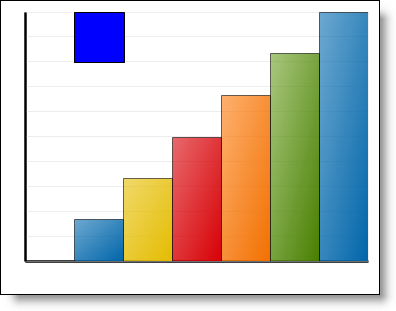

////

|metadata|
{
    "name": "chart-access-axis-inside-fillscenegraph-event-of-a-composite-chart",
    "controlName": ["{WawChartName}"],
    "tags": [],
    "guid": "{6BA69347-846A-44A1-9BD5-A4CC1B8842CE}",  
    "buildFlags": [],
    "createdOn": "0001-01-01T00:00:00Z"
}
|metadata|
////

= Access Axis Inside FillSceneGraph Event of a Composite Chart

Mapping values onto an axis is a common scenario when you are using the FillSceneGraph event. This walkthrough will show you how to access the existing axes from a composite chart.

This example uses a column chart and an array of data.

*Get the axes inside a FillSceneGraph even for a composite chart:*

[start=1]
. Before you start writing any code, you should place using/Imports directives in your code-behind so you don't need to always type out a member's fully qualified name.

*In Visual Basic:*

----
Imports Infragistics.UltraChart.Core
Imports Infragistics.UltraChart.Core.Primitives
Imports Infragistics.UltraChart.Data
Imports Infragistics.UltraChart.Resources
Imports Infragistics.UltraChart.Resources.Appearance
Imports Infragistics.UltraChart.Shared.Styles
----

*In C#:*

----
using Infragistics.UltraChart.Core;
using Infragistics.UltraChart.Core.Primitives;
using Infragistics.UltraChart.Data;
using Infragistics.UltraChart.Resources;
using Infragistics.UltraChart.Resources.Appearance;
using Infragistics.UltraChart.Shared.Styles;
----

[start=2]
. Create the  pick:[win-forms=" link:infragistics4.win.ultrawinchart.v{ProductVersion}~infragistics.win.ultrawinchart.ultrachart~fillscenegraph_ev.html[FillSceneGraph]"]  pick:[asp-net=" link:infragistics4.webui.ultrawebchart.v{ProductVersion}~infragistics.webui.ultrawebchart.ultrachart~fillscenegraph_ev.html[FillSceneGraph]"]  pick:[aspnet-old=" link:infragistics4.webui.ultrawebchart.v{ProductVersion}~infragistics.webui.ultrawebchart.ultrachart~fillscenegraph_ev.html[FillSceneGraph]"]  event.

*In Visual Basic:*

----
Private Sub UltraChart1_FillSceneGraph(ByVal sender As System.Object, _
  ByVal e As Infragistics.UltraChart.Shared.Events.FillSceneGraphEventArgs) _
  Handles UltraChart1.FillSceneGraph
----

*In C#:*

----
private void ultraChart1_FillSceneGraph(object sender, 
  Infragistics.UltraChart.Shared.Events.FillSceneGraphEventArgs e)
----

[start=3]
. Check to see if there are layers yet in the ChartLayers collection, and if not we should return. This needs to be done because by design the chart will fire the FillSceneGraph event twice. The first time is in early pre-rendering, and the second time is before it actually renders. The first time there is not enough information available to the chart, so the ChartLayers collection would be empty so the code below would throw an exception when you try to index into this collection.

*In Visual Basic:*

----
If UltraChart1.CompositeChart.ChartLayers.Count = 0 Then
	Return
End If
----

*In C#:*

----
if (ultraChart1.CompositeChart.ChartLayers.Count == 0)
	return;
----

[start=4]
. Composite chart don't use default axes so the e.Grid will be empty. For composite charts a Grid table off a chart layer is used to access the X and Y axes.

*In Visual Basic:*

----
Dim x As IAdvanceAxis = _
  CType(ultraChart1.CompositeChart.ChartLayers(0).ChartLayer.Grid("X"), _
  IAdvanceAxis)
Dim y As IAdvanceAxis = _
  CType(ultraChart1.CompositeChart.ChartLayers(0).ChartLayer.Grid("Y"), _
  IAdvanceAxis)
----

*In C#:*

----
IAdvanceAxis x = 
  (IAdvanceAxis)ultraChart1.CompositeChart.ChartLayers[0].ChartLayer.Grid["X"];
IAdvanceAxis y = 
  (IAdvanceAxis)ultraChart1.CompositeChart.ChartLayers[0].ChartLayer.Grid["Y"];
----

[start=5]
. Create a  pick:[win-forms=" link:infragistics4.win.ultrawinchart.v{ProductVersion}~infragistics.ultrachart.core.primitives.box.html[Box]"]  pick:[asp-net=" link:infragistics4.webui.ultrawebchart.v{ProductVersion}~infragistics.ultrachart.core.primitives.box.html[Box]"]  pick:[aspnet-old=" link:infragistics4.webui.ultrawebchart.v{ProductVersion}~infragistics.ultrachart.core.primitives.box.html[Box]"]  Primitive and set the following values:

** Color -- Blue
** Width -- 50
** Height -- 50

*In Visual Basic:*

----
Dim box As New Box(New Rectangle(CInt(x.Map(1)), CInt(y.Map(6)), 50, 50))
box.PE.Fill = Color.Blue
----

*In C#:*

----
Box box = new Box(new Rectangle((int)x.Map(1), (int)y.Map(6), 50, 50));
box.PE.Fill = Color.Blue;
----

[start=6]
. Add the Box Primitive to the SceneGraph.

*In Visual Basic:*

----
e.SceneGraph.Add(box)
----

*In C#:*

----
e.SceneGraph.Add(box);
----

[start=7]
. In the load event, bind your chart to an array of data.

*In Visual Basic:*

----
ultraChart1.ChartType = ChartType.Composite
Dim area1 As New ChartArea()
ultraChart1.CompositeChart.ChartAreas.Add(area1)
Dim x As New AxisItem(ultraChart1, AxisNumber.X_Axis)
Dim y As New AxisItem(ultraChart1, AxisNumber.Y_Axis)
x.DataType = AxisDataType.String
area1.Axes.Add(x)
area1.Axes.Add(y)
Dim layer As New ChartLayerAppearance()
layer.ChartType = ChartType.ColumnChart
layer.ChartArea = area1
layer.AxisX = x
layer.AxisY = y
ultraChart1.CompositeChart.ChartLayers.Add(layer)
Dim series As New NumericSeries()
series.Points.Add(New NumericDataPoint(0, "", False))
series.Points.Add(New NumericDataPoint(1, "", False))
series.Points.Add(New NumericDataPoint(2, "", False))
series.Points.Add(New NumericDataPoint(3, "", False))
series.Points.Add(New NumericDataPoint(4, "", False))
series.Points.Add(New NumericDataPoint(5, "", False))
series.Points.Add(New NumericDataPoint(6, "", False))
layer.Series.Add(series)
ultraChart1.CompositeChart.Series.Add(series)
----

*In C#:*

----
ultraChart1.ChartType = ChartType.Composite;
ChartArea area1 = new ChartArea();
ultraChart1.CompositeChart.ChartAreas.Add(area1);
AxisItem x = new AxisItem(ultraChart1, AxisNumber.X_Axis);
AxisItem y = new AxisItem(ultraChart1, AxisNumber.Y_Axis);
x.DataType = AxisDataType.String;
area1.Axes.Add(x);
area1.Axes.Add(y);
ChartLayerAppearance layer = new ChartLayerAppearance();
layer.ChartType = ChartType.ColumnChart;
layer.ChartArea = area1;
layer.AxisX = x;
layer.AxisY = y;
ultraChart1.CompositeChart.ChartLayers.Add(layer);
NumericSeries series = new NumericSeries();
series.Points.Add(new NumericDataPoint(0, "", false));
series.Points.Add(new NumericDataPoint(1, "", false));
series.Points.Add(new NumericDataPoint(2, "", false));
series.Points.Add(new NumericDataPoint(3, "", false));
series.Points.Add(new NumericDataPoint(4, "", false));
series.Points.Add(new NumericDataPoint(5, "", false));
series.Points.Add(new NumericDataPoint(6, "", false));
layer.Series.Add(series);
ultraChart1.CompositeChart.Series.Add(series);
----

[start=8]
. Save and run your application. It should look similar to the chart below.

== Related Topic

link:chart-access-axis-inside-fillscenegraph-event-of-a-non-composite-chart.html[Access Axis Inside FillSceneGraph Event of a Non-Composite Chart]