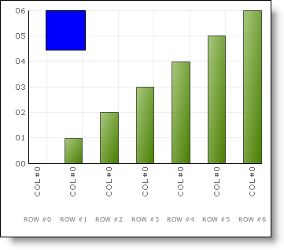

////

|metadata|
{
    "name": "chart-access-axis-inside-fillscenegraph-event-of-a-non-composite-chart",
    "controlName": ["{WawChartName}"],
    "tags": [],
    "guid": "{53C1F236-06AD-4379-9BA8-EF29676C3E2A}",  
    "buildFlags": [],
    "createdOn": "0001-01-01T00:00:00Z"
}
|metadata|
////

= Access Axis Inside FillSceneGraph Event of a Non-Composite Chart

Mapping values onto an axis is a common scenario when you are using the FillSceneGraph event. This walkthrough will show you how to access the existing axes from a non-composite chart.

This example uses a column chart and an array of data.

*Get the axes inside a FillSceneGraph event for a non-composite chart:*

[start=1]
. Before you start writing any code, you should place using/Imports directives in your code-behind so you don't need to always type out a member's fully qualified name.

*In Visual Basic:*

----
Imports Infragistics.UltraChart.Core
Imports Infragistics.UltraChart.Core.Primitives
Imports Infragistics.UltraChart.Data
Imports Infragistics.UltraChart.Resources
Imports Infragistics.UltraChart.Resources.Appearance
Imports Infragistics.UltraChart.Shared.Styles
----

*In C#:*

----
using Infragistics.UltraChart.Core;
using Infragistics.UltraChart.Core.Primitives;
using Infragistics.UltraChart.Data;
using Infragistics.UltraChart.Resources;
using Infragistics.UltraChart.Resources.Appearance;
using Infragistics.UltraChart.Shared.Styles;
----

[start=2]
. Create the  pick:[win-forms=" link:infragistics4.win.ultrawinchart.v{ProductVersion}~infragistics.win.ultrawinchart.ultrachart~fillscenegraph_ev.html[FillSceneGraph]"]  pick:[asp-net=" link:infragistics4.webui.ultrawebchart.v{ProductVersion}~infragistics.webui.ultrawebchart.ultrachart~fillscenegraph_ev.html[FillSceneGraph]"]  pick:[aspnet-old=" link:infragistics4.webui.ultrawebchart.v{ProductVersion}~infragistics.webui.ultrawebchart.ultrachart~fillscenegraph_ev.html[FillSceneGraph]"]  event.

*In Visual Basic:*

----
Private Sub UltraChart1_FillSceneGraph(ByVal sender As System.Object, _
  ByVal e As Infragistics.UltraChart.Shared.Events.FillSceneGraphEventArgs) _
  Handles UltraChart1.FillSceneGraph
----

*In C#:*

----
private void ultraChart1_FillSceneGraph(object sender, 
  Infragistics.UltraChart.Shared.Events.FillSceneGraphEventArgs e)
----

[start=3]
. Get the x and y axes values, as you will need them for mapping functionality. The e.Grid table has the axes.

*In Visual Basic:*

----
Dim xAxis As IAdvanceAxis = CType(e.Grid("X"), IAdvanceAxis)
Dim yAxis As IAdvanceAxis = CType(e.Grid("Y"), IAdvanceAxis)
----

*In C#:*

----
IAdvanceAxis xAxis = (IAdvanceAxis)e.Grid["X"];
IAdvanceAxis yAxis = (IAdvanceAxis)e.Grid["Y"];
----

[start=4]
. Make sure that axes values were actually retrieved. This needs to be done because by design the chart will fire the FillSceneGraph event twice. The first time is in early pre-rendering, and the second time is before it actually renders. The first time there is not enough information available to the chart to make the above code actually have values in it, so if you went to use those values in pre-render firing of the event you would get exceptions.

*In Visual Basic:*

----
If xAxis Is Nothing Or yAxis Is Nothing Then
	Return
End If
----

*In C#:*

----
if (xAxis == null || yAxis == null)
	return;
----

[start=5]
. Create a  pick:[win-forms=" link:infragistics4.win.ultrawinchart.v{ProductVersion}~infragistics.ultrachart.core.primitives.box.html[Box]"]  pick:[asp-net=" link:infragistics4.webui.ultrawebchart.v{ProductVersion}~infragistics.ultrachart.core.primitives.box.html[Box]"]  pick:[aspnet-old=" link:infragistics4.webui.ultrawebchart.v{ProductVersion}~infragistics.ultrachart.core.primitives.box.html[Box]"]  Primitive and set the following values:

** Color -- Blue
** Width -- 50
** Height -- 50

*In Visual Basic:*

----
Dim box As New Box(New Rectangle(CInt(xAxis.Map(1)), CInt(yAxis.Map(6)), 50, 50))
box.PE.Fill = Color.Blue
----

*In C#:*

----
Box box = new Box(new Rectangle((int)xAxis.Map(1), (int)yAxis.Map(6), 50, 50));
box.PE.Fill = Color.Blue;
----

[start=6]
. Add the Box Primitive to the SceneGraph.

*In Visual Basic:*

----
e.SceneGraph.Add(box)
----

*In C#:*

----
e.SceneGraph.Add(box);
----

[start=7]
. In the load event, bind your chart to an array of data.

*In Visual Basic:*

----
Me.UltraChart1.Data.DataSource = _
  New Integer() {1, 2, 4, 5, 6, 7, 8, 9, 9, 9, 12, 13, 14, 15, 16}
Me.UltraChart1.Data.DataBind()
----

*In C#:*

----
this.ultraChart1.Data.DataSource = 
  new int[] { 1, 2, 4, 5, 6, 7, 8, 9, 9, 9, 12, 13, 14, 15, 16 };
this.ultraChart1.Data.DataBind();
----

[start=8]
. Save and run your application. It should look similar to the chart below.

== Related Topic

link:chart-access-axis-inside-fillscenegraph-event-of-a-composite-chart.html[Access Axis Inside FillSceneGraph Event of a Composite Chart]