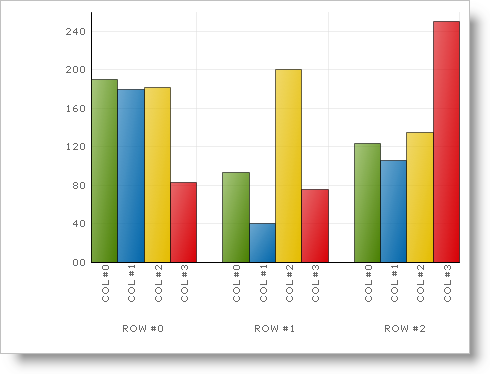
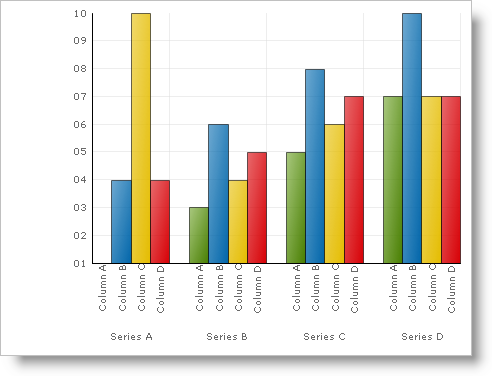

////

|metadata|
{
    "name": "chart-adding-chart-to-a-form",
    "controlName": ["{WawChartName}"],
    "tags": [],
    "guid": "{D24A1A42-3780-4E32-B50C-F7B1F026E202}",  
    "buildFlags": [],
    "createdOn": "0001-01-01T00:00:00Z"
}
|metadata|
////

= Adding Chart to a Form

The basic starting place for the Chart control is getting it on the form and running, and this topic will show you just that. We will step you through the basics of getting the Chart on the form and bound to a basic data table.

[start=1]
. Create or open an existing  pick:[win-forms,win-forms-old="Windows application"]  pick:[asp-net,aspnet-old="ASP.NET Web application"] .
[start=2]
. Drag the UltraChart control to your form from the toolbox. This will cause the Chart Wizard to appear. You can click Cancel on the dialog box since it won't be necessary to set up this basic chart. The chart appears on the form, and appears similar to the following image.

[start=3]
. By default, the ChartType property is set to ColumnChart. For more information on the different chart types refer to the link:chart-chart-types.html[Chart Types section].
[start=4]
. Go to the code behind file and add the following method that returns a data table to which you will bind the chart.

*In Visual Basic:*

----
Private Function GetColumnData() As DataTable
	Dim myColumn As New DataTable
	' Define the columns and their names
	myColumn.Columns.Add("Series Labels", GetType(String))
	myColumn.Columns.Add("Column A", GetType(Integer))
	myColumn.Columns.Add("Column B", GetType(Integer))
	myColumn.Columns.Add("Column C", GetType(Integer))
	myColumn.Columns.Add("Column D", GetType(Integer))
	' Add the rows of data
	myColumn.Rows.Add(New [Object]() {"Series A", 1, 4, 10, 4})
	myColumn.Rows.Add(New [Object]() {"Series B", 3, 6, 4, 5})
	myColumn.Rows.Add(New [Object]() {"Series C", 5, 8, 6, 7})
	myColumn.Rows.Add(New [Object]() {"Series D", 7, 10, 7, 7})
	Return myColumn
End Function
----

*In C#:*

----
private DataTable GetColumnData()
{
	DataTable mydata = new DataTable();
	// Define the columns and their names
	mydata.Columns.Add("Series Labels", typeof(string));
	mydata.Columns.Add("Column A", typeof(int));
	mydata.Columns.Add("Column B", typeof(int));
	mydata.Columns.Add("Column C", typeof(int));
	mydata.Columns.Add("Column D", typeof(int));
	// Add the rows of data
	mydata.Rows.Add(new Object[] {"Series A",1,4,10,4 });
	mydata.Rows.Add(new Object[] {"Series B",3,6,4,5 });
	mydata.Rows.Add(new Object[] {"Series C",5,8,6,7 });
	mydata.Rows.Add(new Object[] {"Series D",7,10,7,7 });
	return mydata;
}
----

[start=5]
. Create the  pick:[win-forms,win-forms-old="Form"]  pick:[asp-net,aspnet-old="Page"]  load event, and add the following code.

*In Visual Basic:*

----
Me.UltraChart1.DataSource = GetColumnData()
Me.UltraChart1.DataBind()
----

*In C#:*

----
this.ultraChart1.DataSource = GetColumnData();
this.ultraChart1.DataBind();
----

[start=6]
. When you run the application, you may see the following chart appear.

ifdef::asp-net,aspnet-old[]
.Note
[NOTE]
====
If you are using WebChart, you will need to set the read and write permissions on the ChartImages folder for the aspnet user. Otherwise, you will get a GDI+ error when you try to run the application.
====
endif::asp-net,aspnet-old[]

This topic explained the basics for setting up a chart. For information on how to customize charts, refer to the topics in the link:chart-using-chart.html[Using Chart] section. You can also review the link:chart-chart-types.html[Chart Types] section for information on the different chart types available, and the data requirements for each of those charts.