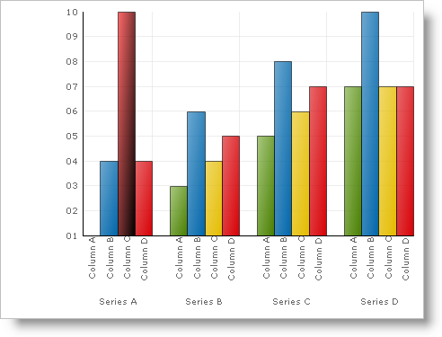

////

|metadata|
{
    "name": "chart-apply-a-gradient-effect-to-a-primitive",
    "controlName": ["{WawChartName}"],
    "tags": [],
    "guid": "{05DE92BA-4C92-4DF7-8FDC-6F7088E1CE0F}",  
    "buildFlags": [],
    "createdOn": "2006-12-04T00:00:00Z"
}
|metadata|
////

= Apply a Gradient Effect to a Primitive

The incredible power within  pick:[win-forms=" link:{ApiPlatform}win.ultrawinchart{ApiVersion}~infragistics.ultrachart.resources.appearance.paintelement.html[PaintElement]"]  pick:[asp-net=" link:{ApiPlatform}webui.ultrawebchart{ApiVersion}~infragistics.ultrachart.resources.appearance.paintelement.html[PaintElement]"]  pick:[aspnet-old=" link:{ApiPlatform}webui.ultrawebchart{ApiVersion}~infragistics.ultrachart.resources.appearance.paintelement.html[PaintElement]"] , derived from the assortment of fill effects, provides the chart's graphical elements. One of the most commonly used effects is the gradient fill. Gradients depict a graduated and blended change between two colors, from the  pick:[win-forms=" link:{ApiPlatform}win.ultrawinchart{ApiVersion}~infragistics.ultrachart.resources.appearance.paintelement~fill.html[Fill]"]  pick:[asp-net=" link:{ApiPlatform}webui.ultrawebchart{ApiVersion}~infragistics.ultrachart.resources.appearance.paintelement~fill.html[Fill]"]  pick:[aspnet-old=" link:{ApiPlatform}webui.ultrawebchart{ApiVersion}~infragistics.ultrachart.resources.appearance.paintelement~fill.html[Fill]"]  color (also used for solid fills) and the  pick:[win-forms=" link:{ApiPlatform}win.ultrawinchart{ApiVersion}~infragistics.ultrachart.resources.appearance.paintelement~fillstopcolor.html[FillStopColor]"]  pick:[asp-net=" link:{ApiPlatform}webui.ultrawebchart{ApiVersion}~infragistics.ultrachart.resources.appearance.paintelement~fillstopcolor.html[FillStopColor]"]  pick:[aspnet-old=" link:{ApiPlatform}webui.ultrawebchart{ApiVersion}~infragistics.ultrachart.resources.appearance.paintelement~fillstopcolor.html[FillStopColor]"] . They can be used to create a variety of pleasing effects on the chart as shown in the figure below.

image::Images/Chart_Rendering_With_Paint_Element_02.png[Graphic showing examples of the available gradient styles, fill, and FillStopColors. ]

Gradients are a by-product of vector calculus and have eagerly become a part of the artistic world. There is a difference between the mathematical definition of gradient and the perspective taken in most image-editing applications, see the following two illustrations.

[cols="a,a"]
|====
|image::Images/Chart_Rendering_With_Paint_Element_03.png[Graphic showing which way a horizontal gradient is applied.]
|image::Images/Chart_Rendering_With_Paint_Element_04.png[Graphic showing which way a vertical gradient is applied.]

|

|====

The artistic perspective would regard a horizontal gradient as one resembling a horizon. However, in mathematics, the gradual change that a gradient represents takes place in the direction of movement; hence, a swash of color resembling a horizon occurs when color changes as one travels vertically. Chart uses the mathematical definition of gradient, which is consistent with the gradients exposed by the underlying .NET Framework. Developers seeking consistency with image-editing applications may want to consider their own logic for impendence-matching between these two definitions.

The example below, uses an arbitrary Box, (a Primitive shape used in the Column and Bar charts), and shows you how to apply a gradient to it. You can then expand upon this example to apply gradients to all the primitives in the chart.

.Note
[NOTE]
====
All references to Color objects are .NET Framework colors from the System.Drawing namespace.
====

*In Visual Basic:*

----
Imports Infragistics.UltraChart.[Shared].Styles
Imports Infragistics.UltraChart.Core.Primitives
...
Private Sub UltraChart1_ChartDrawItem(ByVal sender As Object, _
  ByVal e As Infragistics.UltraChart.Shared.Events.ChartDrawItemEventArgs) _
  Handles UltraChart1.ChartDrawItem
	' Get a Box primitive from a ColumnChart.
	If TypeOf e.Primitive Is Box Then
		Dim b As Box = Nothing
		b = CType(e.Primitive, Box)
		If Not b Is Nothing AndAlso b.Row = 0 AndAlso b.Column = 2 Then
			b.PE = b.PE.Clone()
			' Set the Primitives PaintElement Type to a Gradient
			b.PE.ElementType = PaintElementType.Gradient
			' Set the starting and ending color for the gradient.
			b.PE.Fill = Color.Red
			b.PE.FillStopColor = Color.Black
			' Set a linear direction or shape for the gradient.
			b.PE.FillGradientStyle = GradientStyle.ForwardDiagonal
		End If
	End If
End Sub
----

*In C#:*

----
using Infragistics.UltraChart.Shared.Styles;
using Infragistics.UltraChart.Core.Primitives;
...
private void ultraChart1_ChartDrawItem(object sender, 
  Infragistics.UltraChart.Shared.Events.ChartDrawItemEventArgs e)
{
	// Get a Box primitive from a ColumnChart.
	if (e.Primitive is Box)
	{
		Box b = e.Primitive as Box;
		if(b != null && b.Row == 0 && b.Column == 2)
		{
			// Set the Primitives PaintElement Type to a Gradient
			b.PE.ElementType = PaintElementType.Gradient;
			// Set the starting and ending color for the gradient.
			b.PE.Fill = Color.Red;
			b.PE.FillStopColor = Color.Black;
			// Set a linear direction or shape for the gradient.
			b.PE.FillGradientStyle = GradientStyle.ForwardDiagonal;
		}
	}
}
----

== Related Topic

link:chart-adding-primitives-to-a-chart-layer.html[Adding Primitives to a Chart Layer]