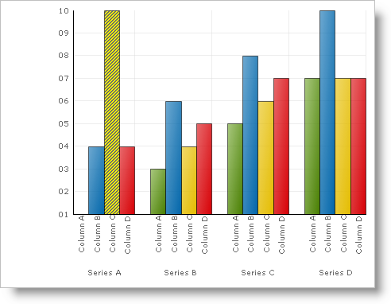

////

|metadata|
{
    "name": "chart-apply-a-hatch-style-to-a-primitive",
    "controlName": ["{WawChartName}"],
    "tags": [],
    "guid": "{EF93FF40-47C0-4AA4-8231-89E6385D2159}",  
    "buildFlags": [],
    "createdOn": "2006-12-04T00:00:00Z"
}
|metadata|
////

= Apply a Hatch Style to a Primitive

In addition to the ability to fill a region with a gradient,  pick:[win-forms=" link:{ApiPlatform}win.ultrawinchart{ApiVersion}~infragistics.ultrachart.resources.appearance.paintelement.html[PaintElement]"]  pick:[asp-net=" link:{ApiPlatform}webui.ultrawebchart{ApiVersion}~infragistics.ultrachart.resources.appearance.paintelement.html[PaintElement]"]  pick:[aspnet-old=" link:{ApiPlatform}webui.ultrawebchart{ApiVersion}~infragistics.ultrachart.resources.appearance.paintelement.html[PaintElement]"]  also has an assortment of tileable pattern fills. Developers can assign these to the Hatch property of Paint Element when painting the interior of graphical chart elements with hatches, zig-zags, brickface, checkerboards, and other patterns.

The foreground color of a hatch pattern is defined by the color value of the  pick:[win-forms=" link:{ApiPlatform}win.ultrawinchart{ApiVersion}~infragistics.ultrachart.resources.appearance.paintelement~fill.html[Fill]"]  pick:[asp-net=" link:{ApiPlatform}webui.ultrawebchart{ApiVersion}~infragistics.ultrachart.resources.appearance.paintelement~fill.html[Fill]"]  pick:[aspnet-old=" link:{ApiPlatform}webui.ultrawebchart{ApiVersion}~infragistics.ultrachart.resources.appearance.paintelement~fill.html[Fill]"]  property, and the background color is determined by the color value assigned to the  pick:[win-forms=" link:{ApiPlatform}win.ultrawinchart{ApiVersion}~infragistics.ultrachart.resources.appearance.paintelement~fillstopcolor.html[FillStopColor]"]  pick:[asp-net=" link:{ApiPlatform}webui.ultrawebchart{ApiVersion}~infragistics.ultrachart.resources.appearance.paintelement~fillstopcolor.html[FillStopColor]"]  pick:[aspnet-old=" link:{ApiPlatform}webui.ultrawebchart{ApiVersion}~infragistics.ultrachart.resources.appearance.paintelement~fillstopcolor.html[FillStopColor]"]  property.

image::Images/Chart_Rendering_With_Paint_Element_07.png[Graphic demonstrating some of the Hatch styles available in the chart.]

The example below, uses an arbitrary Box (a Primitive shape used in the column and bar charts) and shows you how to apply a Hatch style to it. You can then expand upon this example to apply hatch styles to all the primitives in the chart.

*In Visual Basic:*

----
Imports Infragistics.UltraChart.Shared.Styles
Imports Infragistics.UltraChart.Core.Primitives
...
Private Sub UltraChart1_ChartDrawItem(ByVal sender As Object, _
  ByVal e As Infragistics.UltraChart.Shared.Events.ChartDrawItemEventArgs) _
  Handles UltraChart1.ChartDrawItem
	' Get a Box primitive from a ColumnChart
	If TypeOf e.Primitive Is Box Then
		Dim b As Box = Nothing
		b = CType(e.Primitive, Box)
		If Not b Is Nothing AndAlso b.Row = 0 AndAlso b.Column = 2 Then
			b.PE = b.PE.Clone()
			' Set the Primitives PaintElement Type to a hatch
			b.PE.ElementType = PaintElementType.Hatch
			' Set the starting and ending color for the hatch
			b.PE.Fill = Color.Black
			b.PE.FillStopColor = Color.Yellow
			' Set a hatch pattern
			b.PE.Hatch = FillHatchStyle.DarkUpwardDiagonal
		End If
	End If
End Sub
----

*In C#:*

----
using Infragistics.UltraChart.Core.Primitives;
using Infragistics.UltraChart.Shared.Styles;
...
private void ultraChart1_ChartDrawItem(object sender, 
  Infragistics.UltraChart.Shared.Events.ChartDrawItemEventArgs e)
{
	// Get a Box primitive from a ColumnChart.
	if (e.Primitive is Box)
	{
		Box b = e.Primitive as Box;
		if(b != null && b.Row == 0 && b.Column == 2)
        {
			b.PE = b.PE.Clone();
			// Set the Primitives PaintElement Type to a hatch
			b.PE.ElementType = PaintElementType.Hatch;
			// Set the starting and ending color for the hatch
			b.PE.Fill = Color.Black;
			b.PE.FillStopColor = Color.Yellow;
			// Set a hatch pattern
			b.PE.Hatch = FillHatchStyle.DarkUpwardDiagonal;
        }
	{
}
----

== Related Topic

link:chart-adding-primitives-to-a-chart-layer.html[Adding Primitives to a Chart Layer]