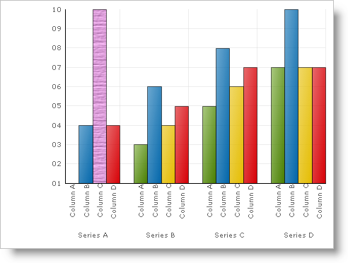

////

|metadata|
{
    "name": "chart-apply-a-texture-effect-to-a-primitive",
    "controlName": ["{WawChartName}"],
    "tags": [],
    "guid": "{2CA3A3EE-887D-403B-A86E-2BD491EFFD8C}",  
    "buildFlags": [],
    "createdOn": "2006-12-04T00:00:00Z"
}
|metadata|
////

= Apply a Texture Effect to a Primitive

If the PaintElementType is set to Texture, then the  pick:[win-forms=" link:{ApiPlatform}win.ultrawinchart{ApiVersion}~infragistics.ultrachart.resources.appearance.paintelement.html[PaintElement]"]  pick:[asp-net=" link:{ApiPlatform}webui.ultrawebchart{ApiVersion}~infragistics.ultrachart.resources.appearance.paintelement.html[PaintElement]"]  pick:[aspnet-old=" link:{ApiPlatform}webui.ultrawebchart{ApiVersion}~infragistics.ultrachart.resources.appearance.paintelement.html[PaintElement]"] 's  pick:[win-forms=" link:{ApiPlatform}win.ultrawinchart{ApiVersion}~infragistics.ultrachart.resources.appearance.paintelement~fill.html[Fill]"]  pick:[asp-net=" link:{ApiPlatform}webui.ultrawebchart{ApiVersion}~infragistics.ultrachart.resources.appearance.paintelement~fill.html[Fill]"]  pick:[aspnet-old=" link:{ApiPlatform}webui.ultrawebchart{ApiVersion}~infragistics.ultrachart.resources.appearance.paintelement~fill.html[Fill]"]  and  pick:[win-forms=" link:{ApiPlatform}win.ultrawinchart{ApiVersion}~infragistics.ultrachart.resources.appearance.paintelement~texture.html[Texture]"]  pick:[asp-net=" link:{ApiPlatform}webui.ultrawebchart{ApiVersion}~infragistics.ultrachart.resources.appearance.paintelement~texture.html[Texture]"]  pick:[aspnet-old=" link:{ApiPlatform}webui.ultrawebchart{ApiVersion}~infragistics.ultrachart.resources.appearance.paintelement~texture.html[Texture]"]  properties can be set to use textures of different colors.

The TextureApplication property affects how brightness is added or subtracted from the base color to apply the texture. If your PaintElement appears too bright or too dark, try changing the value of this property.

The following table illustrates how different property settings can create different textured PaintElements:

[options="header", cols="a,a,a,a"]
|====
|Fill|Texture|TextureApplication|Result

|Orchid
|Wood
|Normal
|image::Images/Chart_Rendering_With_Paint_Element_08.png[Result of the first three columns.]

|MidnightBlue
|Crackle
|Normal
|image::Images/Chart_Rendering_With_Paint_Element_09.png[Result of the first three columns]

|MidnightBlue
|Crackle
|Inverted
|image::Images/Chart_Rendering_With_Paint_Element_10.png[Result of the first three columns]

|OldLace
|CustomImage
|Inverted
|image::Images/Chart_Rendering_With_Paint_Element_11.png[Results of the first three columns.]

|====

The example below, uses an arbitrary Box (a Primitive shape used in the column and bar charts) and shows you how to apply a Hatch style to it. You can then expand upon this example to apply hatch styles to all the primitives in the chart.

*In Visual Basic:*

----
Imports Infragistics.UltraChart.Core.Primitives
Imports Infragistics.UltraChart.Shared.Styles
...
Private Sub UltraChart1_ChartDrawItem(ByVal sender As Object, _
  ByVal e As Infragistics.UltraChart.Shared.Events.ChartDrawItemEventArgs) _
  Handles UltraChart1.ChartDrawItem
	' Get a Box primitive from a ColumnChart
	If TypeOf e.Primitive Is Box Then
		Dim b As Box = Nothing
		b = CType(e.Primitive, Box)
		If Not b Is Nothing AndAlso b.Row = 0 AndAlso b.Column = 2 Then
			b.PE = b.PE.Clone()
			' Set the Primitives PaintElement Type to a texture
			b.PE.ElementType = PaintElementType.Texture
			' Set the starting color for the texture
			b.PE.Fill = Color.Orchid
			' Set a texture and textureapplication
			b.PE.Texture = TexturePresets.Wood
			b.PE.TextureApplication = TextureApplicationStyle.Normal
		End If
	End If
End Sub
----

*In C#:*

----
using Infragistics.UltraChart.Shared.Styles;
using Infragistics.UltraChart.Core.Primitives;
...
private void ultraChart1_ChartDrawItem(object sender, 
  Infragistics.UltraChart.Shared.Events.ChartDrawItemEventArgs e)
{
	// Get a Box primitive from a ColumnChart
	if (e.Primitive is Box)
	{
		Box b = e.Primitive as Box;
		if(b != null && b.Row == 0 && b.Column == 2)
		{
			b.PE = b.PE.Clone();
			// Set the Primitives PaintElement Type to a texture
			b.PE.ElementType = PaintElementType.Texture;
			// Set the starting color for the texture
			b.PE.Fill = Color.Orchid;
			// Set a texture and textureApplication
			b.PE.Texture = TexturePresets.Wood;
			b.PE.TextureApplication = TextureApplicationStyle.Normal;
		}
	}
}
----

Custom images can also be used to generate textures by setting an image for the  pick:[win-forms=" link:{ApiPlatform}win.ultrawinchart{ApiVersion}~infragistics.ultrachart.resources.appearance.paintelement~fillimage.html[FillImage]"]  pick:[asp-net=" link:{ApiPlatform}webui.ultrawebchart{ApiVersion}~infragistics.ultrachart.resources.appearance.paintelement~fillimage.html[FillImage]"]  pick:[aspnet-old=" link:{ApiPlatform}webui.ultrawebchart{ApiVersion}~infragistics.ultrachart.resources.appearance.paintelement~fillimage.html[FillImage]"]  property and setting the Texture property to  pick:[win-forms=" link:{ApiPlatform}win.ultrawinchart{ApiVersion}~infragistics.ultrachart.resources.appearance.textureeffect~customimage.html[CustomImage]"]  pick:[asp-net=" link:{ApiPlatform}webui.ultrawebchart{ApiVersion}~infragistics.ultrachart.resources.appearance.textureeffect~customimage.html[CustomImage]"]  pick:[aspnet-old=" link:{ApiPlatform}webui.ultrawebchart{ApiVersion}~infragistics.ultrachart.resources.appearance.textureeffect~customimage.html[CustomImage]"] . For ideal performance, smaller images are better. Images under 10 KB are best. However, if your chart does not frequently have to repaint, or if the application is running on a server with a powerful CPU, then larger images can be used.

== Related Topic

link:chart-adding-primitives-to-a-chart-layer.html[Adding Primitives to a Chart Layer]