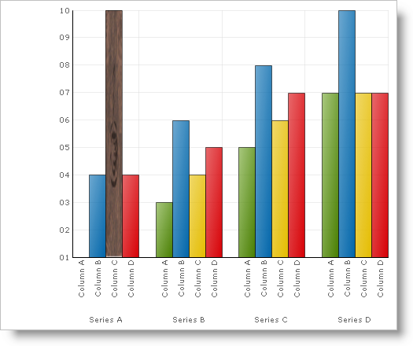

////

|metadata|
{
    "name": "chart-apply-an-image-to-a-chart-primitive",
    "controlName": ["{WawChartName}"],
    "tags": [],
    "guid": "{91100A59-9731-4799-87F9-1D3BFE886B41}",  
    "buildFlags": [],
    "createdOn": "2006-12-04T00:00:00Z"
}
|metadata|
////

= Apply an Image to a Chart Primitive

pick:[win-forms=" link:infragistics4.win.ultrawinchart.v{ProductVersion}~infragistics.ultrachart.resources.appearance.paintelement.html[PaintElement]"]  pick:[asp-net=" link:infragistics4.webui.ultrawebchart.v{ProductVersion}~infragistics.ultrachart.resources.appearance.paintelement.html[PaintElement]"]  pick:[aspnet-old=" link:infragistics4.webui.ultrawebchart.v{ProductVersion}~infragistics.ultrachart.resources.appearance.paintelement.html[PaintElement]"]  also supports an additional texture-filling feature where a graphic image (bitmap) can be used to fill the inside of closed primitive shapes. Developers who want to use this feature must load a bitmap object and assign it to the  pick:[win-forms=" link:infragistics4.win.ultrawinchart.v{ProductVersion}~infragistics.ultrachart.resources.appearance.paintelement~fillimage.html[FillImage]"]  pick:[asp-net=" link:infragistics4.webui.ultrawebchart.v{ProductVersion}~infragistics.ultrachart.resources.appearance.paintelement~fillimage.html[FillImage]"]  pick:[aspnet-old=" link:infragistics4.webui.ultrawebchart.v{ProductVersion}~infragistics.ultrachart.resources.appearance.paintelement~fillimage.html[FillImage]"]  property of the Paint Element.

The example below, uses an arbitrary Box, a Primitive shape used in the column and bar charts, and shows you how to apply an Image to that primitive. You can then expand upon this example to apply an image to all the closed primitives in the chart.

*In Visual Basic:*

----
Imports System.IO
Imports Infragistics.UltraChart.Core.Primitives
Imports Infragistics.UltraChart.Shared.Styles
...
Private Sub UltraChart1_ChartDrawItem(ByVal sender As Object, _
  ByVal e As Infragistics.UltraChart.Shared.Events.ChartDrawItemEventArgs) _
  Handles UltraChart1.ChartDrawItem
	' Get a Box primitive from a ColumnChart
	If TypeOf e.Primitive Is Box Then
		Dim b As Box = Nothing
		b = CType(e.Primitive, Box)
		If Not b Is Nothing AndAlso b.Row = 0 AndAlso b.Column = 2 Then
			b.PE = b.PE.Clone()
			' Set the Primitives PaintElement Type to a image
			b.PE.ElementType = PaintElementType.Image
			' Set the texture of the Box to the bitmap
			b.PE.FillImage = _
			  System.Drawing.Image.FromFile( _
			   "Program Dependent Files\Coffee Bean.bmp")
		End If
	End If
End Sub
----

*In C#:*

----
using System.IO;
using Infragistics.UltraChart.Core.Primitives;
using Infragistics.UltraChart.Shared.Styles;
...
private void ultraChart1_ChartDrawItem(object sender, 
  Infragistics.UltraChart.Shared.Events.ChartDrawItemEventArgs e)
{
	// Get a Box primitive from a ColumnChart
	if (e.Primitive is Box)
	{
		Box b = e.Primitive as Box;
		if(b != null && b.Row == 0 && b.Column == 2)
		{
			b.PE = b.PE.Clone();
			// Set the Primitives PaintElement Type to a image
			b.PE.ElementType = PaintElementType.Image;
			// Set the texture of the Box to the bitmap
			b.PE.FillImage = 
			  System.Drawing.Image.FromFile(
			    @"Program Dependent Files\Coffee Bean.bmp");
        }
	}
}
----

== Related Topic

link:chart-adding-primitives-to-a-chart-layer.html[Adding Primitives to a Chart Layer]