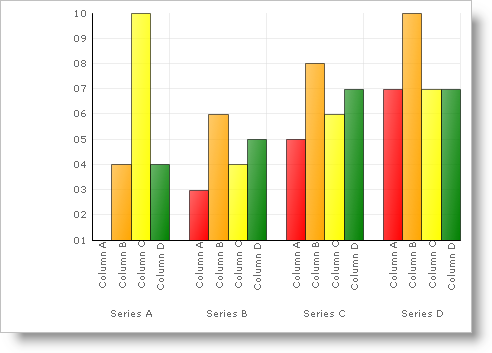

////

|metadata|
{
    "name": "chart-assign-custom-colors-to-chart-elements",
    "controlName": ["{WawChartName}"],
    "tags": [],
    "guid": "{2ADD926D-2BF2-41A5-AE40-E6070B487984}",  
    "buildFlags": [],
    "createdOn": "0001-01-01T00:00:00Z"
}
|metadata|
////

= Assign Custom Colors to Chart Elements

By default, the Chart control will choose random colors for the charting elements. But you can assign a specific color to each bar, bubble, line, etc. You do this by using the  pick:[win-forms=" link:{ApiPlatform}win.ultrawinchart{ApiVersion}~infragistics.win.ultrawinchart.ultrachart~colormodel.html[ColorModel]"]  pick:[asp-net=" link:{ApiPlatform}webui.ultrawebchart{ApiVersion}~infragistics.ultrachart.shared.styles.colormodels.html[ColorModel]"]  pick:[aspnet-old=" link:{ApiPlatform}webui.ultrawebchart{ApiVersion}~infragistics.ultrachart.shared.styles.colormodels.html[ColorModel]"]  object.

[start=1]
. Before you start writing any code, you should place using/import directives in your code-behind so you don't need to always type out a member's fully qualified name.

*In Visual Basic:*

----
Imports Infragistics.UltraChart.Shared.Styles
----

*In C#:*

----
using Infragistics.UltraChart.Shared.Styles;
----

[start=2]
. pick:[win-forms=" link:{ApiPlatform}win.ultrawinchart{ApiVersion}~infragistics.ultrachart.resources.appearance.colorappearance~modelstyle.html[ColorModel.ModelStyle]"]  pick:[asp-net=" link:{ApiPlatform}webui.ultrawebchart{ApiVersion}~infragistics.ultrachart.resources.appearance.colorappearance~modelstyle.html[ColorModel.ModelStyle]"]  pick:[aspnet-old=" link:{ApiPlatform}webui.ultrawebchart{ApiVersion}~infragistics.ultrachart.resources.appearance.colorappearance~modelstyle.html[ColorModel.ModelStyle]"]  to CustomLinear. This tells the Chart to use the colors from the  pick:[win-forms=" link:{ApiPlatform}win.ultrawinchart{ApiVersion}~infragistics.ultrachart.resources.appearance.colorappearance~custompalette.html[CustomPalette]"]  pick:[asp-net=" link:{ApiPlatform}webui.ultrawebchart{ApiVersion}~infragistics.ultrachart.resources.appearance.colorappearance~custompalette.html[CustomPalette]"]  pick:[aspnet-old=" link:{ApiPlatform}webui.ultrawebchart{ApiVersion}~infragistics.ultrachart.resources.appearance.colorappearance~custompalette.html[CustomPalette]"]  in order.

*In Visual Basic:*

----
Me.UltraChart1.ColorModel.ModelStyle = ColorModels.CustomLinear
----

*In C#:*

----
this.ultraChart1.ColorModel.ModelStyle = ColorModels.CustomLinear;
----

[start=3]
. To assign specific colors to specific elements, you must set the CustomPalette to an array of color objects.

*In Visual Basic:*

----
Dim ChartColors() As Color
ChartColors = New Color() {Color.Red, Color.Orange, Color.Yellow, _
  Color.Green, Color.Blue, Color.Indigo, Color.Violet}
Me.UltraChart1.ColorModel.CustomPalette = ChartColors
----

*In C#:*

----
Color[] ChartColors;
ChartColors = new Color[] {Color.Red, Color.Orange, Color.Yellow, 
  Color.Green, Color.Blue, Color.Indigo, Color.Violet};
this.ultraChart1.ColorModel.CustomPalette = ChartColors;
----

