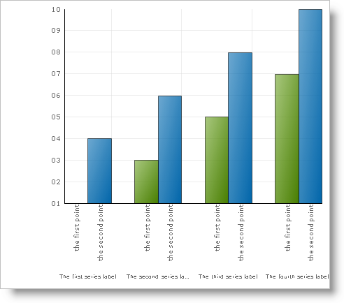

////

|metadata|
{
    "name": "chart-axis-label-layout-behaviors",
    "controlName": ["{WawChartName}"],
    "tags": [],
    "guid": "{B26CD62C-0F07-43C8-8426-4971278CDDEC}",  
    "buildFlags": [],
    "createdOn": "0001-01-01T00:00:00Z"
}
|metadata|
////

= Axis Label Layout Behaviors

In applications which generate charts of variable size and content, it is important that axis labels can make the proper adjustments to fit in the space that is available to them.

The most effective way to do this is to have a prescribed set of rules determining how labels should be laid out. Behaviors like font scaling, text wrapping, rotation, and text clipping will be used until the labels can be laid out clearly in the available space.

The  pick:[win-forms=" link:{ApiPlatform}win.ultrawinchart{ApiVersion}~infragistics.ultrachart.resources.appearance.axislabelappearancebase~layout.html[AxisLabelAppearanceBase.Layout]"]  pick:[asp-net=" link:{ApiPlatform}webui.ultrawebchart{ApiVersion}~infragistics.ultrachart.resources.appearance.axislabelappearancebase~layout.html[AxisLabelAppearanceBase.Layout]"]  pick:[aspnet-old=" link:{ApiPlatform}webui.ultrawebchart{ApiVersion}~infragistics.ultrachart.resources.appearance.axislabelappearancebase~layout.html[AxisLabelAppearanceBase.Layout]"]  property defines how such behaviors are applied. This property exposes an appearance object with the following properties; which are describe in the subsequent sections.

*  pick:[win-forms=" link:{ApiPlatform}win.ultrawinchart{ApiVersion}~infragistics.ultrachart.resources.appearance.axislabellayoutappearance~behavior.html[Behavior]"]  pick:[asp-net=" link:{ApiPlatform}webui.ultrawebchart{ApiVersion}~infragistics.ultrachart.resources.appearance.axislabellayoutappearance~behavior.html[Behavior]"]  pick:[aspnet-old=" link:{ApiPlatform}webui.ultrawebchart{ApiVersion}~infragistics.ultrachart.resources.appearance.axislabellayoutappearance~behavior.html[Behavior]"] 
*  pick:[win-forms=" link:{ApiPlatform}win.ultrawinchart{ApiVersion}~infragistics.ultrachart.resources.appearance.axislabellayoutappearance~behaviorcollection.html[BehaviorCollection]"]  pick:[asp-net=" link:{ApiPlatform}webui.ultrawebchart{ApiVersion}~infragistics.ultrachart.resources.appearance.axislabellayoutappearance~behaviorcollection.html[BehaviorCollection]"]  pick:[aspnet-old=" link:{ApiPlatform}webui.ultrawebchart{ApiVersion}~infragistics.ultrachart.resources.appearance.axislabellayoutappearance~behaviorcollection.html[BehaviorCollection]"] 
*  pick:[win-forms=" link:{ApiPlatform}win.ultrawinchart{ApiVersion}~infragistics.ultrachart.resources.appearance.axislabellayoutappearance~padding.html[Padding]"]  pick:[asp-net=" link:{ApiPlatform}webui.ultrawebchart{ApiVersion}~infragistics.ultrachart.resources.appearance.axislabellayoutappearance~padding.html[Padding]"]  pick:[aspnet-old=" link:{ApiPlatform}webui.ultrawebchart{ApiVersion}~infragistics.ultrachart.resources.appearance.axislabellayoutappearance~padding.html[Padding]"] 

== Behavior

This enumeration allows you to set the mode of the axis label layout. The following modes are available:

* AxisLabelLayoutBehaviors.Auto -- This is the recommended mode. The layout algorithm is automatically selected. Axis label collisions will not occur if there is reasonable space available to display them.

*In Visual Basic:*

----
Imports Infragistics.UltraChart.Shared.Styles
...
Me.UltraChart1.Axis.X.Labels.Layout.Behavior = AxisLabelLayoutBehaviors.Auto
----

*In C#:*

----
using Infragistics.UltraChart.Shared.Styles;
...
this.ultraChart1.Axis.X.Labels.Layout.Behavior = AxisLabelLayoutBehaviors.Auto;
----

* AxisLabelLayoutBehaviors.None -- Labels will not be prevented from overlapping or colliding.
* AxisLabelLayoutBehaviors.UseCollection -- The BehaviorCollection will be used to determine the layout algorithm (see the following section).

== Behavior Collection

The BehaviorCollection property will be used as the set of rules needed to generate an axis label layout algorithm. This option allows for maximum customization, but will require the most effort from the application developer. For more information, see link:chart-using-the-behaviors-collection.html[Using the Behavior Collection].

== Padding

This property can be used to add space between the axis and labels. The value should be expressed in pixels.

.Note
[NOTE]
====
This property is ignored if the Behavior property is set to None.
====

== Related Topics

* link:chart-apply-chart-text-labels.html[Apply Chart Text Labels]

ifdef::win-forms-old,win-forms[]
* link:chart-determine-which-axis-is-being-scrolled-or-scaled.html[Determine Which Axis is Being Scrolled or Scaled]

endif::win-forms-old,win-forms[]

* link:chart-display-data-on-a-time-scale-axis.html[Display Data on a Time-Scale Axis]
* link:chart-display-labels-at-intervals-on-a-time-scale-axis.html[Display Labels at Intervals on a Time-Scale Axis]
* link:chart-scale-chart-axes.html[Scale Chart Axes]
* link:chart-set-minimum-and-maximum-data-values.html[Set Minimum and Maximum Data Values]
* link:chart-plot-log-zero-values.html[Plot Log Zero Values]