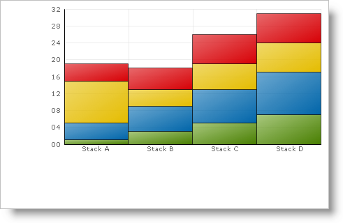

////

|metadata|
{
    "name": "chart-binding-to-a-dataset-dataview-or-datatable",
    "controlName": ["{WawChartName}"],
    "tags": [],
    "guid": "{22BCDEB9-9D99-4AC6-A0B2-3F142B8B4934}",  
    "buildFlags": [],
    "createdOn": "0001-01-01T00:00:00Z"
}
|metadata|
////

= Binding to a DataSet, DataView, or DataTable

Some of the data sources that you can bind the Chart control to are the DataSet, DataTable, and DataView.

== Creating the DataTable

The code below shows you how to create the DataTable in code. However, the procedure is essentially the same for binding Chart to the DataSet or DataView.

*In Visual Basic:*

----
Private Function GetStackColumnData() As DataTable
	Dim mydata As New DataTable()
	' Define the columns and their names
	mydata.Columns.Add("Series Label", GetType(String))
	mydata.Columns.Add("Segment A", GetType(Integer))
	mydata.Columns.Add("Segment B", GetType(Integer))
	mydata.Columns.Add("Segment C", GetType(Integer))
	mydata.Columns.Add("Segment D", GetType(Integer))
	' Add the rows of data
	mydata.Rows.Add(New [Object]() {"Stack A", 1, 4, 10, 4})
	mydata.Rows.Add(New [Object]() {"Stack B", 3, 6, 4, 5})
	mydata.Rows.Add(New [Object]() {"Stack C", 5, 8, 6, 7})
	mydata.Rows.Add(New [Object]() {"Stack D", 7, 10, 7, 7})
	Return mydata
End Function
----

*In C#:*

----
private DataTable GetStackColumnData()
{
	DataTable mydata = new DataTable();
	// Define the columns and their names
	mydata.Columns.Add("Series Label", typeof(string));
	mydata.Columns.Add("Segment A", typeof(int));
	mydata.Columns.Add("Segment B", typeof(int));
	mydata.Columns.Add("Segment C", typeof(int));
	mydata.Columns.Add("Segment D", typeof(int));
	// Add the rows of data
	mydata.Rows.Add(new Object[] {"Stack A",1,4,10,4});
	mydata.Rows.Add(new Object[] {"Stack B",3,6,4,5});
	mydata.Rows.Add(new Object[] {"Stack C",5,8,6,7});
	mydata.Rows.Add(new Object[] {"Stack D",7,10,7,7});
	return mydata;
}
----

== Binding Chart to the DataTable

To bind the chart to the DataTable created in the example code above, set the DataSource property of the chart to the newly created method. The following example code demonstrates how to bind Chart to the DataTable. You can use the example code to bind Chart to a DataSet or DataView, except you must change the GetStackColumnData method to something that returns a DataSet or DataView.

.Note
[NOTE]
====
You may need to specify which table to use from the DataSet, or which view to use from the DataView.
====

*In Visual Basic:*

----
Private Sub Binding_to_a_DataSet_DataView_or_DataTable_Load( _
  ByVal sender As System.Object, _
 ByVal e As System.EventArgs) Handles MyBase.Load
	Me.UltraChart1.DataSource = GetStackColumnData()
End Sub
----

*In C#:*

----
private void Binding_to_a_DataSet_DataView_or_DataTable_Load(object sender, 
  EventArgs e)
{
	this.ultraChart1.DataSource = GetStackColumnData();
}
----

