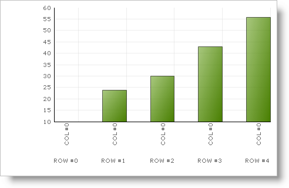

////

|metadata|
{
    "name": "chart-binding-to-an-array",
    "controlName": ["{WawChartName}"],
    "tags": [],
    "guid": "{76316FBF-C6E4-48F0-AEB0-23F46528C197}",  
    "buildFlags": [],
    "createdOn": "0001-01-01T00:00:00Z"
}
|metadata|
////

= Binding to an Array

One of the data sources that you can bind the Chart control to is an Array. The following example code demonstrates how to bind the Chart control to an array.

*In Visual Basic:*

----
Private Sub Binding_to_an_Array_Load(ByVal sender As System.Object, _
  ByVal e As System.EventArgs) Handles MyBase.Load
	Dim myIntArray() As Integer = {10, 24, 30, 43, 56}
	Me.UltraChart1.DataSource = myIntArray
End Sub
----

*In C#:*

----
private void Binding_to_an_Array_Load(object sender, EventArgs e)
{
	this.ultraChart1.DataSource = new int[5] { 10, 24, 30, 43, 56 };
}
----

