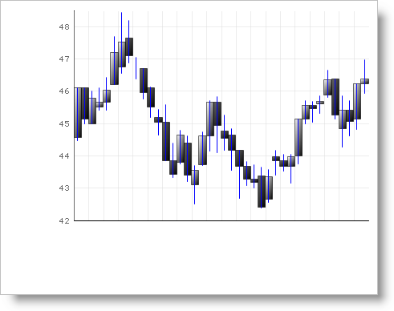

////

|metadata|
{
    "name": "chart-binding-to-an-xml-file",
    "controlName": ["{WawChartName}"],
    "tags": [],
    "guid": "{F73703ED-D59B-482C-8D86-9BC5EF0D634D}",  
    "buildFlags": [],
    "createdOn": "0001-01-01T00:00:00Z"
}
|metadata|
////

= Binding to an XML File

One of the data sources that you can bind the Chart control is an XML file. To bind the Chart control to XML data, the XML must follow the schema requirements of an ADO.NET data set, and the XML must have the ability to be read using the DataSet.ReadXml method.

=== To bind Chart to an XML file:

[start=1]
. Copy the XML (see the XML data at the end of this topic) and paste it into an XML file.
[start=2]
. Bind the Chart control to the XML file using the example code below.

.Note
[NOTE]
====
There is extra code on the right-hand side that is forming the full path to the file.
====

*In Visual Basic:*

----
Private Sub Binding_to_an_XML_File_Load(ByVal sender As System.Object, _
  ByVal e As System.EventArgs) Handles MyBase.Load
	Me.UltraChart1.DataSource = "CandleData.xml"
End Sub
----

*In C#:*

----
private void Binding_to_an_XML_File_Load(object sender, System.EventArgs e)
{
	this.ultraChart1.DataSource = "CandleData.xml";
}
----

The xml file used in the code snippet above is available link:chart-sample-xml-file-candledata.html[here].

