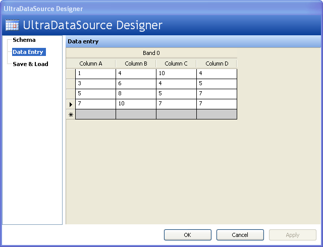

////

|metadata|
{
    "name": "chart-binding-to-windatasource",
    "controlName": ["{WawChartName}"],
    "tags": [],
    "guid": "{6344A9C8-95F5-4225-8506-6549FFF6145C}",  
    "buildFlags": ["win-forms","win-forms-old"],
    "createdOn": "0001-01-01T00:00:00Z"
}
|metadata|
////

= Binding to WinDataSource

One of the data sources that you can bind the WinChart™ control is the WinDataSource component. This topic will guide through the steps to bind your chart to WinDataSource.

.Note
[NOTE]
====
To learn how to work with the WinDataSource component, see link:windatasource-using-the-windatasource-designer.html[Using the WinDataSource Designer].
====

Set up your WinDataSource with valid data for the chart type that you want to bind. The screen shot below shows the Data Entry form of the WinDataSource designer, with a sample set of data to which the Chart control can be bound. The example code below demonstrates how to bind Chart to WinDataSource.

.Note
[NOTE]
====
Make sure you change each DataColumns DataType to be of numeric type, otherwise you will get an exception at run time.
====

*In Visual Basic:*

----
Private Sub Binding_to_WinDataSource_Load(ByVal sender As System.Object, _
  ByVal e As System.EventArgs) Handles MyBase.Load
	Me.UltraChart1.DataSource = Me.UltraDataSource1
End Sub
----

*In C#:*

----
private void Binding_to_WinDataSource_Load(object sender, EventArgs e)
{
	this.ultraChart1.DataSource = this.ultraDataSource1;
}
----