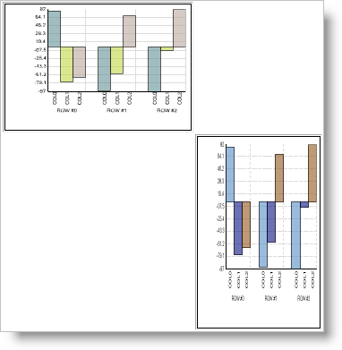

////

|metadata|
{
    "name": "chart-change-a-webcharts-height-and-width-using-percentage-values",
    "controlName": ["{WawChartName}"],
    "tags": [],
    "guid": "{EDEFF1F6-98B6-40E4-B009-F76287087FDB}",  
    "buildFlags": ["asp-net","aspnet-old"],
    "createdOn": "0001-01-01T00:00:00Z"
}
|metadata|
////

= Change a WebChart's Height and Width Using Percentage Values

When the  pick:[asp-net=" link:{ApiPlatform}webui.ultrawebchart{ApiVersion}~infragistics.ultrachart.shared.styles.renderingtype.html[RenderingType]"]  pick:[aspnet-old=" link:{ApiPlatform}webui.ultrawebchart{ApiVersion}~infragistics.ultrachart.shared.styles.renderingtype.html[RenderingType]"]  property is set to SVG or Flash, the height and width of the control can be set as a percentage. Simply set the Height and Width properties to percentage values to see the result of this. Unlike image rendering, these rendering types respect percentage height and width, and WebChart™ will scale dynamically on the client.

The following code example shows WebChart with the height and width set as percentages.

----
<table border="1" >
   <tr >
      <td >
        <igchart:UltraChart runat="server" id="UltraChart1" 
          Height="100%" Width="100%">
	  <DeploymentScenario RenderingType="Flash" />
        </igchart:UltraChart>
      </td>
      <td>
      </td>
   </tr>
   <tr >
      <td>
      </td>
      <td >
        <igchart:UltraChart runat="server" id="UltraChart2" 
	  Height="100%" Width="100%">
	  <DeploymentScenario RenderingType="Svg" />
	</igchart:UltraChart>
      </td>
   </tr>
</table>
----

== Related Topic

link:chart-rendering-types.html[Rendering Types]