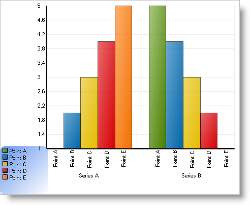

////

|metadata|
{
    "name": "chart-creating-a-composite-chart-in-code-part-1-of-2",
    "controlName": ["{WawChartName}"],
    "tags": [],
    "guid": "{249EF87D-397F-4180-A5B8-0BF6887C141A}",  
    "buildFlags": [],
    "createdOn": "0001-01-01T00:00:00Z"
}
|metadata|
////

= Creating a Composite Chart in Code (Part 1 of 2)

This tutorial walks through the process of creating a link:chart-composite-chart.html[composite chart] using the Forms Designers (the same designers are used for the Chart control). By the end of this tutorial, you will be familiar with every aspect of designing a composite chart.

All the code in this tutorial requires the following Imports or using directives at the top of the code file:

*In Visual Basic:*

----
Imports Infragistics.UltraChart.Shared.Styles
Imports Infragistics.UltraChart.Resources.Appearance
Imports Infragistics.UltraChart.Core.Layers
----

*In C#:*

----
using Infragistics.UltraChart.Shared.Styles;
using Infragistics.UltraChart.Resources.Appearance;
using Infragistics.UltraChart.Core.Layers;
----

In this tutorial, a function called GetData() is referred to. This is used for demonstration purposes whenever an external data source is applicable. In an actual application, this code would most likely get a table from a database. Here is the source code for the GetData() function:

*In Visual Basic:*

----
Private Shared Function GetData() As DataTable
Dim table As New DataTable()
	table.Columns.Add("Label Column", GetType(String))
	table.Columns.Add("Value Column", GetType(Double))
	table.Columns.Add("Another Value Column", GetType(Double))
	table.Rows.Add(New Object() {"Point A", 1.0, 3.0})
	table.Rows.Add(New Object() {"Point B", 2.0, 2.0})
	table.Rows.Add(New Object() {"Point C", 3.0, 1.0})
	table.Rows.Add(New Object() {"Point D", 4.0, 2.0})
	table.Rows.Add(New Object() {"Point E", 5.0, 3.0})
	Return table
End Function
----

*In C#:*

----
private static DataTable GetData()
{
	DataTable table = new DataTable();
	table.Columns.Add("Label Column", typeof(string));
	table.Columns.Add("Value Column", typeof(double));
	table.Columns.Add("Another Value Column", typeof(double));
	table.Rows.Add(new object[] {"Point A", 1.0, 3.0});
	table.Rows.Add(new object[] {"Point B", 2.0, 2.0});
	table.Rows.Add(new object[] {"Point C", 3.0, 1.0});
	table.Rows.Add(new object[] {"Point D", 4.0, 2.0});
	table.Rows.Add(new object[] {"Point E", 5.0, 3.0});
	return table;
}
----

== Basic Settings for a Composite Chart

There are several steps required to set up the first chart layer in a composite chart. Since composite charts allow complete control over the chart, it is necessary to add all the individual elements, such as a chart area, axes, and a chart layer manually. This first section walks through these first steps in detail.

At the end of this section, you will have created a composite chart with two axes, a single chart layer, and a legend.

[start=1]
. Change the  pick:[win-forms=" link:infragistics4.win.ultrawinchart.v{ProductVersion}~infragistics.win.ultrawinchart.ultrachart~charttype.html[ChartType]"]  pick:[asp-net=" link:infragistics4.webui.ultrawebchart.v{ProductVersion}~infragistics.webui.ultrawebchart.ultrachart~charttype.html[ChartType]"]  pick:[aspnet-old=" link:infragistics4.webui.ultrawebchart.v{ProductVersion}~infragistics.webui.ultrawebchart.ultrachart~charttype.html[ChartType]"]  property to "Composite."

*In Visual Basic:*

----
Me.UltraChart1.ChartType = ChartType.Composite
----

*In C#:*

----
this.ultraChart1.ChartType = ChartType.Composite;
----

[start=2]
. Add a  pick:[win-forms=" link:infragistics4.win.ultrawinchart.v{ProductVersion}~infragistics.ultrachart.resources.appearance.chartarea.html[ChartArea]"]  pick:[asp-net=" link:infragistics4.webui.ultrawebchart.v{ProductVersion}~infragistics.ultrachart.resources.appearance.chartarea.html[ChartArea]"]  pick:[aspnet-old=" link:infragistics4.webui.ultrawebchart.v{ProductVersion}~infragistics.ultrachart.resources.appearance.chartarea.html[ChartArea]"]  to the  pick:[win-forms=" link:infragistics4.win.ultrawinchart.v{ProductVersion}~infragistics.ultrachart.resources.appearance.compositechartappearance~chartareas.html[ChartAreas]"]  pick:[asp-net=" link:infragistics4.webui.ultrawebchart.v{ProductVersion}~infragistics.ultrachart.resources.appearance.compositechartappearance~chartareas.html[ChartAreas]"]  pick:[aspnet-old=" link:infragistics4.webui.ultrawebchart.v{ProductVersion}~infragistics.ultrachart.resources.appearance.chartareacollection.html[ChartAreas]"]  collection.

*In Visual Basic:*

----
Dim myChartArea As New ChartArea()
Me.UltraChart1.CompositeChart.ChartAreas.Add(myChartArea)
----

*In C#:*

----
ChartArea myChartArea = new ChartArea();
this.ultraChart1.CompositeChart.ChartAreas.Add(myChartArea);
----

[start=3]
. Add some Axes to the ChartArea.

Create some  pick:[win-forms=" link:infragistics4.win.ultrawinchart.v{ProductVersion}~infragistics.ultrachart.resources.appearance.axisitem.html[AxisItem]"]  pick:[asp-net=" link:infragistics4.webui.ultrawebchart.v{ProductVersion}~infragistics.ultrachart.resources.appearance.axisitem.html[AxisItem]"]  pick:[aspnet-old=" link:infragistics4.webui.ultrawebchart.v{ProductVersion}~infragistics.ultrachart.resources.appearance.axisitem.html[AxisItem]"]  objects with properties matching the requirements of the first chart layer, and add them to the ChartArea's Axes collection.

The first  pick:[win-forms=" link:infragistics4.win.ultrawinchart.v{ProductVersion}~infragistics.ultrachart.resources.appearance.chartlayerappearance.html[ChartLayer]"]  pick:[asp-net=" link:infragistics4.webui.ultrawebchart.v{ProductVersion}~infragistics.ultrachart.resources.appearance.chartlayerappearance.html[ChartLayer]"]  pick:[aspnet-old=" link:infragistics4.webui.ultrawebchart.v{ProductVersion}~infragistics.ultrachart.resources.appearance.chartlayerappearance.html[ChartLayer]"]  in this tutorial will be a column chart layer, so the axes created here match the requirements for a column chart.

*In Visual Basic:*

----
Dim axisX As New AxisItem()
axisX.OrientationType = AxisNumber.X_Axis
axisX.DataType = AxisDataType.String
axisX.SetLabelAxisType = SetLabelAxisType.GroupBySeries
axisX.Labels.ItemFormatString = "<ITEM_LABEL>"
axisX.Labels.Orientation = TextOrientation.VerticalLeftFacing
Dim axisY As New AxisItem()
axisY.OrientationType = AxisNumber.Y_Axis
axisY.DataType = AxisDataType.Numeric
axisY.Labels.ItemFormatString="<DATA_VALUE:0.#>"
myChartArea.Axes.Add(axisX)
myChartArea.Axes.Add(axisY)
----

*In C#:*

----
AxisItem axisX = new AxisItem();
axisX.OrientationType = AxisNumber.X_Axis;
axisX.DataType = AxisDataType.String;
axisX.SetLabelAxisType = SetLabelAxisType.GroupBySeries;
axisX.Labels.ItemFormatString = "<ITEM_LABEL>";
axisX.Labels.Orientation = TextOrientation.VerticalLeftFacing;
AxisItem axisY = new AxisItem();
axisY.OrientationType = AxisNumber.Y_Axis;
axisY.DataType = AxisDataType.Numeric;
axisY.Labels.ItemFormatString="<DATA_VALUE:0.#>";
myChartArea.Axes.Add(axisX);
myChartArea.Axes.Add(axisY);
----

[start=4]
. Add some data series to the  pick:[win-forms=" link:infragistics4.win.ultrawinchart.v{ProductVersion}~infragistics.ultrachart.resources.appearance.compositechartappearance~series.html[Series]"]  pick:[asp-net=" link:infragistics4.webui.ultrawebchart.v{ProductVersion}~infragistics.ultrachart.resources.appearance.compositechartappearance~series.html[Series]"]  pick:[aspnet-old=" link:infragistics4.webui.ultrawebchart.v{ProductVersion}~infragistics.ultrachart.resources.appearance.compositechartappearance~series.html[Series]"]  collection.

Since the first chart layer in this tutorial will be a column chart, we will be generating NumericSeries for its data. Series data can be created in code or retrieved from a  pick:[win-forms=" link:infragistics4.win.ultrawinchart.v{ProductVersion}~infragistics.ultrachart.data.series.seriesdataappearance~datasource.html[DataSource]"]  pick:[asp-net=" link:infragistics4.webui.ultrawebchart.v{ProductVersion}~infragistics.ultrachart.data.series.seriesdataappearance~datasource.html[DataSource]"]  pick:[aspnet-old=" link:infragistics4.webui.ultrawebchart.v{ProductVersion}~infragistics.ultrachart.data.series.seriesdataappearance~datasource.html[DataSource]"] . The following two functions can be used to provide sample data:

*In Visual Basic:*

----
Private Shared Function GetNumericSeriesBound() As NumericSeries
	Dim series As New NumericSeries()
	series.Label = "Series A"
	' this code populates the series from an external data source
	Dim table As DataTable = GetData()
	series.Data.DataSource = table
	series.Data.LabelColumn = "Label Column"
	series.Data.ValueColumn = "Value Column"
	Return series
End Function
Private Shared Function GetNumericSeriesUnBound() As NumericSeries
	Dim series As New NumericSeries()
	series.Label = "Series B"
	' this code populates the series using unbound data
	series.Points.Add(New NumericDataPoint(5.0, "Point A", False))
	series.Points.Add(New NumericDataPoint(4.0, "Point B", False))
	series.Points.Add(New NumericDataPoint(3.0, "Point C", False))
	series.Points.Add(New NumericDataPoint(2.0, "Point D", False))
	series.Points.Add(New NumericDataPoint(1.0, "Point E", False))
	Return series
End Function
----

*In C#:*

----
private static NumericSeries GetNumericSeriesBound()
{
	NumericSeries series = new NumericSeries();
	series.Label = "Series A";
	// this code populates the series from an external data source
	DataTable table = GetData();
	series.Data.DataSource = table;
	series.Data.LabelColumn = "Label Column";
	series.Data.ValueColumn = "Value Column";
	return series;
}
private static NumericSeries GetNumericSeriesUnBound()
{
	NumericSeries series = new NumericSeries();
	series.Label = "Series B";
	// this code populates the series using unbound data
	series.Points.Add(new NumericDataPoint(5.0, "Point A", false));
	series.Points.Add(new NumericDataPoint(4.0, "Point B", false));
	series.Points.Add(new NumericDataPoint(3.0, "Point C", false));
	series.Points.Add(new NumericDataPoint(2.0, "Point D", false));
	series.Points.Add(new NumericDataPoint(1.0, "Point E", false));
	return series;
}
----

The series should be added to the chart's series collection:

*In Visual Basic:*

----
Dim seriesA As NumericSeries = GetNumericSeriesBound()
Dim seriesB As NumericSeries = GetNumericSeriesUnBound()
Me.UltraChart1.CompositeChart.Series.Add(seriesA)
Me.UltraChart1.CompositeChart.Series.Add(seriesB)
----

*In C#:*

----
NumericSeries seriesA = GetNumericSeriesBound();
NumericSeries seriesB = GetNumericSeriesUnBound();
this.ultraChart1.CompositeChart.Series.Add(seriesA);
this.ultraChart1.CompositeChart.Series.Add(seriesB);
----

[start=5]
. Add a chart layer.

A  pick:[win-forms=" link:infragistics4.win.ultrawinchart.v{ProductVersion}~infragistics.ultrachart.resources.appearance.chartlayerappearance.html[ChartLayerAppearance]"]  pick:[asp-net=" link:infragistics4.webui.ultrawebchart.v{ProductVersion}~infragistics.ultrachart.resources.appearance.chartlayerappearance.html[ChartLayerAppearance]"]  pick:[aspnet-old=" link:infragistics4.webui.ultrawebchart.v{ProductVersion}~infragistics.ultrachart.resources.appearance.chartlayerappearance.html[ChartLayerAppearance]"]  object must be created, and the axis and data requirements for its ChartType must be satisfied. For information on the axis and data requirements for each chart layer, see link:chart-chart-data-requirements.html[Chart Data Requirements].

The ChartArea property must be set, and the Axis properties must also be set if it is required by the current ChartType. Series which were previously added to the chart's Series collection must also be added to the ChartLayer's Series collection.

After the ChartLayerAppearance object is created, it must be added to the  pick:[win-forms=" link:infragistics4.win.ultrawinchart.v{ProductVersion}~infragistics.ultrachart.resources.appearance.compositechartappearance~chartlayers.html[ChartLayers]"]  pick:[asp-net=" link:infragistics4.webui.ultrawebchart.v{ProductVersion}~infragistics.ultrachart.resources.appearance.compositechartappearance~chartlayers.html[ChartLayers]"]  pick:[aspnet-old=" link:infragistics4.webui.ultrawebchart.v{ProductVersion}~infragistics.ultrachart.resources.appearance.compositechartappearance~chartlayers.html[ChartLayers]"]  collection.

*In Visual Basic:*

----
Dim myColumnLayer As New ChartLayerAppearance()
myColumnLayer.ChartType = ChartType.ColumnChart
myColumnLayer.ChartArea = myChartArea
myColumnLayer.AxisX = axisX
myColumnLayer.AxisY = axisY
myColumnLayer.Series.Add(seriesA)
myColumnLayer.Series.Add(seriesB)
Me.UltraChart1.CompositeChart.ChartLayers.Add(myColumnLayer)
----

*In C#:*

----
ChartLayerAppearance myColumnLayer = new ChartLayerAppearance();
myColumnLayer.ChartType = ChartType.ColumnChart;
myColumnLayer.ChartArea = myChartArea;
myColumnLayer.AxisX = axisX;
myColumnLayer.AxisY = axisY;
myColumnLayer.Series.Add(seriesA);
myColumnLayer.Series.Add(seriesB);
this.ultraChart1.CompositeChart.ChartLayers.Add(myColumnLayer);
----

[start=6]
. Add a legend to the chart.

To add a chart legend, create a  pick:[win-forms=" link:infragistics4.win.ultrawinchart.v{ProductVersion}~infragistics.ultrachart.resources.appearance.compositelegend.html[CompositeLegend]"]  pick:[asp-net=" link:infragistics4.webui.ultrawebchart.v{ProductVersion}~infragistics.ultrachart.resources.appearance.compositelegend.html[CompositeLegend]"]  pick:[aspnet-old=" link:infragistics4.webui.ultrawebchart.v{ProductVersion}~infragistics.ultrachart.resources.appearance.compositelegend.html[CompositeLegend]"]  object and add it to the Legends collection. Any ChartLayers that the legend should consume should be added to the legend's ChartLayers collection.

By default, the legend's bounds are set to Rectangle.Empty, so the legend occupies the entire surface of the chart and renders items starting in the top-left corner. The legend's bounds can be customized to place the legend anywhere on the chart, and the legend's Border and background  pick:[win-forms=" link:infragistics4.win.ultrawinchart.v{ProductVersion}~infragistics.ultrachart.resources.appearance.paintelement.html[PaintElement]"]  pick:[asp-net=" link:infragistics4.webui.ultrawebchart.v{ProductVersion}~infragistics.ultrachart.resources.appearance.paintelement.html[PaintElement]"]  pick:[aspnet-old=" link:infragistics4.webui.ultrawebchart.v{ProductVersion}~infragistics.ultrachart.resources.appearance.paintelement.html[PaintElement]"]  can be customized as well.

For information on how to change the appearance of your chart legend, see link:chart-customize-chart-legends.html[Customize Chart Legends].

*In Visual Basic:*

----
Dim myLegend As New CompositeLegend()
myLegend.ChartLayers.Add(myColumnLayer)
myLegend.Bounds = New Rectangle(0, 75, 20, 25)
myLegend.BoundsMeasureType = MeasureType.Percentage
myLegend.PE.ElementType = PaintElementType.Gradient
myLegend.PE.FillGradientStyle = GradientStyle.ForwardDiagonal
myLegend.PE.Fill = Color.CornflowerBlue
myLegend.PE.FillStopColor = Color.Transparent
myLegend.Border.CornerRadius = 10
myLegend.Border.Thickness = 0
Me.UltraChart1.CompositeChart.Legends.Add(myLegend)
----

*In C#:*

----
CompositeLegend myLegend = new CompositeLegend();
myLegend.ChartLayers.Add(myColumnLayer);
myLegend.Bounds = new Rectangle(0, 75, 20, 25);
myLegend.BoundsMeasureType = MeasureType.Percentage;
myLegend.PE.ElementType = PaintElementType.Gradient;
myLegend.PE.FillGradientStyle = GradientStyle.ForwardDiagonal;
myLegend.PE.Fill = Color.CornflowerBlue;
myLegend.PE.FillStopColor = Color.Transparent;
myLegend.Border.CornerRadius = 10;
myLegend.Border.Thickness = 0;
this.ultraChart1.CompositeChart.Legends.Add(myLegend);
----

Now run the project and the chart should something like this:

== Related Topics

link:chart-creating-a-composite-chart-in-code-part-2-of-2.html[Creating a Composite Chart in Code (Part 2 of 2)]

link:chart-axis-requirements-for-composite-charts.html[Axis Requirements for Composite Charts]

link:chart-layers.html[Layers]