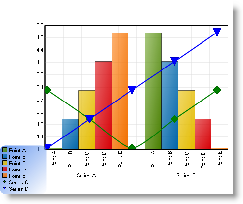

////

|metadata|
{
    "name": "chart-creating-a-composite-chart-in-code-part-2-of-2",
    "controlName": ["{WawChartName}"],
    "tags": [],
    "guid": "{5A52C272-C4B8-4463-893B-C0F3FC5A77A0}",  
    "buildFlags": [],
    "createdOn": "0001-01-01T00:00:00Z"
}
|metadata|
////

= Creating a Composite Chart in Code (Part 2 of 2)

This topic expands on the link:chart-creating-a-composite-chart-in-code-part-1-of-2.html[Creating a Composite Chart in Code (Part 1 of 2)] topic, and demonstrates the power and flexibility of link:chart-composite-chart.html[composite charts] by adding more layers, chart areas, and legends.

[start=1]
. *Add another axis to the ChartArea.*

Before adding another chart layer, it is necessary to add at least one more axis. This is required because most chart layers require an axis for labels, and chart layers cannot share a label axis.

Go back to the ChartArea's  pick:[win-forms=" link:{ApiPlatform}win.ultrawinchart{ApiVersion}~infragistics.ultrachart.resources.appearance.chartarea~axes.html[Axes]"]  pick:[asp-net=" link:{ApiPlatform}webui.ultrawebchart{ApiVersion}~infragistics.ultrachart.resources.appearance.chartarea~axes.html[Axes]"]  pick:[aspnet-old=" link:{ApiPlatform}webui.ultrawebchart{ApiVersion}~infragistics.ultrachart.resources.appearance.chartarea~axes.html[Axes]"]  collection and add a horizontal axis and set its  pick:[win-forms=" link:{ApiPlatform}win.ultrawinchart{ApiVersion}~infragistics.ultrachart.resources.appearance.axisitem~orientationtype.html[OrientationType]"]  pick:[asp-net=" link:{ApiPlatform}webui.ultrawebchart{ApiVersion}~infragistics.ultrachart.resources.appearance.axisitem~orientationtype.html[OrientationType]"]  pick:[aspnet-old=" link:{ApiPlatform}webui.ultrawebchart{ApiVersion}~infragistics.ultrachart.resources.appearance.axisitem~orientationtype.html[OrientationType]"]  property to "X2_Axis." This will add an axis oriented from the top of the chart.

Set the  pick:[win-forms=" link:{ApiPlatform}win.ultrawinchart{ApiVersion}~infragistics.ultrachart.resources.appearance.axisitem~datatype.html[DataType]"]  pick:[asp-net=" link:{ApiPlatform}webui.ultrawebchart{ApiVersion}~infragistics.ultrachart.resources.appearance.axisitem~datatype.html[DataType]"]  pick:[aspnet-old=" link:{ApiPlatform}webui.ultrawebchart{ApiVersion}~infragistics.ultrachart.resources.appearance.axisitem~datatype.html[DataType]"]  to Numeric. Set the  pick:[win-forms=" link:{ApiPlatform}win.ultrawinchart{ApiVersion}~infragistics.ultrachart.resources.appearance.axislabelappearance~itemformat.html[ItemLabels.ItemFormat]"]  pick:[asp-net=" link:{ApiPlatform}webui.ultrawebchart{ApiVersion}~infragistics.ultrachart.resources.appearance.axislabelappearance~itemformat.html[ItemLabels.ItemFormat]"]  pick:[aspnet-old=" link:{ApiPlatform}webui.ultrawebchart{ApiVersion}~infragistics.ultrachart.resources.appearance.axislabelappearance~itemformat.html[ItemLabels.ItemFormat]"]  to "DataValue" so that data values can be displayed on this axis. Set the  pick:[win-forms=" link:{ApiPlatform}win.ultrawinchart{ApiVersion}~infragistics.ultrachart.resources.appearance.axislabelappearancebase~orientation.html[ItemLabels.Orientation]"]  pick:[asp-net=" link:{ApiPlatform}webui.ultrawebchart{ApiVersion}~infragistics.ultrachart.resources.appearance.axislabelappearancebase~orientation.html[ItemLabels.Orientation]"]  pick:[aspnet-old=" link:{ApiPlatform}webui.ultrawebchart{ApiVersion}~infragistics.ultrachart.resources.appearance.axislabelappearancebase~orientation.html[ItemLabels.Orientation]"]  to "VerticalLeftFacing." Then change the  pick:[win-forms=" link:{ApiPlatform}win.ultrawinchart{ApiVersion}~infragistics.ultrachart.resources.appearance.axisappearance~extent.html[Extent]"]  pick:[asp-net=" link:{ApiPlatform}webui.ultrawebchart{ApiVersion}~infragistics.ultrachart.resources.appearance.axisappearance~extent.html[Extent]"]  pick:[aspnet-old=" link:{ApiPlatform}webui.ultrawebchart{ApiVersion}~infragistics.ultrachart.resources.appearance.axisappearance~extent.html[Extent]"]  to 40 to allow more space for the chart.

*In Visual Basic:*

----
Dim axisX2 As New AxisItem()
axisX2.OrientationType = AxisNumber.X2_Axis
axisX2.DataType = AxisDataType.Numeric
axisX2.Labels.ItemFormatString = ""
axisX2.Labels.Orientation = TextOrientation.VerticalLeftFacing
axisX2.Extent = 40
myChartArea.Axes.Add(axisX2)
----

*In C#:*

----
AxisItem axisX2 = new AxisItem();
axisX2.OrientationType = AxisNumber.X2_Axis;
axisX2.DataType = AxisDataType.Numeric;
axisX2.Labels.ItemFormatString = "";
axisX2.Labels.Orientation = TextOrientation.VerticalLeftFacing;
axisX2.Extent = 40;
myChartArea.Axes.Add(axisX2);
----

[start=2]
. *Add another data series.*

The next chart layer will be for a ScatterChart, which requires XY data; so it will be necessary to add one or more XYSeries.

Additionally, this code demonstrates the use of the  pick:[win-forms=" link:{ApiPlatform}win.ultrawinchart{ApiVersion}~infragistics.ultrachart.data.series.seriesbase~pes.html[Series.PEs]"]  pick:[asp-net=" link:{ApiPlatform}webui.ultrawebchart{ApiVersion}~infragistics.ultrachart.data.series.seriesbase~pes.html[Series.PEs]"]  pick:[aspnet-old=" link:{ApiPlatform}webui.ultrawebchart{ApiVersion}~infragistics.ultrachart.data.series.seriesbase~pes.html[Series.PEs]"]  property to customize the colors used when rendering a series.

Functions which provide sample XY data, GetXYSeriesBound() and GetXYSeriesUnBound(), are provided:

*In Visual Basic:*

----
Private Function GetXYSeriesBound() As XYSeries
	Dim series As New XYSeries()
	series.Label = "Series C"
	' this code populates the series from an external data source
	Dim table As DataTable = GetData()
	series.Data.DataSource = table
	series.Data.LabelColumn = "Label Column"
	series.Data.ValueXColumn = "Value Column"
	series.Data.ValueYColumn = "Another Value Column"
	Return series
End Function
Private Function GetXYSeriesUnBound() As XYSeries
	Dim series As New XYSeries()
	series.Label = "Series D"
	' this code populates the series using unbound data
	series.Points.Add(New XYDataPoint(1.0, 1.0, "Point A", False))
	series.Points.Add(New XYDataPoint(2.0, 2.0, "Point B", False))
	series.Points.Add(New XYDataPoint(3.0, 3.0, "Point C", False))
	series.Points.Add(New XYDataPoint(4.0, 4.0, "Point D", False))
	series.Points.Add(New XYDataPoint(5.0, 5.0, "Point E", False))
	Return series
End Function
----

*In C#:*

----
private XYSeries GetXYSeriesBound()
{
	XYSeries series = new XYSeries();
	series.Label = "Series C";
	// this code populates the series from an external data source
	DataTable table = GetData();
	series.Data.DataSource = table;
	series.Data.LabelColumn = "Label Column";
	series.Data.ValueXColumn = "Value Column";
	series.Data.ValueYColumn = "Another Value Column";
	return series;
}
private XYSeries GetXYSeriesUnBound()
{
	XYSeries series = new XYSeries();
	series.Label = "Series D";
	// this code populates the series using unbound data
	series.Points.Add(new XYDataPoint(1.0, 1.0, "Point A", false));
	series.Points.Add(new XYDataPoint(2.0, 2.0, "Point B", false));
	series.Points.Add(new XYDataPoint(3.0, 3.0, "Point C", false));
	series.Points.Add(new XYDataPoint(4.0, 4.0, "Point D", false));
	series.Points.Add(new XYDataPoint(5.0, 5.0, "Point E", false));
	return series;
}
----

*In Visual Basic:*

----
Dim seriesC As XYSeries = GetXYSeriesBound()
Dim seriesD As XYSeries = GetXYSeriesUnBound()
Me.UltraChart1.CompositeChart.Series.Add(seriesC)
Me.UltraChart1.CompositeChart.Series.Add(seriesD)
' Customize the series colors.
seriesC.PEs.Add(New PaintElement(Color.Green))
seriesD.PEs.Add(New PaintElement(Color.Blue))
----

*In C#:*

----
XYSeries seriesC = GetXYSeriesBound();
XYSeries seriesD = GetXYSeriesUnBound();
this.ultraChart1.CompositeChart.Series.Add(seriesC);
this.ultraChart1.CompositeChart.Series.Add(seriesD);
// Customize the series colors.
seriesC.PEs.Add(new PaintElement(Color.Green));
seriesD.PEs.Add(new PaintElement(Color.Blue));
----

[start=3]
. *Add another chart layer.*

This code adds a chart layer with a  pick:[win-forms=" link:{ApiPlatform}win.ultrawinchart{ApiVersion}~infragistics.ultrachart.resources.appearance.chartlayerappearance~charttype.html[ChartType]"]  pick:[asp-net=" link:{ApiPlatform}webui.ultrawebchart{ApiVersion}~infragistics.ultrachart.resources.appearance.chartlayerappearance~chartlayer.html[ChartType]"]  pick:[aspnet-old=" link:{ApiPlatform}webui.ultrawebchart{ApiVersion}~infragistics.ultrachart.resources.appearance.chartlayerappearance~charttype.html[ChartType]"]  of ScatterChart, then sets up its  pick:[win-forms=" link:{ApiPlatform}win.ultrawinchart{ApiVersion}~infragistics.ultrachart.resources.appearance.chartarea.html[ChartArea]"]  pick:[asp-net=" link:{ApiPlatform}webui.ultrawebchart{ApiVersion}~infragistics.ultrachart.resources.appearance.chartarea.html[ChartArea]"]  pick:[aspnet-old=" link:{ApiPlatform}webui.ultrawebchart{ApiVersion}~infragistics.ultrachart.resources.appearance.chartarea.html[ChartArea]"]  and Axes and adds the XY series to it.

It also demonstrates the use of the  pick:[win-forms=" link:{ApiPlatform}win.ultrawinchart{ApiVersion}~infragistics.ultrachart.resources.appearance.charttypeappearance.html[ChartLayer.ChartTypeAppearance]"]  pick:[asp-net=" link:{ApiPlatform}webui.ultrawebchart{ApiVersion}~infragistics.ultrachart.resources.appearance.charttypeappearance.html[ChartLayer.ChartTypeAppearance]"]  pick:[aspnet-old=" link:{ApiPlatform}webui.ultrawebchart{ApiVersion}~infragistics.ultrachart.resources.appearance.charttypeappearance.html[ChartLayer.ChartTypeAppearance]"]  property and adds the ScatterChart layer to the legend.

*In Visual Basic:*

----
Dim myScatterLayer As New ChartLayerAppearance()
myScatterLayer.ChartType = ChartType.ScatterChart
CType(myScatterLayer.ChartTypeAppearance, _
  ScatterChartAppearance).ConnectWithLines = True
myScatterLayer.ChartArea = myChartArea
myScatterLayer.AxisX = axisX2
myScatterLayer.AxisY = axisY
myScatterLayer.Series.Add(seriesC)
myScatterLayer.Series.Add(seriesD)
Me.UltraChart1.CompositeChart.ChartLayers.Add(myScatterLayer)
' Add the second layer to the legend.
myLegend.ChartLayers.Add(myScatterLayer)
----

*In C#:*

----
ChartLayerAppearance myScatterLayer = new ChartLayerAppearance();
myScatterLayer.ChartType = ChartType.ScatterChart;
((ScatterChartAppearance)myScatterLayer.ChartTypeAppearance).ConnectWithLines = 
  true;
myScatterLayer.ChartArea = myChartArea;
myScatterLayer.AxisX = axisX2;
myScatterLayer.AxisY = axisY;
myScatterLayer.Series.Add(seriesC);
myScatterLayer.Series.Add(seriesD);
this.ultraChart1.CompositeChart.ChartLayers.Add(myScatterLayer);
// Add the second layer to the legend.
myLegend.ChartLayers.Add(myScatterLayer);
----

The chart using all the code in the above tutorial should look something like this:

By now you should be familiar enough with the Composite Chart Wizard to experiment on your own. You can add more chart layers, axes, legends, and chart areas freely to suit the needs of your application.