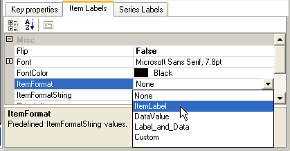

////

|metadata|
{
    "name": "chart-creating-a-composite-chart-using-the-chart-wizard-part-1-of-2",
    "controlName": ["{WawChartName}"],
    "tags": [],
    "guid": "{E48400D5-1AB9-4C7D-831D-55C0F4597BA4}",  
    "buildFlags": [],
    "createdOn": "0001-01-01T00:00:00Z"
}
|metadata|
////

= Creating a Composite Chart Using the Chart Wizard (Part 1 of 2)

This tutorial walks through the process of creating a link:chart-composite-chart.html[composite chart] using the Chart Wizard. By the end of this tutorial, you will be familiar with every aspect of designing a composite chart.

== Basic Settings for a Composite Chart

There are several steps required to set up the first chart layer in a composite chart. Since composite charts allow complete control over the chart, it is necessary to add all the individual elements, such as a chart area, axes, and a chart layer manually. This first section walks through these first steps in detail.

At the end of this section, you will have created a composite chart with two axes, a single chart layer, and a legend.

[start=1]
. Open the Chart Wizard.

The Chart Wizard will open upon first dragging a chart onto a Form. You can also open the wizard by right-clicking the chart control in the designer and selecting "Chart Wizard" from the resulting context menu.

[start=2]
. Enter the Composite Chart Wizard by clicking the blue button or the picture of the composite chart.

The Composite Chart Wizard will appear. The tabs visible at the top of the screen represent the steps of creating a composite chart, but it is possible to move back and forth between these steps, since designing a composite chart is not always a linear process. Clicking the "Next" or "Back" buttons at the bottom of the screen will change the selected tab or return to the "Select a Chart Wizard" screen.

[start=3]
. Add a  pick:[win-forms=" link:infragistics4.win.ultrawinchart.v{ProductVersion}~infragistics.ultrachart.resources.appearance.chartarea.html[ChartArea]"]  pick:[asp-net=" link:infragistics4.webui.ultrawebchart.v{ProductVersion}~infragistics.ultrachart.resources.appearance.chartarea.html[ChartArea]"]  pick:[aspnet-old=" link:infragistics4.webui.ultrawebchart.v{ProductVersion}~infragistics.ultrachart.resources.appearance.chartarea.html[ChartArea]"]  to the  pick:[win-forms=" link:infragistics4.win.ultrawinchart.v{ProductVersion}~infragistics.ultrachart.resources.appearance.compositechartappearance~chartareas.html[ChartAreas]"]  pick:[asp-net=" link:infragistics4.webui.ultrawebchart.v{ProductVersion}~infragistics.ultrachart.resources.appearance.compositechartappearance~chartareas.html[ChartAreas]"]  pick:[aspnet-old=" link:infragistics4.webui.ultrawebchart.v{ProductVersion}~infragistics.ultrachart.resources.appearance.chartareacollection.html[ChartAreas]"]  collection.

This is done by clicking the "Add New" button in the lower left area of the Chart Wizard. The key of the new ChartArea ("area1") will now appear in the ListBox, and the chart surface will turn white. The chart now contains one ChartArea, which covers the entire surface of the control.

Now let's add some  pick:[win-forms=" link:infragistics4.win.ultrawinchart.v{ProductVersion}~infragistics.ultrachart.resources.appearance.chartarea~axes.html[Axes]"]  pick:[asp-net=" link:infragistics4.webui.ultrawebchart.v{ProductVersion}~infragistics.ultrachart.resources.appearance.chartarea~axes.html[Axes]"]  pick:[aspnet-old=" link:infragistics4.webui.ultrawebchart.v{ProductVersion}~infragistics.ultrachart.resources.appearance.chartarea~axes.html[Axes]"]  to this ChartArea.
[start=4]
. Change to the Axes tab and add an x-axis and a y-axis.

Change to the "Axes" tab and the Axes collection for the select ChartArea (area1) will be displayed. Then, click on the "Add New..." button and select "X axis" from the resulting context menu. Click again and select "Y axis." Two axes will then be displayed in the ListBox and on the chart.

Now, two  pick:[win-forms=" link:infragistics4.win.ultrawinchart.v{ProductVersion}~infragistics.ultrachart.resources.appearance.axisitem.html[AxisItem]"]  pick:[asp-net=" link:infragistics4.webui.ultrawebchart.v{ProductVersion}~infragistics.ultrachart.resources.appearance.axisitem.html[AxisItem]"]  pick:[aspnet-old=" link:infragistics4.webui.ultrawebchart.v{ProductVersion}~infragistics.ultrachart.resources.appearance.axisitem.html[AxisItem]"]  objects have been added to the current ChartArea's Axes collection; one with its  pick:[win-forms=" link:infragistics4.win.ultrawinchart.v{ProductVersion}~infragistics.ultrachart.resources.appearance.axislabelappearancebase~orientation.html[Orientation]"]  pick:[asp-net=" link:infragistics4.webui.ultrawebchart.v{ProductVersion}~infragistics.ultrachart.resources.appearance.axislabelappearancebase~orientation.html[Orientation]"]  pick:[aspnet-old=" link:infragistics4.webui.ultrawebchart.v{ProductVersion}~infragistics.ultrachart.resources.appearance.axislabelappearancebase~orientation.html[Orientation]"]  property set to "X_Axis" and the other with Orientation set to "Y_Axis."

[start=5]
. Configure the axes for use with a column chart layer.

The first layer to add in this sample will be a column chart layer. Therefore, we must configure these axes to satisfy the requirements of a column chart layer.

As indicated in the link:chart-axis-requirements-for-composite-charts.html[Axis Requirements for Composite Charts] topic, a column chart layer requires that the x-axis have a DataType of String, and a  pick:[win-forms=" link:infragistics4.win.ultrawinchart.v{ProductVersion}~infragistics.ultrachart.resources.appearance.axisitem~setlabelaxistype.html[SetLabelAxisType]"]  pick:[asp-net=" link:infragistics4.webui.ultrawebchart.v{ProductVersion}~infragistics.ultrachart.resources.appearance.axisitem~setlabelaxistype.html[SetLabelAxisType]"]  pick:[aspnet-old=" link:infragistics4.webui.ultrawebchart.v{ProductVersion}~infragistics.ultrachart.resources.appearance.axisitem~setlabelaxistype.html[SetLabelAxisType]"]  of GroupBySeries, while the y-axis should have a DataType of Numeric. These properties can be set in the  pick:[win-forms=" link:infragistics4.win.ultrawinchart.v{ProductVersion}~infragistics.ultrachart.resources.appearance.axisitem~key.html[Key]"]  pick:[asp-net=" link:infragistics4.webui.ultrawebchart.v{ProductVersion}~infragistics.ultrachart.resources.appearance.axisitem~key.html[Key]"]  pick:[aspnet-old=" link:infragistics4.webui.ultrawebchart.v{ProductVersion}~infragistics.ultrachart.resources.appearance.axisitem~key.html[Key]"]  properties" tab in the lower right area of the chart wizard.

To change the axis being edited, select the axis you wish to edit in the ListBox on the left side of the Chart Wizard.

After the x- and y-axes are configured as described, set the  pick:[win-forms=" link:infragistics4.win.ultrawinchart.v{ProductVersion}~infragistics.ultrachart.resources.appearance.axislabelappearance~itemformat.html[ItemFormat]"]  pick:[asp-net=" link:infragistics4.webui.ultrawebchart.v{ProductVersion}~infragistics.ultrachart.resources.appearance.axislabelappearance~itemformat.html[ItemFormat]"]  pick:[aspnet-old=" link:infragistics4.webui.ultrawebchart.v{ProductVersion}~infragistics.ultrachart.resources.appearance.axislabelappearance~itemformat.html[ItemFormat]"]  for each axis. For a column chart, the ideal configuration is to have the x-axis displaying item labels and the y-axis displaying data values. Therefore, the ItemFormat of the x-axis (axis1) should be set to "ItemLabel," and the ItemFormat of the Y-axis (axis2) should be set to "DataValue." This change can be made by selecting the "Item Labels" tab in the lower right area of the chart wizard and changing the value of the "ItemFormat" property in the properties grid.

It is also ideal to have vertical labels on the x-axis. This change can be made by changing the Orientation property to VerticalLeftFacing (for axis1) in the same properties grid.
[start=6]
. Change to the "Data" tab and add two numeric Series.

This is done by clicking the "Add New..." button on the left side of the chart wizard and selecting "Numeric Series." Do this twice.

Then, enter data in the grid for each of the two series. Just enter some sample data, like:

[cols="a,a"]
|====
|Label
|Value

|Item A
|1

|Item B
|2

|Item C
|3

|Item D
|4

|Item E
|5

|====

Assign labels to your series using the editor in the "Key Properties" tab. Call your series "Series A" and "Series B."

[start=7]
. Change to the "Chart Layers" tab and add a chart layer.

Again, this is done by clicking the "Add New" button. This adds a  pick:[win-forms=" link:infragistics4.win.ultrawinchart.v{ProductVersion}~infragistics.ultrachart.resources.appearance.chartlayerappearance.html[ChartLayer]"]  pick:[asp-net=" link:infragistics4.webui.ultrawebchart.v{ProductVersion}~infragistics.ultrachart.resources.appearance.chartlayerappearance.html[ChartLayer]"]  pick:[aspnet-old=" link:infragistics4.webui.ultrawebchart.v{ProductVersion}~infragistics.ultrachart.resources.appearance.chartlayerappearance.html[ChartLayer]"]  to the  pick:[win-forms=" link:infragistics4.win.ultrawinchart.v{ProductVersion}~infragistics.ultrachart.resources.appearance.compositechartappearance~chartlayers.html[ChartLayers]"]  pick:[asp-net=" link:infragistics4.webui.ultrawebchart.v{ProductVersion}~infragistics.ultrachart.resources.appearance.compositechartappearance~chartlayers.html[ChartLayers]"]  pick:[aspnet-old=" link:infragistics4.webui.ultrawebchart.v{ProductVersion}~infragistics.ultrachart.resources.appearance.compositechartappearance~chartlayers.html[ChartLayers]"]  collection.

Select the "ChartArea and Axes" tab in the lower right area of the chart wizard and configure the ChartArea and axes for the column chart layer. Select area1 for the ChartArea, axis1 for AxisX, and axis2 for AxisY.

Note that the axis requirements for a column chart layer are displayed in red on this tab. When the requirements have been satisfied, the red text will disappear.

Now select the "Series" tab and select both Series to be consumed by the column chart layer.

Now your composite chart is rendering a single chart layer in a single ChartArea with 2 axes.
[start=8]
. Add a  pick:[win-forms=" link:infragistics4.win.ultrawinchart.v{ProductVersion}~infragistics.ultrachart.resources.appearance.compositelegend.html[Legend]"]  pick:[asp-net=" link:infragistics4.webui.ultrawebchart.v{ProductVersion}~infragistics.ultrachart.resources.appearance.compositechartappearance~legends.html[Legend]"]  pick:[aspnet-old=" link:infragistics4.webui.ultrawebchart.v{ProductVersion}~infragistics.ultrachart.resources.appearance.compositechartappearance~legends.html[Legend]"]  to the chart.

Change to the "Legends" tab and click "Add New..." to add a legend.

A composite chart legend consumes chart layers, so select the only chart layer (chartLayer1) in the ChartLayers ListBox in the lower right area of the chart wizard. Selecting layers in this ListBox adds them to the selected legend's ChartLayers collection.

By default, the legend's bounds are set to Rectangle.Empty, so the legend occupies the entire surface of the chart and renders items starting in the top-left corner. The legend's bounds can be customized to place the legend anywhere on the chart, and the legend's background  pick:[win-forms=" link:infragistics4.win.ultrawinchart.v{ProductVersion}~infragistics.ultrachart.resources.appearance.paintelement.html[PaintElement]"]  pick:[asp-net=" link:infragistics4.webui.ultrawebchart.v{ProductVersion}~infragistics.ultrachart.resources.appearance.paintelement.html[PaintElement]"]  pick:[aspnet-old=" link:infragistics4.webui.ultrawebchart.v{ProductVersion}~infragistics.ultrachart.resources.appearance.paintelement.html[PaintElement]"]  can be customized as well. Experiment with these properties in the chart wizard to get a feel for how they work.

In the following image, the legend  pick:[win-forms=" link:infragistics4.win.ultrawinchart.v{ProductVersion}~infragistics.ultrachart.resources.appearance.compositelegend~bounds.html[Bounds]"]  pick:[asp-net=" link:infragistics4.webui.ultrawebchart.v{ProductVersion}~infragistics.ultrachart.resources.appearance.compositelegend~bounds.html[Bounds]"]  pick:[aspnet-old=" link:infragistics4.webui.ultrawebchart.v{ProductVersion}~infragistics.ultrachart.resources.appearance.compositelegend~bounds.html[Bounds]"]  are set to {X=0, Y=75, Width=20, Height=25} with a  pick:[win-forms=" link:infragistics4.win.ultrawinchart.v{ProductVersion}~infragistics.ultrachart.resources.appearance.compositelegend~boundsmeasuretype.html[MeasureType]"]  pick:[asp-net=" link:infragistics4.webui.ultrawebchart.v{ProductVersion}~infragistics.ultrachart.resources.appearance.compositelegend~boundsmeasuretype.html[MeasureType]"]  pick:[aspnet-old=" link:infragistics4.webui.ultrawebchart.v{ProductVersion}~infragistics.ultrachart.resources.appearance.compositelegend~boundsmeasuretype.html[MeasureType]"]  of Percentage. The legend's PaintElement is set to a ForwardDiagonal Gradient from CornflowerBlue to Transparent.

== Related Topics

link:chart-creating-a-composite-chart-using-the-chart-wizard-part-2-of-2.html[Creating a Composite Chart Using the Chart Wizard (Part 2 of 2)]

link:chart-axis-requirements-for-composite-charts.html[Axis Requirements for Composite Charts]

link:chart-layers.html[Layers]