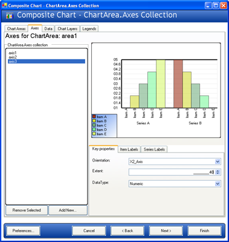
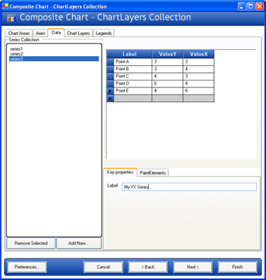
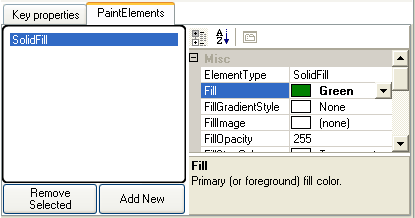
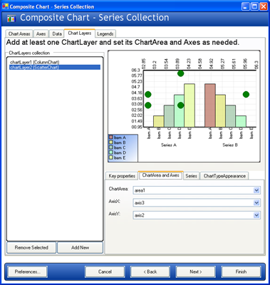

////

|metadata|
{
    "name": "chart-creating-a-composite-chart-using-the-chart-wizard-part-2-of-2",
    "controlName": ["{WawChartName}"],
    "tags": [],
    "guid": "{ADFC3368-9928-4F4C-A50F-291FE9FE0757}",  
    "buildFlags": [],
    "createdOn": "0001-01-01T00:00:00Z"
}
|metadata|
////

= Creating a Composite Chart Using the Chart Wizard (Part 2 of 2)

This section expands on the link:chart-creating-a-composite-chart-using-the-chart-wizard-part-1-of-2.html[Creating a Composite Chart Using the Chart Wizard (Part 1 of 2)] topic, and demonstrates the power and flexibility of link:chart-composite-chart.html[composite charts] by adding more layers, chart areas, and legends.

[start=1]
. Add another axis to the  pick:[win-forms=" link:infragistics4.win.ultrawinchart.v{ProductVersion}~infragistics.ultrachart.resources.appearance.chartarea.html[ChartArea]"]  pick:[asp-net=" link:infragistics4.webui.ultrawebchart.v{ProductVersion}~infragistics.ultrachart.resources.appearance.chartarea.html[ChartArea]"]  pick:[aspnet-old=" link:infragistics4.webui.ultrawebchart.v{ProductVersion}~infragistics.ultrachart.resources.appearance.chartarea.html[ChartArea]"] .

Before adding another chart layer, it is necessary to add at least one more axis. This is required because most chart layers require an axis for labels, and chart layers cannot share a label axis.

Change to the  pick:[win-forms=" link:infragistics4.win.ultrawinchart.v{ProductVersion}~infragistics.ultrachart.resources.appearance.chartarea~axes.html[Axes]"]  pick:[asp-net=" link:infragistics4.webui.ultrawebchart.v{ProductVersion}~infragistics.ultrachart.resources.appearance.chartarea~axes.html[Axes]"]  pick:[aspnet-old=" link:infragistics4.webui.ultrawebchart.v{ProductVersion}~infragistics.ultrachart.resources.appearance.chartarea~axes.html[Axes]"]  tab and add an "X2" style axis (axis3). This will add an axis oriented from the top of the chart.

Set the DataType to Numeric. Set the  pick:[win-forms=" link:infragistics4.win.ultrawinchart.v{ProductVersion}~infragistics.ultrachart.resources.appearance.axislabelappearance~itemformat.html[ItemLabels.ItemFormat]"]  pick:[asp-net=" link:infragistics4.webui.ultrawebchart.v{ProductVersion}~infragistics.ultrachart.resources.appearance.axislabelappearance~itemformat.html[ItemLabels.ItemFormat]"]  pick:[aspnet-old=" link:infragistics4.webui.ultrawebchart.v{ProductVersion}~infragistics.ultrachart.resources.appearance.axislabelappearance~itemformat.html[ItemLabels.ItemFormat]"]  to "DataValue" so that data values can be displayed on this axis. Set the  pick:[win-forms=" link:infragistics4.win.ultrawinchart.v{ProductVersion}~infragistics.ultrachart.resources.appearance.axislabelappearancebase~orientation.html[ItemLabels.Orientation]"]  pick:[asp-net=" link:infragistics4.webui.ultrawebchart.v{ProductVersion}~infragistics.ultrachart.resources.appearance.axislabelappearancebase~orientation.html[ItemLabels.Orientation]"]  pick:[aspnet-old=" link:infragistics4.webui.ultrawebchart.v{ProductVersion}~infragistics.ultrachart.resources.appearance.axislabelappearancebase~orientation.html[ItemLabels.Orientation]"]  to "VerticalLeftFacing." Then change the  pick:[win-forms=" link:infragistics4.win.ultrawinchart.v{ProductVersion}~infragistics.ultrachart.resources.appearance.axisappearance~extent.html[Extent]"]  pick:[asp-net=" link:infragistics4.webui.ultrawebchart.v{ProductVersion}~infragistics.ultrachart.resources.appearance.axisappearance~extent.html[Extent]"]  pick:[aspnet-old=" link:infragistics4.webui.ultrawebchart.v{ProductVersion}~infragistics.ultrachart.resources.appearance.axisappearance~extent.html[Extent]"]  (on the "Key properties" tab) to 40 to allow more space for the chart.

[start=2]
. Add another data series.

Switch to the "Data Tab" and click the "Add New..." button. This time, create an XY Series. The grid will appear set up for entering values with x- and y-coordinates. Enter some sample data and give the series a label in the "Key properties" tab.

To assign this series a color, change to the "PaintElements" tab in the lower right area of the chart wizard, add a new PaintElement to the Series'  pick:[win-forms=" link:infragistics4.win.ultrawinchart.v{ProductVersion}~infragistics.ultrachart.data.series.seriesbase~pes.html[PEs]"]  pick:[asp-net=" link:infragistics4.webui.ultrawebchart.v{ProductVersion}~infragistics.ultrachart.data.series.seriesbase~pes.html[PEs]"]  pick:[aspnet-old=" link:infragistics4.webui.ultrawebchart.v{ProductVersion}~infragistics.ultrachart.data.series.seriesbase~pes.html[PEs]"]  collection, and set its Fill property to a color (in this example, Green is used).

[start=3]
. Add another  pick:[win-forms=" link:infragistics4.win.ultrawinchart.v{ProductVersion}~infragistics.ultrachart.resources.appearance.chartlayerappearance.html[ChartLayer]"]  pick:[asp-net=" link:infragistics4.webui.ultrawebchart.v{ProductVersion}~infragistics.ultrachart.resources.appearance.chartlayerappearance.html[ChartLayer]"]  pick:[aspnet-old=" link:infragistics4.webui.ultrawebchart.v{ProductVersion}~infragistics.ultrachart.resources.appearance.chartlayerappearance.html[ChartLayer]"] .

Change to the "Chart Layers" tab and click "Add New" to add a new Chart layer.

Set its  pick:[win-forms=" link:infragistics4.win.ultrawinchart.v{ProductVersion}~infragistics.ultrachart.resources.appearance.chartlayerappearance~charttype.html[ChartType]"]  pick:[asp-net=" link:infragistics4.webui.ultrawebchart.v{ProductVersion}~infragistics.ultrachart.resources.appearance.chartlayerappearance~charttype.html[ChartType]"]  pick:[aspnet-old=" link:infragistics4.webui.ultrawebchart.v{ProductVersion}~infragistics.ultrachart.resources.appearance.chartlayerappearance~charttype.html[ChartType]"]  to ScatterChart, then set its ChartArea to area1, its AxisX to "axis3," and its AxisY to "axis2." Switch to the Series tab and select the XY series (series3) as the series for this layer to consume. Now the second chart layer will appear.

By now you should be familiar enough with the Composite Chart Wizard to experiment on your own. You can add more chart layers, axes, legends, and chart areas freely to suit the needs of your application.

== Related Topics

link:chart-axis-requirements-for-composite-charts.html[Axis Requirements for Composite Charts]

link:chart-layers.html[Layers]