////

|metadata|
{
    "name": "chart-creating-a-composite-chart-using-the-designer-part-1-of-2",
    "controlName": ["{WawChartName}"],
    "tags": [],
    "guid": "{34A56E9F-ABE4-4AAB-9DCB-4EACA53A1D64}",  
    "buildFlags": [],
    "createdOn": "0001-01-01T00:00:00Z"
}
|metadata|
////

= Creating a Composite Chart Using the Designer (Part 1 of 2)

This tutorial walks through the process of creating a link:chart-composite-chart.html[composite chart] using the Forms Designers. By the end of this tutorial, you will be familiar with some of the key aspects of designing a composite chart.

== Basic Settings for a Composite Chart

There are several steps required to set up the first chart layer in a composite chart. Since composite charts allow complete control over your chart, it is necessary to add all the individual elements, such as a chart area, axes, and a chart layer manually. This first section walks through these first steps in detail.

At the end of this section, you will have created a composite chart with two axes, a single chart layer, and a legend.

[start=1]
. Change the  pick:[win-forms=" link:{ApiPlatform}win.ultrawinchart{ApiVersion}~infragistics.win.ultrawinchart.ultrachart~charttype.html[ChartType]"]  pick:[asp-net=" link:{ApiPlatform}webui.ultrawebchart{ApiVersion}~infragistics.webui.ultrawebchart.ultrachart~charttype.html[ChartType]"]  pick:[aspnet-old=" link:{ApiPlatform}webui.ultrawebchart{ApiVersion}~infragistics.webui.ultrawebchart.ultrachart~charttype.html[ChartType]"]  property to "Composite".

A message will be displayed in red, briefly explaining what is required for a working composite chart.

This tutorial aims to guide you through these steps in detail. The collections referred to are all found under the  pick:[win-forms=" link:{ApiPlatform}win.ultrawinchart{ApiVersion}~infragistics.win.ultrawinchart.ultrachart~compositechart.html[CompositeChart]"]  pick:[asp-net=" link:{ApiPlatform}webui.ultrawebchart{ApiVersion}~infragistics.webui.ultrawebchart.ultrachart~compositechart.html[CompositeChart]"]  pick:[aspnet-old=" link:{ApiPlatform}webui.ultrawebchart{ApiVersion}~infragistics.webui.ultrawebchart.ultrachart~compositechart.html[CompositeChart]"]  property of the chart. You can observe this by expanding the CompositeChart property in the Visual Studio .NET properties grid.

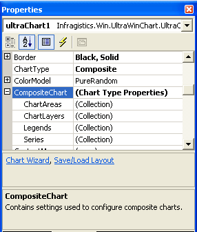

[start=2]
. Add a  pick:[win-forms=" link:{ApiPlatform}win.ultrawinchart{ApiVersion}~infragistics.ultrachart.resources.appearance.chartarea.html[ChartArea]"]  pick:[asp-net=" link:{ApiPlatform}webui.ultrawebchart{ApiVersion}~infragistics.ultrachart.resources.appearance.chartarea.html[ChartArea]"]  pick:[aspnet-old=" link:{ApiPlatform}webui.ultrawebchart{ApiVersion}~infragistics.ultrachart.resources.appearance.chartarea.html[ChartArea]"]  to the  pick:[win-forms=" link:{ApiPlatform}win.ultrawinchart{ApiVersion}~infragistics.ultrachart.resources.appearance.compositechartappearance~chartareas.html[ChartAreas]"]  pick:[asp-net=" link:{ApiPlatform}webui.ultrawebchart{ApiVersion}~infragistics.ultrachart.resources.appearance.compositechartappearance~chartareas.html[ChartAreas]"]  pick:[aspnet-old=" link:{ApiPlatform}webui.ultrawebchart{ApiVersion}~infragistics.ultrachart.resources.appearance.chartareacollection.html[ChartAreas]"]  collection.

Begin editing the ChartAreas collection by selecting it in the properties grid and clicking on the ellipsis that appears in that row. This will open the ChartArea Collection Editor. Click the "Add" button to add a ChartArea to the collection.

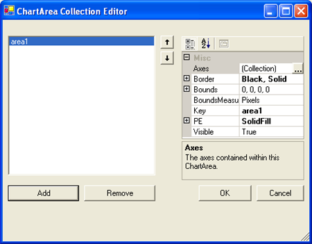

[start=3]
. Add some  pick:[win-forms=" link:{ApiPlatform}win.ultrawinchart{ApiVersion}~infragistics.ultrachart.resources.appearance.chartarea~axes.html[Axes]"]  pick:[asp-net=" link:{ApiPlatform}webui.ultrawebchart{ApiVersion}~infragistics.ultrachart.resources.appearance.chartarea~axes.html[Axes]"]  pick:[aspnet-old=" link:{ApiPlatform}webui.ultrawebchart{ApiVersion}~infragistics.ultrachart.resources.appearance.chartarea~axes.html[Axes]"]  to this ChartArea.

Click on the ellipsis by the "Axes" property in the ChartArea collection editor. This will open the Axis Collection Editor.

In the Axis Collection Editor, click "Add" and add a horizontal axis. Click "Add" again and add a vertical axis. Assign a meaningful  pick:[win-forms=" link:{ApiPlatform}win.ultrawinchart{ApiVersion}~infragistics.ultrachart.resources.appearance.axisitem~key.html[Key]"]  pick:[asp-net=" link:{ApiPlatform}webui.ultrawebchart{ApiVersion}~infragistics.ultrachart.resources.appearance.chartarea~key.html[Key]"]  pick:[aspnet-old=" link:{ApiPlatform}webui.ultrawebchart{ApiVersion}~infragistics.ultrachart.resources.appearance.chartarea~key.html[Key]"]  to each axis by setting the Key property in the properties grid. For this tutorial, the keys axisX and axisY, for the horizontal and vertical axis, are used.

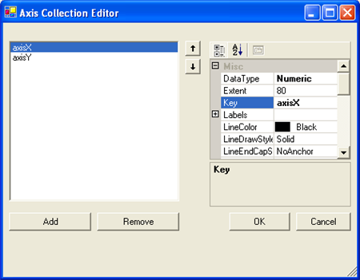

[start=4]
. Configure the Axes for use with a column chart layer.

The first layer to add in this sample will be a column chart layer. Therefore, we must configure these Axes to satisfy the requirements of a column chart layer.

As indicated in the link:chart-axis-requirements-for-composite-charts.html[Axis Requirements for Composite Charts], a column chart layer requires that the x-axis have a DataType of String, and a  pick:[win-forms=" link:{ApiPlatform}win.ultrawinchart{ApiVersion}~infragistics.ultrachart.resources.appearance.axisitem~setlabelaxistype.html[SetLabelAxisType]"]  pick:[asp-net=" link:{ApiPlatform}webui.ultrawebchart{ApiVersion}~infragistics.ultrachart.resources.appearance.axisitem~setlabelaxistype.html[SetLabelAxisType]"]  pick:[aspnet-old=" link:{ApiPlatform}webui.ultrawebchart{ApiVersion}~infragistics.ultrachart.resources.appearance.axisitem~setlabelaxistype.html[SetLabelAxisType]"]  of GroupBySeries, while the y-axis should have a DataType of Numeric. These properties can be set in the properties grid on the Axis Collection Editor.

After the x- and y-axes are configured as described, set the  pick:[win-forms=" link:{ApiPlatform}win.ultrawinchart{ApiVersion}~infragistics.ultrachart.resources.appearance.axislabelappearance~itemformat.html[ItemFormat]"]  pick:[asp-net=" link:{ApiPlatform}webui.ultrawebchart{ApiVersion}~infragistics.ultrachart.resources.appearance.axislabelappearance~itemformat.html[ItemFormat]"]  pick:[aspnet-old=" link:{ApiPlatform}webui.ultrawebchart{ApiVersion}~infragistics.ultrachart.resources.appearance.axislabelappearance~itemformat.html[ItemFormat]"]  for each axis. For a column chart, the ideal configuration is to have the x-axis displaying item labels and the y-axis displaying data values. Therefore, the ItemFormat of axisX should be set to "ItemLabel," and the ItemFormat of axisY should be set to "DataValue". These changes can be made in the properties grid of the Axis Collection Editor, under the "Labels" property of each Axis.

It is also ideal to have vertical labels on the x-axis. This change can be made by changing the  pick:[win-forms=" link:{ApiPlatform}win.ultrawinchart{ApiVersion}~infragistics.ultrachart.resources.appearance.axislabelappearancebase~orientation.html[Orientation]"]  pick:[asp-net=" link:{ApiPlatform}webui.ultrawebchart{ApiVersion}~infragistics.ultrachart.resources.appearance.axislabelappearancebase~orientation.html[Orientation]"]  pick:[aspnet-old=" link:{ApiPlatform}webui.ultrawebchart{ApiVersion}~infragistics.ultrachart.resources.appearance.axislabelappearancebase~orientation.html[Orientation]"]  property to VerticalLeftFacing for axisX in the same properties grid.

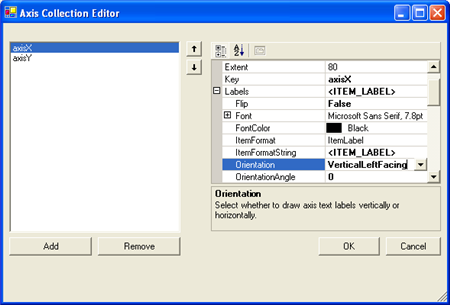

Now close the Axis Collection Editor and the ChartArea Collection Editor by clicking the OK button in each dialog. An x and y axis should now be visible on the chart control.

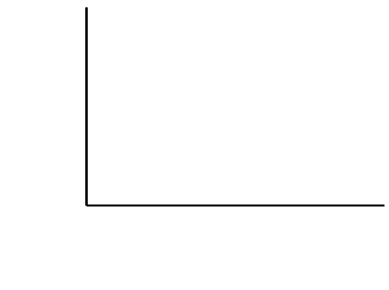

[start=5]
. Add some data series to the series collection.

Back in the chart properties grid, click the ellipsis for the  pick:[win-forms=" link:{ApiPlatform}win.ultrawinchart{ApiVersion}~infragistics.ultrachart.resources.appearance.compositechartappearance~series.html[Series]"]  pick:[asp-net=" link:{ApiPlatform}webui.ultrawebchart{ApiVersion}~infragistics.ultrachart.resources.appearance.compositechartappearance~series.html[Series]"]  pick:[aspnet-old=" link:{ApiPlatform}webui.ultrawebchart{ApiVersion}~infragistics.ultrachart.resources.appearance.compositechartappearance~series.html[Series]"]  collection under the CompositeChart property. This will open the Series Collection Editor.

In the Series Collection Editor, click the "Add" button and add two Numeric Series. Assign a meaningful value like "Series A" to the  pick:[win-forms=" link:{ApiPlatform}win.ultrawinchart{ApiVersion}~infragistics.ultrachart.data.series.seriesbase~label.html[Label]"]  pick:[asp-net=" link:{ApiPlatform}webui.ultrawebchart{ApiVersion}~infragistics.ultrachart.data.series.seriesbase~label.html[Label]"]  pick:[aspnet-old=" link:{ApiPlatform}webui.ultrawebchart{ApiVersion}~infragistics.ultrachart.data.series.seriesbase~label.html[Label]"]  property of each series.

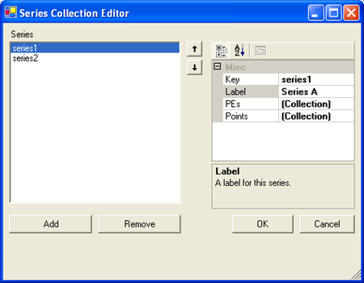

For each series, click the ellipsis by the Points property in the properties grid. This will open the DataPoint Collection Editor.

In the DataPoint Collection Editor, click the "Add" button several times to add some DataPoints. For each DataPoint, assign a value to the  pick:[win-forms=" link:{ApiPlatform}win.ultrawinchart{ApiVersion}~infragistics.ultrachart.resources.appearance.datapointbase~label.html[Label]"]  pick:[asp-net=" link:{ApiPlatform}webui.ultrawebchart{ApiVersion}~infragistics.ultrachart.resources.appearance.datapointbase~label.html[Label]"]  pick:[aspnet-old=" link:{ApiPlatform}webui.ultrawebchart{ApiVersion}~infragistics.ultrachart.resources.appearance.datapointbase~label.html[Label]"]  and  pick:[win-forms=" link:{ApiPlatform}win.ultrawinchart{ApiVersion}~infragistics.ultrachart.resources.appearance.numericdatapoint~value.html[Value]"]  pick:[asp-net=" link:{ApiPlatform}webui.ultrawebchart{ApiVersion}~infragistics.ultrachart.resources.appearance.numericdatapoint~value.html[Value]"]  pick:[aspnet-old=" link:{ApiPlatform}webui.ultrawebchart{ApiVersion}~infragistics.ultrachart.resources.appearance.numericdatapoint~value.html[Value]"]  properties in the properties grid. Just enter some sample data, like:

[cols="a,a"]
|====
|Label
|Value

|Item A
|5

|Item B
|4

|Item C
|3

|Item D
|2

|Item E
|1

|====

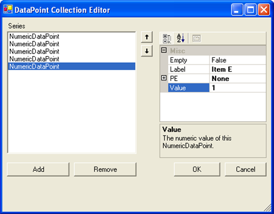

Now close the DataPoint Collection Editor and the Series Collection Editor by clicking OK in each dialog box.
[start=6]
. Add a chart layer.

Back in the UltraChart properties grid, click the ellipsis for the  pick:[win-forms=" link:{ApiPlatform}win.ultrawinchart{ApiVersion}~infragistics.ultrachart.resources.appearance.compositechartappearance~chartlayers.html[ChartLayers]"]  pick:[asp-net=" link:{ApiPlatform}webui.ultrawebchart{ApiVersion}~infragistics.ultrachart.resources.appearance.compositechartappearance~chartlayers.html[ChartLayers]"]  pick:[aspnet-old=" link:{ApiPlatform}webui.ultrawebchart{ApiVersion}~infragistics.ultrachart.resources.appearance.compositechartappearance~chartlayers.html[ChartLayers]"]  collection under the CompositeChart property. This will open the ChartLayer Collection Editor.

In the ChartLayer Collection Editor, click the "Add" button to add a chart layer.

In the properties grid for this chart layer, select the ChartArea property. This row in the properties grid will turn into a DropDownList, from which your chart area (area1) can be selected. Select this area, and then select "axisX" for the  pick:[win-forms=" link:{ApiPlatform}win.ultrawinchart{ApiVersion}~infragistics.ultrachart.resources.appearance.chartlayerappearance~axisx.html[AxisX]"]  pick:[asp-net=" link:{ApiPlatform}webui.ultrawebchart{ApiVersion}~infragistics.ultrachart.resources.appearance.chartlayerappearance~axisx.html[AxisX]"]  pick:[aspnet-old=" link:{ApiPlatform}webui.ultrawebchart{ApiVersion}~infragistics.ultrachart.resources.appearance.chartlayerappearance~axisx.html[AxisX]"]  property and "axisY" for the  pick:[win-forms=" link:{ApiPlatform}win.ultrawinchart{ApiVersion}~infragistics.ultrachart.resources.appearance.chartlayerappearance~axisy.html[AxisY]"]  pick:[asp-net=" link:{ApiPlatform}webui.ultrawebchart{ApiVersion}~infragistics.ultrachart.resources.appearance.chartlayerappearance~axisy.html[AxisY]"]  pick:[aspnet-old=" link:{ApiPlatform}webui.ultrawebchart{ApiVersion}~infragistics.ultrachart.resources.appearance.chartlayerappearance~axisy.html[AxisY]"]  property of the chart layer. For information on the axis requirements, see link:chart-axis-requirements-for-composite-charts.html[Axis Requirements for Composite Charts].

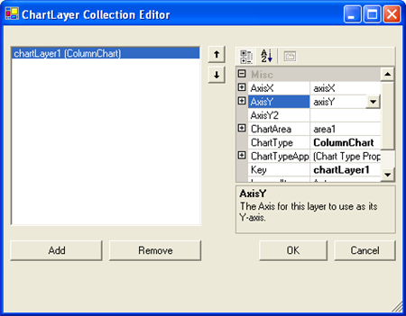

This satisfies the axis requirements for a column chart layer: an x-axis with a DataType of String, and a y-axis with a DataType of Numeric.

Now select the "Series" property in the properties grid to open the Series Picker. Hold the CTRL key and click on both series to have this chart layer consume both of these series.

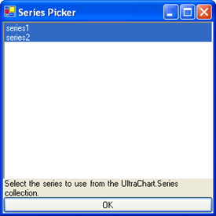

Click on OK to exit the Series Picker and again to exit the ChartLayer Collection Editor. Now your composite chart is rendering a single chart layer in a single ChartArea with 2 axes.

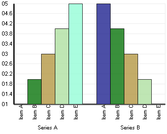

[start=7]
. Add a legend to the chart.

Back in the UltraChart properties grid, click the ellipsis for the  pick:[win-forms=" link:{ApiPlatform}win.ultrawinchart{ApiVersion}~infragistics.ultrachart.resources.appearance.compositechartappearance~legends.html[Legends]"]  pick:[asp-net=" link:{ApiPlatform}webui.ultrawebchart{ApiVersion}~infragistics.ultrachart.resources.appearance.compositechartappearance~legends.html[Legends]"]  pick:[aspnet-old=" link:{ApiPlatform}webui.ultrawebchart{ApiVersion}~infragistics.ultrachart.resources.appearance.compositechartappearance~legends.html[Legends]"]  collection under the CompositeChart property. This will open the Composite Legend Collection Editor.

In the Composite Legend Collection Editor, click the "Add" button to add a legend.

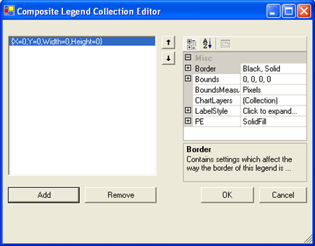

Click the ellipsis by the ChartLayers property in the properties grid and select chartLayer1 as the layer for this legend to consume.

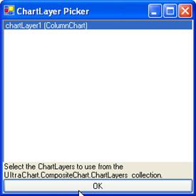

By default, the legend's bounds are set to Rectangle.Empty, so the legend occupies the entire surface of the chart and renders items starting in the top-left corner. The legend's bounds can be customized to place the legend anywhere on the chart, and the legend's background  pick:[win-forms=" link:{ApiPlatform}win.ultrawinchart{ApiVersion}~infragistics.ultrachart.resources.appearance.paintelement.html[PaintElement]"]  pick:[asp-net=" link:{ApiPlatform}webui.ultrawebchart{ApiVersion}~infragistics.ultrachart.resources.appearance.paintelement.html[PaintElement]"]  pick:[aspnet-old=" link:{ApiPlatform}webui.ultrawebchart{ApiVersion}~infragistics.ultrachart.resources.appearance.paintelement.html[PaintElement]"]  can be customized as well. Experiment with these properties in the chart wizard to get a feel for how they work.

In the following image, the legend  pick:[win-forms=" link:{ApiPlatform}win.ultrawinchart{ApiVersion}~infragistics.ultrachart.resources.appearance.compositelegend~bounds.html[Bounds]"]  pick:[asp-net=" link:{ApiPlatform}webui.ultrawebchart{ApiVersion}~infragistics.ultrachart.resources.appearance.compositelegend~bounds.html[Bounds]"]  pick:[aspnet-old=" link:{ApiPlatform}webui.ultrawebchart{ApiVersion}~infragistics.ultrachart.resources.appearance.compositelegend~bounds.html[Bounds]"]  are set to {X=0, Y=75, Width=20, Height=25} with a  pick:[win-forms=" link:{ApiPlatform}win.ultrawinchart{ApiVersion}~infragistics.ultrachart.resources.appearance.compositelegend~boundsmeasuretype.html[MeasureType]"]  pick:[asp-net=" link:{ApiPlatform}webui.ultrawebchart{ApiVersion}~infragistics.ultrachart.resources.appearance.compositelegend~boundsmeasuretype.html[MeasureType]"]  pick:[aspnet-old=" link:{ApiPlatform}webui.ultrawebchart{ApiVersion}~infragistics.ultrachart.resources.appearance.compositelegend~boundsmeasuretype.html[MeasureType]"]  of Percentage. The legend's PaintElement is set to a ForwardDiagonal Gradient from CornflowerBlue to Transparent. The  pick:[win-forms=" link:{ApiPlatform}win.ultrawinchart{ApiVersion}~infragistics.ultrachart.resources.appearance.compositelegend~border.html[Border.CornerRadius]"]  pick:[asp-net=" link:{ApiPlatform}webui.ultrawebchart{ApiVersion}~infragistics.ultrachart.resources.appearance.compositelegend~border.html[Border.CornerRadius]"]  pick:[aspnet-old=" link:{ApiPlatform}webui.ultrawebchart{ApiVersion}~infragistics.ultrachart.resources.appearance.compositelegend~border.html[Border.CornerRadius]"]  is set to 10 to give the legend box rounded borders and the Border.Thickness is set to 0 to remove the legend's default black outline.

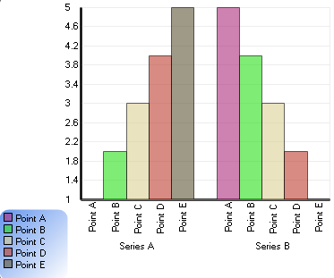

== Related Topics

link:chart-creating-a-composite-chart-using-the-designer-part-2-of-2.html[Creating a Composite Chart Using the Designer (Part 2 of 2)]

link:chart-axis-requirements-for-composite-charts.html[Axis Requirements for Composite Charts]

link:chart-layers.html[Layers]