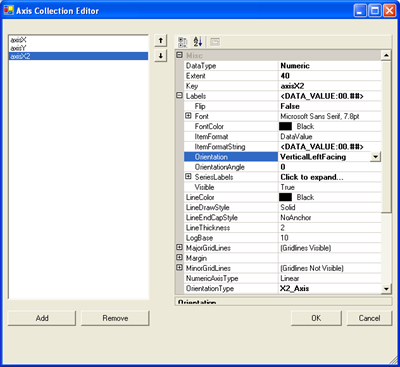

////

|metadata|
{
    "name": "chart-creating-a-composite-chart-using-the-designer-part-2-of-2",
    "controlName": ["{WawChartName}"],
    "tags": [],
    "guid": "{FCF635A9-E127-4C05-BC36-DB64DFFE2A28}",  
    "buildFlags": [],
    "createdOn": "0001-01-01T00:00:00Z"
}
|metadata|
////

= Creating a Composite Chart Using the Designer (Part 2 of 2)

This section expands on the topic, link:chart-creating-a-composite-chart-using-the-designer-part-1-of-2.html[Creating a Composite Chart Using the Designer (Part 1 of 2)], and demonstrates the power and flexibility of link:chart-composite-chart.html[composite charts] by adding more layers, chart areas, and legends.

[start=1]
. Add another axis to the  pick:[win-forms=" link:infragistics4.win.ultrawinchart.v{ProductVersion}~infragistics.ultrachart.resources.appearance.chartarea.html[ChartArea]"]  pick:[asp-net=" link:infragistics4.webui.ultrawebchart.v{ProductVersion}~infragistics.ultrachart.resources.appearance.chartarea.html[ChartArea]"]  pick:[aspnet-old=" link:infragistics4.webui.ultrawebchart.v{ProductVersion}~infragistics.ultrachart.resources.appearance.chartareacollection.html[ChartAreas]"] .

Before adding another chart layer, it is necessary to add at least one more axis. This is required because most chart layers require an axis for labels, and chart layers cannot share a label axis.

Go back to the ChartArea's  pick:[win-forms=" link:infragistics4.win.ultrawinchart.v{ProductVersion}~infragistics.ultrachart.resources.appearance.chartarea~axes.html[Axes]"]  pick:[asp-net=" link:infragistics4.webui.ultrawebchart.v{ProductVersion}~infragistics.ultrachart.resources.appearance.chartarea~axes.html[Axes]"]  pick:[aspnet-old=" link:infragistics4.webui.ultrawebchart.v{ProductVersion}~infragistics.ultrachart.resources.appearance.chartarea~axes.html[Axes]"]  collection and add a horizontal axis and set its  pick:[win-forms=" link:infragistics4.win.ultrawinchart.v{ProductVersion}~infragistics.ultrachart.resources.appearance.axisitem~orientationtype.html[OrientationType]"]  pick:[asp-net=" link:infragistics4.webui.ultrawebchart.v{ProductVersion}~infragistics.ultrachart.resources.appearance.axisitem~orientationtype.html[OrientationType]"]  pick:[aspnet-old=" link:infragistics4.webui.ultrawebchart.v{ProductVersion}~infragistics.ultrachart.resources.appearance.axisitem~orientationtype.html[OrientationType]"]  property to "X2_Axis." Assign a meaningful key like axisX2. This will add an axis oriented from the top of the chart.

Set the  pick:[win-forms=" link:infragistics4.win.ultrawinchart.v{ProductVersion}~infragistics.ultrachart.resources.appearance.axisitem~datatype.html[DataType]"]  pick:[asp-net=" link:infragistics4.webui.ultrawebchart.v{ProductVersion}~infragistics.ultrachart.resources.appearance.axisitem~datatype.html[DataType]"]  pick:[aspnet-old=" link:infragistics4.webui.ultrawebchart.v{ProductVersion}~infragistics.ultrachart.resources.appearance.axisitem~datatype.html[DataType]"]  to Numeric. Set the  pick:[win-forms=" link:infragistics4.win.ultrawinchart.v{ProductVersion}~infragistics.ultrachart.resources.appearance.axislabelappearance~itemformat.html[ItemLabels.ItemFormat]"]  pick:[asp-net=" link:infragistics4.webui.ultrawebchart.v{ProductVersion}~infragistics.ultrachart.resources.appearance.axislabelappearance~itemformat.html[ItemLabels.ItemFormat]"]  pick:[aspnet-old=" link:infragistics4.webui.ultrawebchart.v{ProductVersion}~infragistics.ultrachart.resources.appearance.axislabelappearance~itemformat.html[ItemLabels.ItemFormat]"]  to "DataValue" so that data values can be displayed on this axis. Set the  pick:[win-forms=" link:infragistics4.win.ultrawinchart.v{ProductVersion}~infragistics.ultrachart.resources.appearance.axislabelappearancebase~orientation.html[ItemLabels.Orientation]"]  pick:[asp-net=" link:infragistics4.webui.ultrawebchart.v{ProductVersion}~infragistics.ultrachart.resources.appearance.axislabelappearancebase~orientation.html[ItemLabels.Orientation]"]  pick:[aspnet-old=" link:infragistics4.webui.ultrawebchart.v{ProductVersion}~infragistics.ultrachart.resources.appearance.axislabelappearancebase~orientation.html[ItemLabels.Orientation]"]  to "VerticalLeftFacing." Then change the  pick:[win-forms=" link:infragistics4.win.ultrawinchart.v{ProductVersion}~infragistics.ultrachart.resources.appearance.axisappearance~extent.html[Extent]"]  pick:[asp-net=" link:infragistics4.webui.ultrawebchart.v{ProductVersion}~infragistics.ultrachart.resources.appearance.axisappearance~extent.html[Extent]"]  pick:[aspnet-old=" link:infragistics4.webui.ultrawebchart.v{ProductVersion}~infragistics.ultrachart.resources.appearance.axisappearance~extent.html[Extent]"]  to 40 to allow more space for the chart.

[start=2]
. Add another data series.

Return to the  pick:[win-forms=" link:infragistics4.win.ultrawinchart.v{ProductVersion}~infragistics.ultrachart.resources.appearance.compositechartappearance~series.html[Series]"]  pick:[asp-net=" link:infragistics4.webui.ultrawebchart.v{ProductVersion}~infragistics.ultrachart.resources.appearance.compositechartappearance~series.html[Series]"]  pick:[aspnet-old=" link:infragistics4.webui.ultrawebchart.v{ProductVersion}~infragistics.ultrachart.resources.appearance.compositechartappearance~series.html[Series]"]  Collection editor by clicking on the ellipsis by the CompositeChart.Series property. Add an XY Series to the Series Collection. Then enter some data points with X and Y values.

[start=3]
. To assign this series a color, close the DataPoint Collection Editor to return to the Series Collection Editor. Then click the ellipsis by the  pick:[win-forms=" link:infragistics4.win.ultrawinchart.v{ProductVersion}~infragistics.ultrachart.data.series.seriesbase~pes.html[PEs]"]  pick:[asp-net=" link:infragistics4.webui.ultrawebchart.v{ProductVersion}~infragistics.ultrachart.data.series.seriesbase~pes.html[PEs]"]  pick:[aspnet-old=" link:infragistics4.webui.ultrawebchart.v{ProductVersion}~infragistics.ultrachart.data.series.seriesbase~pes.html[PEs]"]  property for this series (series3) to open the  pick:[win-forms=" link:infragistics4.win.ultrawinchart.v{ProductVersion}~infragistics.ultrachart.resources.appearance.paintelement.html[PaintElement]"]  pick:[asp-net=" link:infragistics4.webui.ultrawebchart.v{ProductVersion}~infragistics.ultrachart.resources.appearance.paintelement.html[PaintElement]"]  pick:[aspnet-old=" link:infragistics4.webui.ultrawebchart.v{ProductVersion}~infragistics.ultrachart.resources.appearance.paintelement.html[PaintElement]"]  Collection Editor for that Series' PEs collection.

Add a single PaintElement by clicking the "Add" button and set its Fill color to a color (in this example, Green is used).

[start=4]
. Add another chart layer.

Return to the ChartLayer collection editor by clicking on the ellipsis by the CompositeChart.ChartLayers property. Add a new  pick:[win-forms=" link:infragistics4.win.ultrawinchart.v{ProductVersion}~infragistics.ultrachart.resources.appearance.chartlayerappearance.html[ChartLayer]"]  pick:[asp-net=" link:infragistics4.webui.ultrawebchart.v{ProductVersion}~infragistics.ultrachart.resources.appearance.chartlayerappearance.html[ChartLayer]"]  pick:[aspnet-old=" link:infragistics4.webui.ultrawebchart.v{ProductVersion}~infragistics.ultrachart.resources.appearance.chartlayerappearance.html[ChartLayer]"]  to the collection, and set its  pick:[win-forms=" link:infragistics4.win.ultrawinchart.v{ProductVersion}~infragistics.ultrachart.resources.appearance.chartlayerappearance~charttype.html[ChartType]"]  pick:[asp-net=" link:infragistics4.webui.ultrawebchart.v{ProductVersion}~infragistics.ultrachart.resources.appearance.chartlayerappearance~charttype.html[ChartType]"]  pick:[aspnet-old=" link:infragistics4.webui.ultrawebchart.v{ProductVersion}~infragistics.ultrachart.resources.appearance.chartlayerappearance~charttype.html[ChartType]"]  property to ScatterChart.

Set its ChartArea to area1, its  pick:[win-forms=" link:infragistics4.win.ultrawinchart.v{ProductVersion}~infragistics.ultrachart.resources.appearance.chartlayerappearance~axisx.html[AxisX]"]  pick:[asp-net=" link:infragistics4.webui.ultrawebchart.v{ProductVersion}~infragistics.ultrachart.resources.appearance.chartlayerappearance~axisx.html[AxisX]"]  pick:[aspnet-old=" link:infragistics4.webui.ultrawebchart.v{ProductVersion}~infragistics.ultrachart.resources.appearance.chartlayerappearance~axisx.html[AxisX]"]  to "axisX2," and its  pick:[win-forms=" link:infragistics4.win.ultrawinchart.v{ProductVersion}~infragistics.ultrachart.resources.appearance.chartlayerappearance~axisy.html[AxisY]"]  pick:[asp-net=" link:infragistics4.webui.ultrawebchart.v{ProductVersion}~infragistics.ultrachart.resources.appearance.chartlayerappearance~axisy.html[AxisY]"]  pick:[aspnet-old=" link:infragistics4.webui.ultrawebchart.v{ProductVersion}~infragistics.ultrachart.resources.appearance.chartlayerappearance~axisy.html[AxisY]"]  to "axisY."

Open the ChartLayer's Series Collection and select the XY Series (series3). Now close out of the collection editor and the second chart layer will appear.

By now you should be familiar enough with the Composite Chart Wizard to experiment on your own. You can add more chart layers, axes, legends, and chart areas freely to suit the needs of your application.

== Related Topics

link:chart-axis-requirements-for-composite-charts.html[Axis Requirements for Composite Charts]

link:chart-layers.html[Layers]