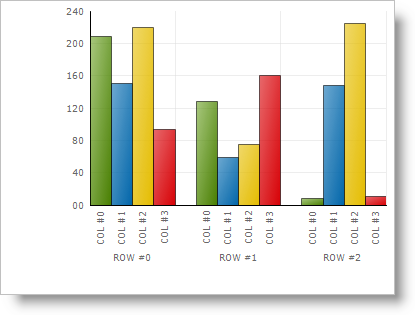
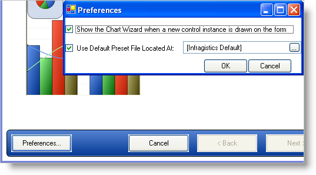

////

|metadata|
{
    "name": "chart-default-preset",
    "controlName": ["{WawChartName}"],
    "tags": [],
    "guid": "{0863AA6B-749B-4BCB-A983-BA2A334B14E1}",  
    "buildFlags": [],
    "createdOn": "0001-01-01T00:00:00Z"
}
|metadata|
////

= Default Preset

The Chart control provides a Default Preset, which can be used to change the default settings of a chart when it is first added to a form. Our Default Preset feature automatically enables some useful chart features such as link:chart-smart-tickmarks.html[Smart Tickmarks] and improves the default appearance of the chart by adjusting the fonts and colors used. It is also possible to change the default preset on any developer's machine to a preset of your choosing.

The following is an example image of a chart with the Default Preset feature enabled.

To change the default preset on any machine, open the Chart Wizard and click the Preferences button. Then use the input field to specify a path to the new default preset. Default Preset functionality can also be disabled by clearing the "Use Default Preset File Located At:" check box.

Because chart presets are simply clear text XML, they can be created in a text editor, or at run time using the  pick:[win-forms=" link:{ApiPlatform}win.ultrawinchart{ApiVersion}~infragistics.win.ultrawinchart.ultrachart~savepreset.html[SavePreset]"]  pick:[asp-net=" link:{ApiPlatform}webui.ultrawebchart{ApiVersion}~infragistics.webui.ultrawebchart.ultrachart~savepreset.html[SavePreset]"]  pick:[aspnet-old=" link:{ApiPlatform}webui.ultrawebchart{ApiVersion}~infragistics.webui.ultrawebchart.ultrachart~savepreset.html[SavePreset]"]  method. Some presets are provided in the "\Program Files\Common Files\Infragistics\Presets\" folder where the Infragistics product installer places them.