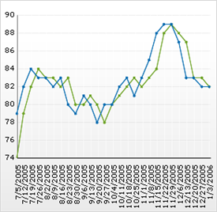

////

|metadata|
{
    "name": "chart-display-data-on-a-time-scale-axis",
    "controlName": ["{WawChartName}"],
    "tags": [],
    "guid": "{69F8B61E-07DE-4D33-A48D-F059BBB14A6D}",  
    "buildFlags": [],
    "createdOn": "2006-03-01T00:00:00Z"
}
|metadata|
////

= Display Data on a Time-Scale Axis

Normally, charts treat date/time values in the data as string values and the X-axis is ordinal and not time-based. If you want to organize your chart data chronologically (even if the data is not in chronological order), you can set up the following chart types to use a time-scale axis:

* link:chart-about-2d-area-charts.html[Area Chart]
* link:chart-gantt-chart.html[Gantt Chart]
* link:chart-about-2d-line-charts.html[Line Chart]
* link:chart-about-scatter-charts.html[Scatter Chart]
* link:chart-about-2d-spline-charts.html[Spline Chart]
* link:chart-about-2d-spline-area-charts.html[Spline Area Chart]
* link:chart-about-stacked-area-charts.html[Stacked Area Chart]
* link:chart-about-stacked-line-charts.html[Stacked Line Chart]
* link:chart-about-stacked-spline-area-charts.html[Stacked Spline Area Chart]
* link:chart-about-stacked-spline-charts.html[Stacked Spline Chart]
* link:chart-about-step-area-charts.html[Step Area Chart]
* link:chart-about-step-line-charts.html[Step Line Chart]

.Note
[NOTE]
====
To create a scatter chart with time values on the x-axis, use the Series collection with one or more NumericTimeSeries. The X-axis labels should have a  pick:[win-forms=" link:{ApiPlatform}win.ultrawinchart{ApiVersion}~infragistics.ultrachart.resources.appearance.axisserieslabelappearance~formatstring.html[FormatString]"]  pick:[asp-net=" link:{ApiPlatform}webui.ultrawebchart{ApiVersion}~infragistics.ultrachart.resources.appearance.axisserieslabelappearance~formatstring.html[FormatString]"]  pick:[aspnet-old=" link:{ApiPlatform}webui.ultrawebchart{ApiVersion}~infragistics.ultrachart.resources.appearance.axisserieslabelappearance~formatstring.html[FormatString]"]  like "ITEM_LABEL:MM/dd/yyyy>". Setting the FormatString to "<ITEM_LABEL>" without a format specifier will result in the most reasonable format for the range of the data being used.
====

=== To use a time-scale axis:

[start=1]
. In the Properties window of the Design view, double-click the property that corresponds to the type of chart that you are configuring. For example, if you are configuring the Area chart, double-click the AreaChart property.
[start=2]
. Change the value of the  pick:[win-forms=" link:{ApiPlatform}win.ultrawinchart{ApiVersion}~infragistics.ultrachart.resources.appearance.areachartappearance~treatdatetimeasstring.html[TreatDateTimeAsString]"]  pick:[asp-net=" link:{ApiPlatform}webui.ultrawebchart{ApiVersion}~infragistics.ultrachart.resources.appearance.areachartappearance~treatdatetimeasstring.html[TreatDateTimeAsString]"]  pick:[aspnet-old=" link:{ApiPlatform}webui.ultrawebchart{ApiVersion}~infragistics.ultrachart.resources.appearance.areachartappearance~treatdatetimeasstring.html[TreatDateTimeAsString]"]  property to False. (In the form's code-behind for the area chart, for example, this would appear as AreaChartAppearance.TreatDateTimeAsString=false).

== Data Requirements

The data requirement for a time-based X-axis is that the column names can be parsed as DateTime values. If  pick:[win-forms=" link:{ApiPlatform}win.ultrawinchart{ApiVersion}~infragistics.ultrachart.resources.appearance.dataappearance~swaprowsandcolumns.html[SwapRowsAndColumns]"]  pick:[asp-net=" link:{ApiPlatform}webui.ultrawebchart{ApiVersion}~infragistics.ultrachart.resources.appearance.dataappearance~swaprowsandcolumns.html[SwapRowsAndColumns]"]  pick:[aspnet-old=" link:{ApiPlatform}webui.ultrawebchart{ApiVersion}~infragistics.ultrachart.resources.appearance.dataappearance~swaprowsandcolumns.html[SwapRowsAndColumns]"]  is True, then either a DateTime column, or a column containing strings which can be parsed as DateTime values, must be present (just as if they were row labels).

.Note
[NOTE]
====
The above-mentioned data requirements applies to all chart types that support a time-scale axis, except the gantt, step area, and step line charts.
====

If the  pick:[win-forms=" link:{ApiPlatform}win.ultrawinchart{ApiVersion}~infragistics.ultrachart.data.series.seriescollection.html[Series]"]  pick:[asp-net=" link:{ApiPlatform}webui.ultrawebchart{ApiVersion}~infragistics.ultrachart.data.series.seriescollection.html[Series]"]  pick:[aspnet-old=" link:{ApiPlatform}webui.ultrawebchart{ApiVersion}~infragistics.ultrachart.data.series.seriescollection.html[Series]"]  collection is being used, simply create one or more  pick:[win-forms=" link:{ApiPlatform}win.ultrawinchart{ApiVersion}~infragistics.ultrachart.resources.appearance.numerictimeseries.html[NumericTimeSeries]"]  pick:[asp-net=" link:{ApiPlatform}webui.ultrawebchart{ApiVersion}~infragistics.ultrachart.resources.appearance.numerictimeseries.html[NumericTimeSeries]"]  pick:[aspnet-old=" link:{ApiPlatform}webui.ultrawebchart{ApiVersion}~infragistics.ultrachart.resources.appearance.numerictimeseries.html[NumericTimeSeries]"]  to use as a data source for the area chart.

For information on displaying axis labels at specific intervals, see link:chart-display-labels-at-intervals-on-a-time-scale-axis.html[Display Labels at Intervals on a Time-Scale Axis].

[options="header", cols="a,a,a"]
|====
|DateTimeStamp|Column1|Column2

|1/1/2005
|123123
|1123

|1/2/2005
|341212
|0

|1/3/2005
|1231234
|0

|1/4/2005
|234234
|0

|====