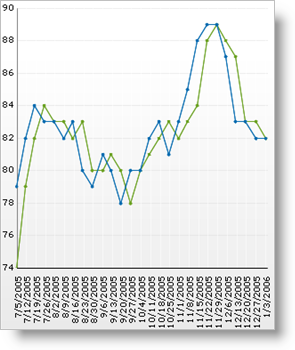

////

|metadata|
{
    "name": "chart-display-labels-at-intervals-on-a-time-scale-axis",
    "controlName": ["{WawChartName}"],
    "tags": [],
    "guid": "{BB02110E-AB1C-4F40-A698-3AC596091748}",  
    "buildFlags": [],
    "createdOn": "2006-04-01T00:00:00Z"
}
|metadata|
////

= Display Labels at Intervals on a Time-Scale Axis

When using a time-scale axis, as with a numeric axis, the default  pick:[win-forms=" link:{ApiPlatform}win.ultrawinchart{ApiVersion}~infragistics.ultrachart.resources.appearance.axisappearance~tickmarkstyle.html[TickmarkStyle]"]  pick:[asp-net=" link:{ApiPlatform}webui.ultrawebchart{ApiVersion}~infragistics.ultrachart.resources.appearance.axisappearance~tickmarkstyle.html[TickmarkStyle]"]  pick:[aspnet-old=" link:{ApiPlatform}webui.ultrawebchart{ApiVersion}~infragistics.ultrachart.resources.appearance.axisappearance~tickmarkstyle.html[TickmarkStyle]"]  is set to Percentage, and the default  pick:[win-forms=" link:{ApiPlatform}win.ultrawinchart{ApiVersion}~infragistics.ultrachart.resources.appearance.axisappearance~tickmarkpercentage.html[TickmarkPercentage]"]  pick:[asp-net=" link:{ApiPlatform}webui.ultrawebchart{ApiVersion}~infragistics.ultrachart.resources.appearance.axisappearance~tickmarkpercentage.html[TickmarkPercentage]"]  pick:[aspnet-old=" link:{ApiPlatform}webui.ultrawebchart{ApiVersion}~infragistics.ultrachart.resources.appearance.axisappearance~tickmarkpercentage.html[TickmarkPercentage]"]  is 10. This means that a tickmark will appear at every 10% of the range of data. This is not always the best option because most units of time are not based on 10. In this case, Smart Tickmarks can be used. When TickmarkStyle is set to Smart on a DateTime axis, tickmarks are generated using logical intervals of time (e.g. days, weeks, or months).

Enabling smart tickmarks automatically sets the  pick:[win-forms=" link:{ApiPlatform}win.ultrawinchart{ApiVersion}~infragistics.ultrachart.resources.appearance.axisappearance~tickmarkintervaltype.html[TickmarkIntervalType]"]  pick:[asp-net=" link:{ApiPlatform}webui.ultrawebchart{ApiVersion}~infragistics.ultrachart.resources.appearance.axisappearance~tickmarkintervaltype.html[TickmarkIntervalType]"]  pick:[aspnet-old=" link:{ApiPlatform}webui.ultrawebchart{ApiVersion}~infragistics.ultrachart.resources.appearance.axisappearance~tickmarkintervaltype.html[TickmarkIntervalType]"]  and  pick:[win-forms=" link:{ApiPlatform}win.ultrawinchart{ApiVersion}~infragistics.ultrachart.resources.appearance.axisappearance~tickmarkinterval.html[TickmarkInterval]"]  pick:[asp-net=" link:{ApiPlatform}webui.ultrawebchart{ApiVersion}~infragistics.ultrachart.resources.appearance.axisappearance~tickmarkinterval.html[TickmarkInterval]"]  pick:[aspnet-old=" link:{ApiPlatform}webui.ultrawebchart{ApiVersion}~infragistics.ultrachart.resources.appearance.axisappearance~tickmarkinterval.html[TickmarkInterval]"]  properties to the best values for the given range of data. For complete customization, these properties can be used when TickmarkStyle is set to DataInterval. To place a tickmark every 3 days, set the TickmarkIntervalType property to Days and set the TickmarkInterval property to 3.

For information on how to display your chart data on the time-scale axis, see link:chart-display-data-on-a-time-scale-axis.html[Display Data on a Time-Scale Axis].

== Related Topic:

link:chart-tickmarks.html[Tickmarks]

link:chart-smart-tickmarks.html[Smart Tickmarks]