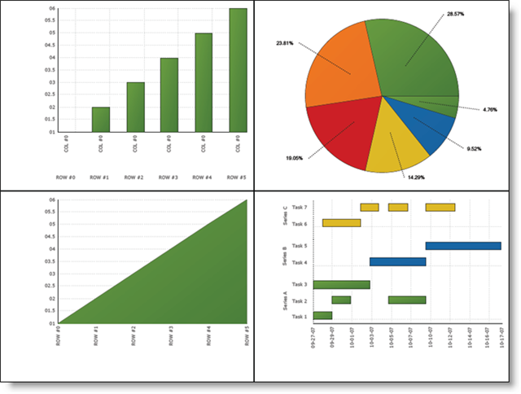

////

|metadata|
{
    "name": "chart-exporting-numerous-charts-to-a-pdf",
    "controlName": ["{WawChartName}"],
    "tags": [],
    "guid": "{B158C7DA-77EA-47D6-8CFF-E2C77A28D9A8}",  
    "buildFlags": [],
    "createdOn": "0001-01-01T00:00:00Z"
}
|metadata|
////

= Exporting Numerous Charts to a PDF

Exporting many charts to one Portable Document Format (PDF) file is a common scenario. This walkthrough will show you how to:

* export four charts to one PDF file
* position the charts within the PDF file

.Note
[NOTE]
====
This topic assumes that you already created a chart. For information on how to create a chart, see link:chart-getting-started-with-chart.html[Getting Started with Chart].
====

When you save and run your application after completing the following steps, your PDF should look similar to the following image:

*Export numerous charts to one PDF:*

[start=1]
. Add a reference to Infragistics4.Documents.Reports.v{ProductVersion} to your project.
[start=2]
. Create the form's Load event handler and add the following code to it.
[start=3]
. Create a new report and add a page to it.

*In Visual Basic:*

----
Dim reportPath As String = _
    System.Environment.GetFolderPath( _
     System.Environment.SpecialFolder.MyDocuments)
UltraChart1.Size = New Size(400, 300) 
Dim report As New Report()
Dim page As ISectionPage = report.AddSection().AddPage()
page.Width = 800
page.Height = 600
----

*In C#:*

----
string reportPath =
  System.Environment.GetFolderPath(System.Environment.SpecialFolder.MyDocuments);
ultraChart1.Size =  new Size(400, 300);
Report report = new Report();
ISectionPage page = report.AddSection().AddPage();
page.Width = 800;
page.Height = 600;
----

[start=4]
. Create the first chart. Set the chartType to ColumnChart and bind it to an array of data.

*In Visual Basic:*

----
UltraChart1.ChartType = ChartType.ColumnChart
UltraChart1.Data.DataSource = New Integer() {1, 2, 3, 4, 5, 6}
UltraChart1.Data.DataBind()
----

*In C#:*

----
ultraChart1.ChartType = ChartType.ColumnChart;
ultraChart1.Data.DataSource = new int[] { 1, 2, 3, 4, 5, 6 };
ultraChart1.Data.DataBind();
----

[start=5]
. Create a new canvas and render the column chart to the canvas graphics.

*In Visual Basic:*

----
Dim canvas As ICanvas = page.AddCanvas(0, 0)
canvas.Width = New FixedWidth(400)
canvas.Height = New FixedHeight(300)
Dim g As Graphics = canvas.CreateGraphics()
UltraChart1.RenderPdfFriendlyGraphics(g)
----

*In C#:*

----
ICanvas canvas = page.AddCanvas(0, 0);
canvas.Width = new FixedWidth(400);
canvas.Height = new FixedHeight(300);
Graphics g = canvas.CreateGraphics();
ultraChart1.RenderPdfFriendlyGraphics(g);
----

[start=6]
. Create the second chart. Set the chartType to PieChart and bind it to an array of data.

*In Visual Basic:*

----
UltraChart1.ChartType = ChartType.PieChart
UltraChart1.Data.DataSource = New Integer() {1, 2, 3, 4, 5, 6}
UltraChart1.Data.DataBind()
----

*In C#:*

----
ultraChart1.ChartType = ChartType.PieChart;
ultraChart1.Data.DataSource = new int[] { 1, 2, 3, 4, 5, 6 };
ultraChart1.Data.DataBind();
----

[start=7]
. Create another canvas at a different location and render the pie chart.

*In Visual Basic:*

----
canvas = page.AddCanvas(400, 0)
canvas.Width = New FixedWidth(400)
canvas.Height = New FixedHeight(300)
g = canvas.CreateGraphics()
UltraChart1.RenderPdfFriendlyGraphics(g)
----

*In C#:*

----
canvas = page.AddCanvas(400, 0);
canvas.Width = new FixedWidth(400);
canvas.Height = new FixedHeight(300);
g = canvas.CreateGraphics();
ultraChart1.RenderPdfFriendlyGraphics(g);
----

[start=8]
. Create the third chart. Set the chartType to AreaChart and bind it to an array of data.

*In Visual Basic:*

----
UltraChart1.ChartType = ChartType.AreaChart
UltraChart1.Data.DataSource = New Integer() {1, 2, 3, 4, 5, 6}
UltraChart1.Data.SwapRowsAndColumns = True
UltraChart1.Data.DataBind()
----

*In C#:*

----
ultraChart1.ChartType = ChartType.AreaChart;
ultraChart1.Data.DataSource = new int[] { 1, 2, 3, 4, 5, 6 };
ultraChart1.Data.SwapRowsAndColumns = true;
ultraChart1.Data.DataBind();
----

[start=9]
. Create another canvas at a different location and render the area chart.

*In Visual Basic:*

----
canvas = page.AddCanvas(0, 300)
canvas.Width = New FixedWidth(400)
canvas.Height = New FixedHeight(300)
g = canvas.CreateGraphics()
UltraChart1.RenderPdfFriendlyGraphics(g)
----

*In C#:*

----
canvas = page.AddCanvas(0, 300);
canvas.Width = new FixedWidth(400);
canvas.Height = new FixedHeight(300);
g = canvas.CreateGraphics();
ultraChart1.RenderPdfFriendlyGraphics(g);
----

[start=10]
. Create the fourth chart. Set the chartType to GanttChart and bind it to a demo table of data.

*In Visual Basic:*

----
UltraChart1.ChartType = ChartType.GanttChart
UltraChart1.Data.SwapRowsAndColumns = False
UltraChart1.Data.DataSource = Infragistics.UltraChart.Data.DemoTable.Table(4)
UltraChart1.Data.DataBind()
----

*In C#:*

----
ultraChart1.ChartType = ChartType.GanttChart;
ultraChart1.Data.SwapRowsAndColumns = false;
ultraChart1.Data.DataSource = Infragistics.UltraChart.Data.DemoTable.Table(4);
ultraChart1.Data.DataBind();
----

[start=11]
. Create another canvas at a different location and render the gantt chart.

*In Visual Basic:*

----
canvas = page.AddCanvas(400, 300)
canvas.Width = New FixedWidth(400)
canvas.Height = New FixedHeight(300)
g = canvas.CreateGraphics()
UltraChart1.RenderPdfFriendlyGraphics(g)
----

*In C#:*

----
canvas = page.AddCanvas(400, 300);
canvas.Width = new FixedWidth(400);
canvas.Height = new FixedHeight(300);
g = canvas.CreateGraphics();
ultraChart1.RenderPdfFriendlyGraphics(g);
----

[start=12]
. Publish the report.

*In Visual Basic:*

----
report.Publish(reportPath + "\Report.pdf", FileFormat.PDF)
----

*In C#:*

----
report.Publish(reportPath + "\\Report.pdf", FileFormat.PDF);
----

[start=13]
. Save and run your application

== Related Topics

link:chart-export-to-pdf.html[Export to PDF]

link:chart-exporting-to-pdf.html[Exporting to PDF]