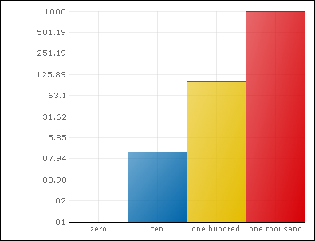

////

|metadata|
{
    "name": "chart-plot-log-zero-values",
    "controlName": ["{WawChartName}"],
    "tags": [],
    "guid": "{DDCF6539-5F36-4C49-9B5B-FBA3AD1D8119}",  
    "buildFlags": [],
    "createdOn": "0001-01-01T00:00:00Z"
}
|metadata|
////

= Plot Log Zero Values

In order to allow you to plot Log(0) values without an exception being thrown, the Chart component allows you to specify a value when the axis tries to plot Log(0).

The following code sample allows a table or series with zero values to be plotted using the logarithmic y-axis. The minimum value of the axis is 1.0 and all zero values are plotted at 1.0.

*In Visual Basic:*

----
Me.UltraChart1.Axis.Y.LogZero = 1.0
----

*In C#:*

----
this.UltraChart1.Axis.Y.LogZero = 1.0;
----

.Note
[NOTE]
====
The default value for the LogZero property is double.NaN. If you leave this property at the default value, an exception will be thrown.
====

The following screen shot shows a column chart with a logarithmic y-axis and a zero value.

