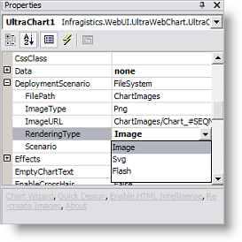

////

|metadata|
{
    "name": "chart-rendering-types",
    "controlName": ["{WawChartName}"],
    "tags": [],
    "guid": "{1BDC9B7F-62C8-4311-9DEC-D2761758080E}",  
    "buildFlags": ["asp-net","aspnet-old"],
    "createdOn": "0001-01-01T00:00:00Z"
}
|metadata|
////

= Rendering Types

WebChart™ can be rendered in three ways, depending on the setting of the DeploymentScenario. pick:[asp-net=" link:infragistics4.webui.ultrawebchart.v{ProductVersion}~infragistics.ultrachart.shared.styles.renderingtype.html[RenderingType]"]  pick:[aspnet-old=" link:infragistics4.webui.ultrawebchart.v{ProductVersion}~infragistics.ultrachart.shared.styles.renderingtype.html[RenderingType]"]  property.

The following is a list of the three image rendering types, along with some considerations concerning that rendering type.

[options="header", cols="a,a"]
|====
|Rendering Type|Description

|Image
|This rendering type is raster-based. Resizing a generated image will reduce the quality of that image. Changing the size of the control on the server will increase the size and quality of the image and the size of the generated file will also increase. Images can easily be copied from web pages, and can conveniently be embedded in many document formats such as Microsoft Word.

|Flash (SWF)
|This rendering type is vector-based. If the image size is changed, it will not change the quality of the appearance. Flash can be printed at high quality. SWF is a binary format with excellent compression to minimize file size. 

SWF is a binary format with excellent compression to minimize file size. 

The majority of users on the web do have Macromedia Flash Player installed. Flash Player is pre-installed in several web browsers and on many computers. It is included in Windows XP and Apple Macintosh operating systems, Netscape Navigator, and America Online.

|SVG (Scalable Vector Graphics)
|This rendering type is vector-based. If the image size is changed, it will not change the quality of the appearance. SVG can be printed at high quality. Text in SVG can be selected and copied into other documents. 

Most users do not have an SVG viewer installed at this time. However, it is possible to embed a script on a page to automatically prompt the user to install an SVG viewer if one is not already installed. For an example of this, see the Rendering Types sample in the Infragistics ASP.NET Samples Browser.

|====

== Related Topic

link:chart-change-a-webcharts-height-and-width-using-percentage-values.html[Change a WebChart's Height and Width Using Percentage Values]