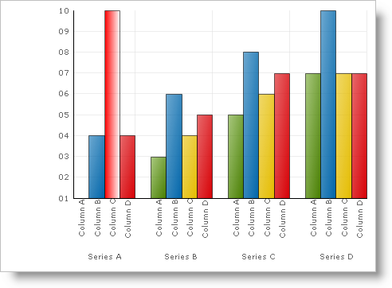

////

|metadata|
{
    "name": "chart-set-the-opacity-of-a-gradient-effect",
    "controlName": ["{WawChartName}"],
    "tags": [],
    "guid": "{C6AC841F-7FC6-4569-8DDA-DA25387BB395}",  
    "buildFlags": [],
    "createdOn": "2006-12-04T00:00:00Z"
}
|metadata|
////

= Set the Opacity of the Gradient

Gradients can have an even more stunning effect when used in combination with opacity (transparency). Both the starting color value of the gradient (Fill) and the ending color value (FillStopColor) can be associated with a separate opacity value. This is exposed in the properties  pick:[win-forms=" link:infragistics4.win.ultrawinchart.v{ProductVersion}~infragistics.ultrachart.resources.appearance.paintelement~fillopacity.html[FillOpacity]"]  pick:[asp-net=" link:infragistics4.webui.ultrawebchart.v{ProductVersion}~infragistics.ultrachart.resources.appearance.paintelement~fillopacity.html[FillOpacity]"]  pick:[aspnet-old=" link:infragistics4.webui.ultrawebchart.v{ProductVersion}~infragistics.ultrachart.resources.appearance.paintelement~fillopacity.html[FillOpacity]"]  and  pick:[win-forms=" link:infragistics4.win.ultrawinchart.v{ProductVersion}~infragistics.ultrachart.resources.appearance.paintelement~fillstopopacity.html[FillStopOpacity]"]  pick:[asp-net=" link:infragistics4.webui.ultrawebchart.v{ProductVersion}~infragistics.ultrachart.resources.appearance.paintelement~fillstopopacity.html[FillStopOpacity]"]  pick:[aspnet-old=" link:infragistics4.webui.ultrawebchart.v{ProductVersion}~infragistics.ultrachart.resources.appearance.paintelement~fillstopopacity.html[FillStopOpacity]"] , respectively.

The diagram below demonstrates decreasing and increasing opacity values over a white-to-black gradient. With the Box of a bar from a Bar Chart.

[cols="a,a,a"]
|====
|image::Images/Chart_Rendering_With_Paint_Element_05.png[Graphic demonstrating decreasing opacity.]
|
|image::Images/Chart_Rendering_With_Paint_Element_06.png[Graphic demonstrating increasing opacity.]

|

|====

The example below uses an arbitrary Box (a Primitive shape used in the Column and Bar charts) and shows you how to change the opacity of a gradient. You can then expand upon this example to change the opacity of all the primitives in the chart.

*In Visual Basic:*

----
Imports Infragistics.UltraChart.Core.Primitives
Imports Infragistics.UltraChart.Shared.Styles
...
Private Sub UltraChart1_ChartDrawItem(ByVal sender As Object, _
  ByVal e As Infragistics.UltraChart.Shared.Events.ChartDrawItemEventArgs) _
  Handles UltraChart1.ChartDrawItem
	' Get a Box primitive from a ColumnChart
	If TypeOf e.Primitive Is Box Then
		Dim b1 As Box = Nothing
		b1 = CType(e.Primitive, Box)
		If Not b1 Is Nothing AndAlso b1.Row = 0 AndAlso b1.Column = 2 Then
			b1.PE = b1.PE.Clone()
			' Set the Primitive's PaintElement Type to a Gradient
			b1.PE.ElementType = PaintElementType.Gradient
			' Set the starting and ending color for the gradient
			b1.PE.Fill = Color.Red
			b1.PE.FillStopColor = Color.Black
			' Set the starting and ending opacity value for the gradient
			b1.PE.FillOpacity = 255
			b1.PE.FillStopOpacity = 0
			' Set a linear direction for the gradient
			b1.PE.FillGradientStyle = GradientStyle.Horizontal
		End If
	End If
End Sub
----

*In C#:*

----
using Infragistics.UltraChart.Core.Primitives;
using Infragistics.UltraChart.Shared.Styles;
...
private void ultraChart1_ChartDrawItem(object sender, 
  Infragistics.UltraChart.Shared.Events.ChartDrawItemEventArgs e)
{
	// Get a Box primitive from a ColumnChart
	if (e.Primitive is Box)
	{
		Box b1 = e.Primitive as Box;
		if(b1 != null && b1.Row == 0 && b1.Column == 2)
		{
			b1.PE = b1.PE.Clone();
			// Set the Primitive's PaintElementType to a Gradient
			b1.PE.ElementType = PaintElementType.Gradient;
			// Set the starting and ending colors for the gradient.
			b1.PE.Fill = Color.Red;
			b1.PE.FillStopColor = Color.Black;
			// Set the starting and ending opacity value for the gradient
			b1.PE.FillOpacity = 255;
			b1.PE.FillStopOpacity = 0;
			// Set a linear direction for the gradient
			b1.PE.FillGradientStyle = GradientStyle.Horizontal;
		}
	}
}
----

While it is possible to set the opacity directly on a Color object assigned to Fill (and FillStopColor), this is strongly discouraged. The Chart rendering engine is responsible for proper application of any opacity where necessary.