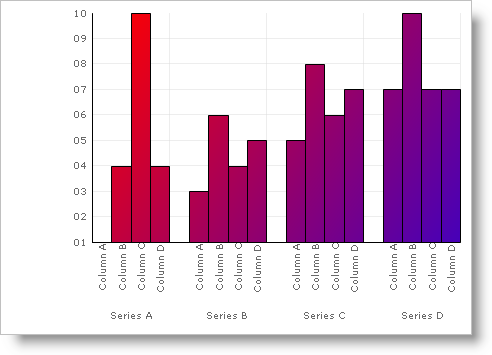

////

|metadata|
{
    "name": "chart-use-a-custom-brush-in-a-paintelement",
    "controlName": ["{WawChartName}"],
    "tags": [],
    "guid": "{5C7A80DB-208F-4CA0-9E44-FA340CB6DC2F}",  
    "buildFlags": [],
    "createdOn": "2006-12-04T00:00:00Z"
}
|metadata|
////

= Use a Custom Brush in a PaintElement

It is also possible to use a custom brush in a  pick:[win-forms=" link:{ApiPlatform}win.ultrawinchart{ApiVersion}~infragistics.ultrachart.resources.appearance.paintelement.html[PaintElement]"]  pick:[asp-net=" link:{ApiPlatform}webui.ultrawebchart{ApiVersion}~infragistics.ultrachart.resources.appearance.paintelement.html[PaintElement]"]  pick:[aspnet-old=" link:{ApiPlatform}webui.ultrawebchart{ApiVersion}~infragistics.ultrachart.resources.appearance.paintelement.html[PaintElement]"] . To do this, set the  pick:[win-forms=" link:{ApiPlatform}win.ultrawinchart{ApiVersion}~infragistics.ultrachart.resources.appearance.paintelement~elementtype.html[ElementType]"]  pick:[asp-net=" link:{ApiPlatform}webui.ultrawebchart{ApiVersion}~infragistics.ultrachart.resources.appearance.paintelement~elementtype.html[ElementType]"]  pick:[aspnet-old=" link:{ApiPlatform}webui.ultrawebchart{ApiVersion}~infragistics.ultrachart.resources.appearance.paintelement~elementtype.html[ElementType]"]  to CustomBrush and set the  pick:[win-forms=" link:{ApiPlatform}win.ultrawinchart{ApiVersion}~infragistics.ultrachart.resources.appearance.paintelement~custombrush.html[CustomBrush]"]  pick:[asp-net=" link:{ApiPlatform}webui.ultrawebchart{ApiVersion}~infragistics.ultrachart.resources.appearance.paintelement~custombrush.html[CustomBrush]"]  pick:[aspnet-old=" link:{ApiPlatform}webui.ultrawebchart{ApiVersion}~infragistics.ultrachart.resources.appearance.paintelement~custombrush.html[CustomBrush]"]  property to any Brush object.

A custom brush allows you to do more than what is available with the Chart's built-in PaintElement. By using a custom brush, you can use any of the drawing options available under the System.Drawing namespace that the PaintElement doesn't have.

The example below shows you how to modify the chart using a CustomBrush.

*In Visual Basic:*

----
Imports System.Drawing.Drawing2D
Imports Infragistics.UltraChart.Shared.Styles
Imports Infragistics.UltraChart.Resources.Appearance
...
Private Sub Use_a_Custom_Brush_in_a_PaintElement_Load( _
  ByVal sender As System.Object, _
  ByVal e As System.EventArgs) Handles MyBase.Load
	Me.UltraChart1.ColorModel.ModelStyle = ColorModels.CustomSkin
	Me.UltraChart1.ColorModel.Skin.PEs.Add(New PaintElement())
	Me.UltraChart1.ColorModel.Skin.PEs(0).ElementType = PaintElementType.CustomBrush
	Me.UltraChart1.DataSource = GetColumnData()
	Me.UltraChart1.ColorModel.Skin.PEs(0).CustomBrush = Me.GetBrush()
	Me.UltraChart1.InvalidateLayers()
End Sub
Private Function GetBrush() As LinearGradientBrush
	If Not (Me.myBrush Is Nothing) Then
		' Don't forget to dispose your brush when you are done using it...
		' This includes when you update the brush by creating a new one.
		Me.myBrush.Dispose()
	End If
	Me.myBrush = New LinearGradientBrush(Me.UltraChart1.Location, _
	  New Point(Me.UltraChart1.Right, Me.UltraChart1.Bottom), Color.Red, Color.Blue)
	Return Me.myBrush
End Function
----

*In C#:*

----
using System.Drawing.Drawing2D;
using Infragistics.UltraChart.Shared.Styles;
using Infragistics.UltraChart.Resources.Appearance;
...
private void Use_a_Custom_Brush_in_a_PaintElement_Load(object sender, 
  EventArgs e)
{
	this.ultraChart1.ColorModel.ModelStyle = ColorModels.CustomSkin;
	this.ultraChart1.ColorModel.Skin.PEs.Add(new PaintElement());
	this.ultraChart1.ColorModel.Skin.PEs[0].ElementType = PaintElementType.CustomBrush;
	this.ultraChart1.DataSource = GetColumnData();
	this.ultraChart1.ColorModel.Skin.PEs[0].CustomBrush = this.GetBrush();
	this.ultraChart1.InvalidateLayers();
}
private LinearGradientBrush GetBrush()
{
	if (this.myBrush != null)
	{
		// Don't forget to dispose your brush when you are done using it...
		// This includes when you update the brush by creating a new one.
		this.myBrush.Dispose();
	}
	this.myBrush = new LinearGradientBrush(this.ultraChart1.Location, 
	  new Point(this.ultraChart1.Right, this.ultraChart1.Bottom), Color.Red, Color.Blue);
	return this.myBrush;
}
----

