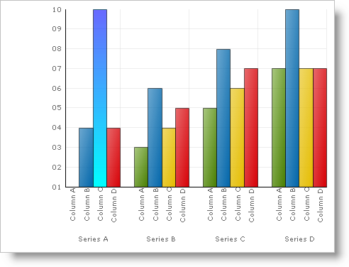

////

|metadata|
{
    "name": "chart-use-the-paintelements-elementtype-property",
    "controlName": ["{WawChartName}"],
    "tags": [],
    "guid": "{2EED04F6-BE61-42AD-9B26-AECD00C50217}",  
    "buildFlags": [],
    "createdOn": "2006-12-04T00:00:00Z"
}
|metadata|
////

= Use the PaintElement's ElementType Property

pick:[win-forms=" link:{ApiPlatform}win.ultrawinchart{ApiVersion}~infragistics.ultrachart.resources.appearance.paintelement.html[PaintElement]"]  pick:[asp-net=" link:{ApiPlatform}webui.ultrawebchart{ApiVersion}~infragistics.ultrachart.resources.appearance.paintelement.html[PaintElement]"]  pick:[aspnet-old=" link:{ApiPlatform}webui.ultrawebchart{ApiVersion}~infragistics.ultrachart.resources.appearance.paintelement.html[PaintElement]"]  exposes another property named ElementType that is updated when properties corresponding to solid fills, gradients, hatches or texture images have been assigned.

Sometimes a PaintElement may have values assigned to multiple fill effects, while the developer wants to apply only one of them. Ordinarily, the most recent effect-specific setting takes precedence, but when multiple fills are defined in a PaintElement, the developer should adjust the ElementType property in selecting the active fill.

The example below uses an arbitrary Box (a Primitive shape used in the column and bar charts) and shows you how to modify the ElementType to allow a Gradient to be applied to the primitive. You can then expand upon this example to use the other ElementTypes available for the chart.

*In Visual Basic:*

----
Imports Infragistics.UltraChart.Core.Primitives
Imports Infragistics.UltraChart.Shared.Styles
...
Private Sub UltraChart1_ChartDrawItem(ByVal sender As Object, _
  ByVal e As Infragistics.UltraChart.Shared.Events.ChartDrawItemEventArgs) _
 Handles UltraChart1.ChartDrawItem
	' Get a Box primitive from a ColumnChart
	If TypeOf e.Primitive Is Box Then
		Dim b As Box = Nothing
		b = CType(e.Primitive, Box)
		If Not b Is Nothing AndAlso b.Row = 0 AndAlso b.Column = 2 Then
			b.PE = b.PE.Clone()
			' Tell UltraChart to use Gradient fill
			b.PE.ElementType = PaintElementType.Gradient
			' Set the colors for the Box
			b.PE.Fill = Color.Blue
			b.PE.FillStopColor = Color.Cyan
			' Initialize both a Gradient and Hatch fill
			b.PE.FillGradientStyle = GradientStyle.Vertical
			b.PE.Hatch = FillHatchStyle.LargeGrid
		End If
	End If
End Sub
----

*In C#:*

----
using Infragistics.UltraChart.Core.Primitives;
using Infragistics.UltraChart.Shared.Styles;
...
private void ultraChart1_ChartDrawItem(object sender, 
  Infragistics.UltraChart.Shared.Events.ChartDrawItemEventArgs e)
{
	// Get a Box primitive from a ColumnChart
	if (e.Primitive is Box)
	{
		Box b = e.Primitive as Box;
		if(b != null && b.Row == 0 && b.Column == 2)
        {
			b.PE = b.PE.Clone();
			// Tell Chart to use Gradient fill
			b.PE.ElementType = PaintElementType.Gradient;
			// Set the colors for the Box
			b.PE.Fill = Color.Blue;
			b.PE.FillStopColor = Color.Cyan;
			// Initialize both a Gradient and Hatch fill
			b.PE.FillGradientStyle = GradientStyle.Vertical;
			b.PE.Hatch = FillHatchStyle.LargeGrid;
        }
	}
}
----

