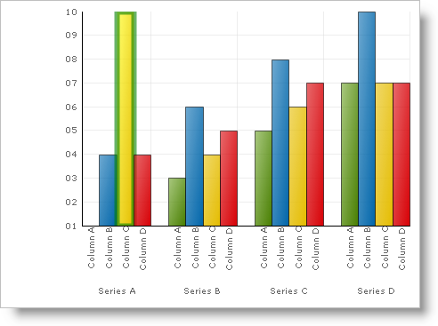

////

|metadata|
{
    "name": "chart-use-the-paintelements-fill-stroke-and-strokewidth-properties",
    "controlName": ["{WawChartName}"],
    "tags": [],
    "guid": "{E480D72C-A8E5-4966-A614-B23E34616FBF}",  
    "buildFlags": [],
    "createdOn": "2006-12-04T00:00:00Z"
}
|metadata|
////

= Use the PaintElement's Fill, Stroke, and StrokeWidth Properties

The general-purpose approach of dealing with a chart's Color Model is through the procedures described in the topic, link:chart-assign-custom-colors-to-chart-elements.html[Assign Custom Colors to Chart Elements]. However, sometimes developers require more control over a chart element's fill color than custom color palettes can provide.

== Fill Property

The example below uses an arbitrary Box (a Primitive shape used in the column and bar charts) and shows you how to change the Fill color of the primitive. You can then expand upon this example to change the Fill color of all the primitives in the chart.

.Note
[NOTE]
====
All references to Color objects are .NET Framework colors from the System.Drawing namespace.
====

*In Visual Basic:*

----
Imports Infragistics.UltraChart.Core.Primitives
Imports Infragistics.UltraChart.Shared.Styles
...
Private Sub UltraChart1_ChartDrawItem(ByVal sender As Object, _
  ByVal e As Infragistics.UltraChart.Shared.Events.ChartDrawItemEventArgs) _
  Handles UltraChart1.ChartDrawItem
	' Get a Box primitive from a ColumnChart
	If TypeOf e.Primitive Is Box Then
		Dim b As Box = Nothing
		b = CType(e.Primitive, Box)
		If Not b Is Nothing AndAlso b.Row = 0 AndAlso b.Column = 2 Then
			b.PE = b.PE.Clone()
			' Set the Fill color
			b.PE.Fill = Color.Yellow
		End If
	End If
End Sub
----

*In C#:*

----
using Infragistics.UltraChart.Core.Primitives;
using Infragistics.UltraChart.Shared.Styles;
...
private void ultraChart1_ChartDrawItem(object sender, 
  Infragistics.UltraChart.Shared.Events.ChartDrawItemEventArgs e)
{
	// Get a Box primitive from a ColumnChart
	if (e.Primitive is Box)
	{
		Box b = e.Primitive as Box;
		if(b != null && b.Row == 0 && b.Column == 2)
		{
			b.PE = b.PE.Clone();
			// Set the Fill color
			b.PE.Fill = Color.Yellow;
		}
	}
}
----

The example code above not only demonstrates how to color a primitive blue, but also how to retrieve a primitive shape from the application logic. The final Invalidate method call is also important to re-render the scene graph. In subsequent code examples, it will be assumed that a reference to a box has already been attained and that the scene graph will be refreshed before its changes are rendered.

== Stroke and StrokeWidth Properties

In addition to filling the interior with primitives or other graphical elements appearing on the chart, an application may require control over the width (or thickness) and color of the pen used to outline the edges of the shape. This is exposed by the  pick:[win-forms=" link:infragistics4.win.ultrawinchart.v{ProductVersion}~infragistics.ultrachart.resources.appearance.paintelement~stroke.html[Stroke]"]  pick:[asp-net=" link:infragistics4.webui.ultrawebchart.v{ProductVersion}~infragistics.ultrachart.resources.appearance.paintelement~stroke.html[Stroke]"]  pick:[aspnet-old=" link:infragistics4.webui.ultrawebchart.v{ProductVersion}~infragistics.ultrachart.resources.appearance.paintelement~stroke.html[Stroke]"] ,  pick:[win-forms=" link:infragistics4.win.ultrawinchart.v{ProductVersion}~infragistics.ultrachart.resources.appearance.paintelement~strokewidth.html[StrokeWidth]"]  pick:[asp-net=" link:infragistics4.webui.ultrawebchart.v{ProductVersion}~infragistics.ultrachart.resources.appearance.paintelement~strokewidth.html[StrokeWidth]"]  pick:[aspnet-old=" link:infragistics4.webui.ultrawebchart.v{ProductVersion}~infragistics.ultrachart.resources.appearance.paintelement~strokewidth.html[StrokeWidth]"]  and  pick:[win-forms=" link:infragistics4.win.ultrawinchart.v{ProductVersion}~infragistics.ultrachart.resources.appearance.paintelement~strokeopacity.html[StrokeOpacity]"]  pick:[asp-net=" link:infragistics4.webui.ultrawebchart.v{ProductVersion}~infragistics.ultrachart.resources.appearance.paintelement~strokeopacity.html[StrokeOpacity]"]  pick:[aspnet-old=" link:infragistics4.webui.ultrawebchart.v{ProductVersion}~infragistics.ultrachart.resources.appearance.paintelement~strokeopacity.html[StrokeOpacity]"]  properties of the  pick:[win-forms=" link:infragistics4.win.ultrawinchart.v{ProductVersion}~infragistics.ultrachart.resources.appearance.paintelement.html[PaintElement]"]  pick:[asp-net=" link:infragistics4.webui.ultrawebchart.v{ProductVersion}~infragistics.ultrachart.resources.appearance.paintelement.html[PaintElement]"]  pick:[aspnet-old=" link:infragistics4.webui.ultrawebchart.v{ProductVersion}~infragistics.ultrachart.resources.appearance.paintelement.html[PaintElement]"]  class. The figure below shows several ellipse primitives demonstrating different values for Stroke and StrokeWidth.

image::Images/Chart_Rendering_With_Paint_Element_01.png[Graphic showing several combinations of the Stroke and StrokeWidth property settings.]

The example code below, uses an arbitrary Box (a Primitive shape used in the Column and Bar charts) and shows you how to change the Stroke and StrokeWidth of the primitive. You can then expand upon this example to change the Stroke and StrokeWidth of all the primitives in the chart.

*In Visual Basic:*

----
Imports Infragistics.UltraChart.Core.Primitives
Imports Infragistics.UltraChart.Shared.Styles
Private Sub UltraChart1_ChartDrawItem(ByVal sender As Object, _
  ByVal e As Infragistics.UltraChart.Shared.Events.ChartDrawItemEventArgs) _
  Handles UltraChart1.ChartDrawItem
	' Get a Box primitive from a ColumnChart
	If TypeOf e.Primitive Is Box Then
		Dim b As Box = Nothing
		b = CType(e.Primitive, Box)
		If Not b Is Nothing AndAlso b.Row = 0 AndAlso b.Column = 2 Then
			b.PE = b.PE.Clone()
			' Set the Fill color
			b.PE.Fill = Color.Yellow
			' Color it's border green
			b.PE.Stroke = Color.Green
			' Make it's border 6 pixels thick
			b.PE.StrokeWidth = 6
		End If
	End If
End Sub
----

*In C#:*

----
using Infragistics.UltraChart.Core.Primitives;
using Infragistics.UltraChart.Shared.Styles;
private void ultraChart1_ChartDrawItem(object sender, 
  Infragistics.UltraChart.Shared.Events.ChartDrawItemEventArgs e)
{
	// Get a Box primitive from a ColumnChart
	if (e.Primitive is Box)
	{
		Box b = e.Primitive as Box;
		if(b != null && b.Row == 0 && b.Column == 2)
		{
			b.PE = b.PE.Clone();
			// Set the Fill color
			b.PE.Fill = Color.Yellow;
			// Color it's border green
			b.PE.Stroke = Color.Green;
			// Make it's border 6 pixels thick
			b.PE.StrokeWidth = 6;
		}
	}
}
----

.Note
[NOTE]
====
Opacity (also known as transparency or alpha level) is described in greater detail in the link:chart-set-the-opacity-of-a-gradient-effect.html[Set the Opacity of the Gradient] topic.
====