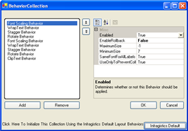

////

|metadata|
{
    "name": "chart-using-the-behaviors-collection",
    "controlName": ["{WawChartName}"],
    "tags": [],
    "guid": "{F41D8573-F531-434F-A75E-951394193E6B}",  
    "buildFlags": [],
    "createdOn": "0001-01-01T00:00:00Z"
}
|metadata|
////

= Using the Behaviors Collection

The AxisLabelLayoutAppearance.  pick:[win-forms=" link:{ApiPlatform}win.ultrawinchart{ApiVersion}~infragistics.ultrachart.resources.appearance.axislabellayoutappearance~behaviorcollection.html[BehaviorCollection]"]  pick:[asp-net=" link:{ApiPlatform}webui.ultrawebchart{ApiVersion}~infragistics.ultrachart.resources.appearance.axislabellayoutappearance~behaviorcollection.html[BehaviorCollection]"]  pick:[aspnet-old=" link:{ApiPlatform}webui.ultrawebchart{ApiVersion}~infragistics.ultrachart.resources.appearance.axislabellayoutappearance~behaviorcollection.html[BehaviorCollection]"]  represents an ordered set of rules, which is used to generate a layout algorithm for axis labels.

The effects of each behavior can be toggled on or off using its Enabled property. Behaviors are applied in order from the start of the collection. Behaviors are capable of reporting when they are successful or unsuccessful, and their effects can be optionally rolled back if unsuccessful; this is determined by the EnableRollback property of each Behavior object. By default a behavior will only be applied if label collisions are detected. To ensure that a behavior is always applied, set the UseOnlyToPreventCollisions property to False. Layout behaviors are applied in the order of their appearance in the collection.

The following layout behaviors are provided:

*  pick:[win-forms=" link:{ApiPlatform}win.ultrawinchart{ApiVersion}~infragistics.ultrachart.resources.appearance.fontscalingaxislabellayoutbehavior.html[FontScalingAxisLabelLayoutBehavior]"]  pick:[asp-net=" link:{ApiPlatform}webui.ultrawebchart{ApiVersion}~infragistics.ultrachart.resources.appearance.fontscalingaxislabellayoutbehavior.html[FontScalingAxisLabelLayoutBehavior]"]  pick:[aspnet-old=" link:{ApiPlatform}webui.ultrawebchart{ApiVersion}~infragistics.ultrachart.resources.appearance.fontscalingaxislabellayoutbehavior.html[FontScalingAxisLabelLayoutBehavior]"]  -- Resizes labels to fit the available space. A Font Scaling behavior can make fonts larger or smaller than the original setting of the  pick:[win-forms=" link:{ApiPlatform}win.ultrawinchart{ApiVersion}~infragistics.ultrachart.resources.appearance.axislabelappearancebase~font.html[AxisLabelAppearance.Font]"]  pick:[asp-net=" link:{ApiPlatform}webui.ultrawebchart{ApiVersion}~infragistics.ultrachart.resources.appearance.axislabelappearancebase~font.html[AxisLabelAppearance.Font]"]  pick:[aspnet-old=" link:{ApiPlatform}webui.ultrawebchart{ApiVersion}~infragistics.ultrachart.resources.appearance.axislabelappearancebase~font.html[AxisLabelAppearance.Font]"]  property. The range of scaling is defined by the  pick:[win-forms=" link:{ApiPlatform}win.ultrawinchart{ApiVersion}~infragistics.ultrachart.resources.appearance.fontscalingaxislabellayoutbehavior~minimumsize.html[MinimumSize]"]  pick:[asp-net=" link:{ApiPlatform}webui.ultrawebchart{ApiVersion}~infragistics.ultrachart.resources.appearance.fontscalingaxislabellayoutbehavior~minimumsize.html[MinimumSize]"]  pick:[aspnet-old=" link:{ApiPlatform}webui.ultrawebchart{ApiVersion}~infragistics.ultrachart.resources.appearance.fontscalingaxislabellayoutbehavior~minimumsize.html[MinimumSize]"]  and  pick:[win-forms=" link:{ApiPlatform}win.ultrawinchart{ApiVersion}~infragistics.ultrachart.resources.appearance.fontscalingaxislabellayoutbehavior~maximumsize.html[MaximumSize]"]  pick:[asp-net=" link:{ApiPlatform}webui.ultrawebchart{ApiVersion}~infragistics.ultrachart.resources.appearance.fontscalingaxislabellayoutbehavior~maximumsize.html[MaximumSize]"]  pick:[aspnet-old=" link:{ApiPlatform}webui.ultrawebchart{ApiVersion}~infragistics.ultrachart.resources.appearance.fontscalingaxislabellayoutbehavior~maximumsize.html[MaximumSize]"]  properties.
*  pick:[win-forms=" link:{ApiPlatform}win.ultrawinchart{ApiVersion}~infragistics.ultrachart.resources.appearance.wraptextaxislabellayoutbehavior.html[WrapTextAxisLabelLayoutBehavior]"]  pick:[asp-net=" link:{ApiPlatform}webui.ultrawebchart{ApiVersion}~infragistics.ultrachart.resources.appearance.wraptextaxislabellayoutbehavior.html[WrapTextAxisLabelLayoutBehavior]"]  pick:[aspnet-old=" link:{ApiPlatform}webui.ultrawebchart{ApiVersion}~infragistics.ultrachart.resources.appearance.wraptextaxislabellayoutbehavior.html[WrapTextAxisLabelLayoutBehavior]"]  -- Wraps labels to multiple lines of text, if space is needed and available.
*  pick:[win-forms=" link:{ApiPlatform}win.ultrawinchart{ApiVersion}~infragistics.ultrachart.resources.appearance.rotateaxislabellayoutbehavior.html[RotateAxisLabelLayoutBehavior]"]  pick:[asp-net=" link:{ApiPlatform}webui.ultrawebchart{ApiVersion}~infragistics.ultrachart.resources.appearance.rotateaxislabellayoutbehavior.html[RotateAxisLabelLayoutBehavior]"]  pick:[aspnet-old=" link:{ApiPlatform}webui.ultrawebchart{ApiVersion}~infragistics.ultrachart.resources.appearance.rotateaxislabellayoutbehavior.html[RotateAxisLabelLayoutBehavior]"]  -- Rotates labels to a specified angle.
*  pick:[win-forms=" link:{ApiPlatform}win.ultrawinchart{ApiVersion}~infragistics.ultrachart.resources.appearance.staggeraxislabellayoutbehavior.html[StaggerAxisLabelLayoutBehavior]"]  pick:[asp-net=" link:{ApiPlatform}webui.ultrawebchart{ApiVersion}~infragistics.ultrachart.resources.appearance.staggeraxislabellayoutbehavior.html[StaggerAxisLabelLayoutBehavior]"]  pick:[aspnet-old=" link:{ApiPlatform}webui.ultrawebchart{ApiVersion}~infragistics.ultrachart.resources.appearance.staggeraxislabellayoutbehavior.html[StaggerAxisLabelLayoutBehavior]"]  -- Arranges labels in alternating rows.
*  pick:[win-forms=" link:{ApiPlatform}win.ultrawinchart{ApiVersion}~infragistics.ultrachart.resources.appearance.cliptextaxislabellayoutbehavior.html[ClipTextAxisLabelLayoutBehavior]"]  pick:[asp-net=" link:{ApiPlatform}webui.ultrawebchart{ApiVersion}~infragistics.ultrachart.resources.appearance.cliptextaxislabellayoutbehavior.html[ClipTextAxisLabelLayoutBehavior]"]  pick:[aspnet-old=" link:{ApiPlatform}webui.ultrawebchart{ApiVersion}~infragistics.ultrachart.resources.appearance.cliptextaxislabellayoutbehavior.html[ClipTextAxisLabelLayoutBehavior]"]  -- Truncates the labels that exceed their bounds, and appends them with an ellipsis.

In addition to the layout behaviors described above, you can create a custom layout behavior. Any object that derives from AxisLabelLayoutBehavior can be added to the collection.

== Related Topics

* link:chart-apply-chart-text-labels.html[Apply Chart Text Labels]

ifdef::win-forms-old,win-forms[]
* link:chart-determine-which-axis-is-being-scrolled-or-scaled.html[Determine Which Axis is Being Scrolled or Scaled]

endif::win-forms-old,win-forms[]

* link:chart-display-data-on-a-time-scale-axis.html[Display Data on a Time-Scale Axis]
* link:chart-display-labels-at-intervals-on-a-time-scale-axis.html[Display Labels at Intervals on a Time-Scale Axis]
* link:chart-scale-chart-axes.html[Scale Chart Axes]
* link:chart-set-minimum-and-maximum-data-values.html[Set Minimum and Maximum Data Values]
* link:chart-plot-log-zero-values.html[Plot Log Zero Values]