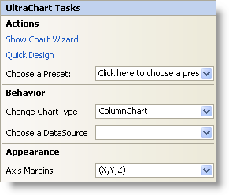

////

|metadata|
{
    "name": "chart-webchart-smart-tag",
    "controlName": ["{WawChartName}"],
    "tags": [],
    "guid": "{BDC6296E-1F3C-430F-9345-E73D733341C5}",  
    "buildFlags": ["asp-net","aspnet-old"],
    "createdOn": "2005-04-11T00:00:00Z"
}
|metadata|
////

= WebChart Smart Tag

In Visual Studio 2005 (.NET Framework 2.0), each Infragistics ASP.NET control/component is equipped with a Smart Tag. By simply selecting the control/component, a Smart Tag anchor appears. When you click this anchor, a pop-up panel appears, providing you with quick and easy access to the most common properties and settings of the control/component.

The WebChart™ Smart Tag contains the following sections:

* Actions -- Provides quick access to the Chart Wizard and Quick Design, which allow you to create and configure charts.
* Behavior -- Provides easy access to properties that govern how the control behaves on the form.
* Appearance -- Provides common tasks involving the appearance, look, and feel of the control.

See below for a description of the item (e.g., drop-down list) in each section, as well as the item's corresponding property in the properties grid.

[options="header", cols="a,a,a"]
|====
|Actions|Description|Corresponding Property

|Show Chart Wizard
|Clicking this will display the Chart Wizard. You can also open the Chart Wizard by right-clicking the WebChart control and selecting Chart Wizard.
|n/a

|Quick Design
|Click Quick Design to access WebChart's Quick Design. You can also access it by right-clicking the WebChart control and selecting Quick Design from the pop-up menu.
|n/a

|Choose Preset
|Use the drop-down list to quickly select a preset for the WebChart. This is the same functionality as if you opened the Quick Designer, expanded Presets, and clicked on Manage Presets.
|n/a

|====

[options="header", cols="a,a,a"]
|====
|Behavior|Description|Corresponding Property

|Change ChartType
|Click the drop-down arrow and you will be presented with a graphical representation of the many chart types available to you.
| pick:[asp-net=" link:infragistics4.webui.ultrawebchart.v{ProductVersion}~infragistics.webui.ultrawebchart.ultrachart~charttype.html[ChartType]"] pick:[aspnet-old=" link:infragistics4.webui.ultrawebchart.v{ProductVersion}~infragistics.webui.ultrawebchart.ultrachart~charttype.html[ChartType]"] 

|Choose a Data Source
|The drop-down list enables you to select which data source you want the WebChart to use. If you do not have a data source configured, select <New data source...>.
| pick:[asp-net=" link:infragistics4.webui.ultrawebchart.v{ProductVersion}~infragistics.ultrachart.resources.appearance.dataappearance~datasource.html[DataSource]"] pick:[aspnet-old=" link:infragistics4.webui.ultrawebchart.v{ProductVersion}~infragistics.ultrachart.resources.appearance.dataappearance~datasource.html[DataSource]"] 

|====

[options="header", cols="a,a,a"]
|====
|Appearance|Description|Corresponding Property

|Axis Margins
|Click the drop-down arrow and a representation of the x- and y-axes will appear. Drag whichever axis for which you want to change the margin.
| pick:[asp-net=" link:infragistics4.webui.ultrawebchart.v{ProductVersion}~infragistics.webui.ultrawebchart.ultrachart~axis.html[Axis]"] pick:[aspnet-old=" link:infragistics4.webui.ultrawebchart.v{ProductVersion}~infragistics.webui.ultrawebchart.ultrachart~axis.html[Axis]"] 

|====