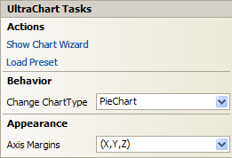

////

|metadata|
{
    "name": "chart-winchart-smart-tag",
    "controlName": ["{WawChartName}"],
    "tags": [],
    "guid": "{062BA0E4-743A-4971-9D1C-F4B0B56C9130}",  
    "buildFlags": ["win-forms","win-forms-old"],
    "createdOn": "2005-04-11T00:00:00Z"
}
|metadata|
////

= WinChart Smart Tag

In Visual Studio 2005 (.NET Framework 2.0), each Infragistics Windows Forms control/component is equipped with a Smart Tag. By simply selecting the control/component, a Smart Tag anchor appears. When you click this anchor, a pop-up panel appears, providing you with quick and easy access to the most common properties and settings of the control/component.

The WinChart™ Smart Tag contains the following sections:

* Actions -- Provides quick access to the Chart Wizard, which allows you to create and configure charts.
* Behavior -- Provides easy access to properties that govern how the control behaves on the form.
* Appearance -- Provides common tasks involving the appearance, look, and feel of the control.

See below for a description of the item (e.g., drop-down list) in each section, as well as the item's corresponding property in the properties grid.

[options="header", cols="a,a,a"]
|====
|Actions|Description|Corresponding Property

|Show Chart Wizard
|Displays the Chart Wizard. You can also open the Chart Wizard by right-clicking on the chart and selecting Chart Wizard.
|n/a

|Load Preset
|Displays the Load Preset dialog box, allowing you to select from the available Microsoft® Office 2007-style presets. You can also access the Load Preset dialog box by right-clicking the chart and selecting Load Preset.
|n/a

|====

[options="header", cols="a,a,a"]
|====
|Behavior|Description|Corresponding Property

|Change ChartType
|Click the drop-down arrow and you will be presented with a graphical representation of the many chart types available to you.
| pick:[win-forms=" link:{ApiPlatform}win.ultrawinchart{ApiVersion}~infragistics.win.ultrawinchart.ultrachart~charttype.html[ChartType]"] 

|====

<t>Description</t>

[options="header", cols="a,a"]
|====
|Appearance|Corresponding Property

|Axis Margins
|Click the drop-down arrow and a representation of the x- and y-axes will appear. Drag whichever axis for which you want to change the margin.
| pick:[win-forms=" link:{ApiPlatform}win.ultrawinchart{ApiVersion}~infragistics.win.ultrawinchart.ultrachart~axis.html[Axis]"] 

|====