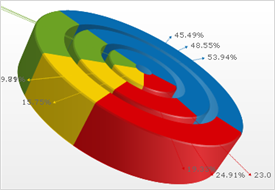

////

|metadata|
{
    "name": "chart-working-with-3d-doughnut-chart-data",
    "controlName": ["{WawChartName}"],
    "tags": [],
    "guid": "{97CBA62A-FA6E-4947-82CA-6B82A5829104}",  
    "buildFlags": [],
    "createdOn": "2006-02-03T00:00:00Z"
}
|metadata|
////

= Working with 3D Doughnut Chart Data

This topic discusses useful information that will help you to ensure that your data is rendered properly in the 3D doughnut chart.

== Data Requirements

While the Chart control allows you to easily point the chart to your own custom data, it is important that you are supplying the appropriate amount and type of data that the chart requires. If the data does not meet the minimum requirements based on the type of chart that you are using, an error will be generated.

The following is a list of data requirements for 3D doughnut charts:

* The data set contains one numeric column. A numeric column is any DataColumn containing only values that can be interpreted as numbers. The UltraChart.DoughnutChart. pick:[win-forms=" link:{ApiPlatform}win.ultrawinchart{ApiVersion}~infragistics.ultrachart.resources.appearance.piechartappearance~columnindex.html[ColumnIndex]"]  pick:[asp-net=" link:{ApiPlatform}webui.ultrawebchart{ApiVersion}~infragistics.ultrachart.resources.appearance.piechartappearance~columnindex.html[ColumnIndex]"]  pick:[aspnet-old=" link:{ApiPlatform}webui.ultrawebchart{ApiVersion}~infragistics.ultrachart.resources.appearance.piechartappearance~columnindex.html[ColumnIndex]"]  property must be set to match the index of the correct column to use in the data source.
* If you are binding the 3D doughnut chart to a series object, see link:chart-requirements-for-series-binding.html[Requirements for Series Binding] for information on the series binding requirements.

.Note
[NOTE]
====
To use a single row instead of a column for the data values, then you should swap the rows and columns. For information on how to do this, see link:chart-swap-rows-and-columns.html[Swap Rows and Columns].
====

== Mapping Data to 3D Doughnut Charts

The chart data is rendered using the following rules:

* Each row represents one doughnut sector.
* The data values do not need to be percentages, as the sum of the data values in the column is used to calculate the percentage applicable to each row. Negative data values are treated as non-negative (by taking their absolute value) for this purpose.
* Optionally, a labels column can be included in the data source to associate sections with names or descriptions. These labels can be displayed in the chart legend or in the labels displayed next to each section:
[source]
----
UltraChart.DoughnutChart.Labels.ItemFormatString = "<ITEM_LABEL>: <DATA_VALUE:#> (<PERCENT_VALUE:#>%)"
----
* To use a column as a section in the chart, you must set the property to 0 (see the code below. To automatically search the data, you can set the property to -1. In this case, the first numeric column encountered will be used for the section values.

[source]
----
UltraChart.DoughnutChart.ColumnIndex = 0
----

* The column specified through the ColumnIndex property is the only column used for values in the chart.

See below for an example data set, along with the rendered 3D doughnut chart.

[options="header", cols="a,a"]
|====
|Product|Units Sold

|Java
|225

|ActiveX
|653

|$$.NET$$1
|335

|Misc
|132

|Native
|56

|$$.NET$$2
|62

|Apple
|42

|====

