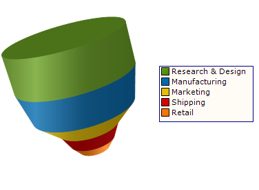

////

|metadata|
{
    "name": "chart-working-with-3d-funnel-chart-data",
    "controlName": ["{WawChartName}"],
    "tags": [],
    "guid": "{F8F94134-6CB9-492C-A033-9F04AB9CE9C4}",  
    "buildFlags": [],
    "createdOn": "0001-01-01T00:00:00Z"
}
|metadata|
////

= Working with 3D Funnel Chart Data

This topic discusses useful information that will help you to ensure that your data is rendered properly in the 3D funnel chart.

== Data Requirements

While the Chart control allows you to easily point the chart to your own custom data, it is important that you are supplying the appropriate amount and type of data that the chart requires. If the data does not meet the minimum requirements based on the type of chart that you are using, an error will be generated.

The following is a list of data requirements for 3D funnel charts:

* The data set must contain at least one row and one numeric column. A numeric column is any DataColumn containing only values that can be interpreted as numbers. If an array or collection is used as the data source, the objects in that array or collection must have at least one public property which is of a numeric Type.
* If you are binding the 3D funnel chart to a series object, see link:chart-requirements-for-series-binding.html[Requirements for Series Binding] for information on the series binding requirements.

== Mapping Data to 3D Funnel Charts

The chart data is rendered using the following rules:

* Only the first numeric column will be plotted on the chart.
* Each row constitutes a single colored section of the funnel.

See below for an example data set, along with the rendered funnel chart.

[options="header", cols="a,a"]
|====
|Phase|Expenses

|Research & Design
|88000

|Manufacturing
|76000

|Marketing
|45000

|Shipping
|33500

|Retail
|22000

|====

