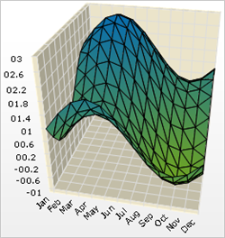

////

|metadata|
{
    "name": "chart-working-with-3d-heat-map-chart-data",
    "controlName": ["{WawChartName}"],
    "tags": [],
    "guid": "{30FE90FF-38AA-4185-9C42-66EB546049F2}",  
    "buildFlags": [],
    "createdOn": "2006-02-03T00:00:00Z"
}
|metadata|
////

= Working with 3D Heat Map Chart Data

This topic discusses useful information that will help you to ensure that your data is rendered properly in the 3D heat map chart.

== Data Requirements

While the Chart control allows you to easily point the chart to your own custom data, it is important that you are supplying the appropriate amount and type of data that the chart requires. If the data does not meet the minimum requirements based on the type of chart that you are using, an error will be generated.

The following is a list of data requirements for 3D heat map charts:

* The data set contains at least two numeric columns (up to 255 columns are supported).
* The dataset contains at least two rows.
* The minimal 2x2 data set is sufficient to define one low-quality heat map tile, where each data value represents the altitude of the tile at each of its four corners.
* If you are binding the 3D heat map chart to a series object, see link:chart-requirements-for-series-binding.html[Requirements for Series Binding] for information on the series binding requirements.

.Note
[NOTE]
====
If the data available is in a format where each column represents different horizontal coordinates, and each column represents different vertical coordinates, then you should swap the rows and columns. For information on how to do this, see link:chart-swap-rows-and-columns.html[Swap Rows and Columns].
====

== Mapping Data to 3D Heat Map Charts

The chart data is rendered using the following rules:

* Data is plotted on a Heat Map chart in terms of latitude, longitude, and altitude. The data is plotted as a surface, with a physical dimension as well as color representing altitude.
* Each row represents one latitude. Each column represents one longitude. The numeric data values in each cell represent the altitude at the intersection of each latitude and longitude (row and column).
* In a heat map chart, the altitude is a numeric scale, while latitude and longitude are represented as a SetLabelAxis object, so latitude and longitude values will be evenly spaced according to the number of rows or columns in the data source.
* The first string column encountered in the data will be used for row labels.
* You can include or exclude any column from the chart using the UltraChart.Data. pick:[win-forms=" link:infragistics4.win.ultrawinchart.v{ProductVersion}~infragistics.ultrachart.data.chartdatafilter~includecolumn.html[IncludeColumn]"]  pick:[asp-net=" link:infragistics4.webui.ultrawebchart.v{ProductVersion}~infragistics.ultrachart.resources.appearance.dataappearance~includecolumn.html[IncludeColumn]"]  pick:[aspnet-old=" link:infragistics4.webui.ultrawebchart.v{ProductVersion}~infragistics.ultrachart.data.chartdatafilter~includecolumn.html[IncludeColumn]"]  method.
* You can select an alternate column to be used for row labels, and toggle between the primary and secondary labels.

See below for an example data set, along with the rendered 3D heat map chart.<t>Jan</t>

[options="header", cols="a,a,a,a,a,a,a,a,a,a,a"]
|====
|Feb|Mar|Apr|May|Jun|Jul|Aug|Sep|Oct|Nov|Dec

|1
|1.5
|1.8660254037844
|2
|1.86602540378444
|1.5
|1
|0.5
|0.133974596215562
|0
|0.133974596215561
|0.5

|0.5
|1
|1.3660254037844
|1.5
|1.36602540378444
|1
|0.5
|2.77555756156289e-16
|-0.366025403784438
|-0.5
|-0.366025403784439
|-4.44089209850063e-16

|0.133974596215561
|0.633974596215561
|1
|1.13397459621556
|1
|0.633974596215562
|0.133974596215562
|-0.366025403784438
|-0.73205080756887
|-0.866025403784439
|-0.732050807568878
|-0.366025403784439

|0
|0.5
|0.866025403784439
|1
|0.866025403784439
|0.5
|1.22460635382238e-16
|-0.5
|-0.866025403784438
|-1
|-0.866025403784439
|-0.5

|0.133974596215561
|0.633974596215561
|1
|1.13397459621556
|1
|0.633974596215562
|0.133974596215561
|-0.366025403784438
|-0.732050807568877
|-0.866025403784439
|-0.732050807568878
|-0.366025403784439

|0.5
|1
|1.36602540378444
|1.5
|1.36602540378444
|1
|0.5
|-5.55111512312578e-17
|-0.366025403784439
|-0.5
|-0.366025403784439
|-7.7715611723761e-16

|1
|1.5
|1.86602540378444
|2
|1.86602540378444
|1.5
|1
|0.5
|0.13397596215562
|-1.11022302462516e-16
|0.133974596215561
|0.499999999999999

|1.5
|2
|2.36602540378444
|2.5
|2.36602540378444
|2
|1.5
|1
|0.63397459615561
|0.5
|0.633974596215561
|0.999999999999999

|1.86602540378444
|2.36602540378444
|2.73205080756888
|2.86602540378444
|2.73205080756888
|2.36602540378444
|1.86602540378444
|1.36602540378444
|1
|0.866025403784438
|0.999999999999999
|1.36602540378444

|2
|2.5
|2.86602540378444
|3
|2.86602540378444
|2.5
|2
|1.5
|1.13397459621556
|1
|1.13397459621556
|1.5

|1.86602540378444
|2.36602540378444
|2.73205080756888
|2.86602540378444
|2.73205080756888
|2.36602540378444
|1.86602540378444
|1.36602540378444
|1
|0.866025403784439
|1
|1.36602540378444

|1.5
|2
|2.36602540378444
|2.5
|2.36602540378444
|2
|1.5
|1
|0.633974596215562
|0.5
|0.633974596215567
|1

|====

