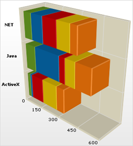

////

|metadata|
{
    "name": "chart-working-with-3d-stacked-bar-chart-data",
    "controlName": ["{WawChartName}"],
    "tags": [],
    "guid": "{2C7EF564-DF91-4D5A-8A4D-31C1F5EA6BF6}",  
    "buildFlags": [],
    "createdOn": "2006-02-03T00:00:00Z"
}
|metadata|
////

= Working with 3D Stacked Bar Chart Data

This topic discusses useful information that will help you to ensure that your data is rendered properly in the 3D stacked bar chart.

== Data Requirements

While the Chart control allows you to easily point the chart to your own custom data, it is important that you are supplying the appropriate amount and type of data that the chart requires. If the data does not meet the minimum requirements based on the type of chart that you are using, an error will be generated.

The following is a list of data requirements for 3D stacked bar charts:

* The data set contains one or more numeric columns.
* The columns must contain values that are either all positive, or all negative. All columns of the same row are stacked into a horizontal bar.
* If you are binding the 2D stacked bar chart to a series object, see link:chart-requirements-for-series-binding.html[Requirements for Series Binding] for information on the series binding requirements.

.Note
[NOTE]
====
If the data available is in a format where each column represents one line, and each row contains points for each line, then you should swap the rows and columns. For information on how to do this, see link:chart-swap-rows-and-columns.html[Swap Rows and Columns].
====

== Mapping Data to 3D Stacked Bar Charts

The chart data is rendered using the following rules:

* Each row represents a single bar or "stack", which is divided into sections.
* If there are multiple rows, each row constitutes a different stacked bar.
* Each column value in each row represents a section of a stacked bar.

See below for an example data set, along with the rendered 3D stacked bar chart.

[options="header", cols="a,a,a,a"]
|====
|Week#|ActiveX|Java|NET

|Week 1
|25
|85
|65

|Week 2
|15
|200
|95

|Week 3
|100
|45
|110

|Week 4
|120
|75
|99

|Week 5
|60
|113
|50

|====

