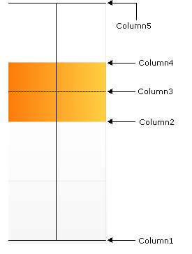

////

|metadata|
{
    "name": "chart-working-with-box-chart-data",
    "controlName": ["{WawChartName}"],
    "tags": [],
    "guid": "{E0944A93-852F-40AB-A52B-6C3C0ECD03AD}",  
    "buildFlags": [],
    "createdOn": "0001-01-01T00:00:00Z"
}
|metadata|
////

= Working with Box Chart Data

This topic discusses useful information that will help you to ensure that your data is rendered properly in the box chart.

== Data Requirements

While the Chart control allows you to easily point the chart to your own custom data, it is important that you are supplying the appropriate amount and type of data that the chart requires. If the data does not meet the minimum requirements based on the type of chart that you are using, an error will be generated.

The following is a list of data requirements for box charts:

* When using the DataSource property of the chart, the data set must include five numeric columns, in the following order: Minimum, Q1, Q2, Q3, Maximum. "Q1", "Q2", and "Q3" represent the first, second, and third quartiles. However, there are various methods of drawing box charts. In some variations, the "Q2" line is replaced by the mean or median from the data.
* When using the  pick:[win-forms=" link:{ApiPlatform}win.ultrawinchart{ApiVersion}~infragistics.ultrachart.data.series.seriescollection.html[Series]"]  pick:[asp-net=" link:{ApiPlatform}webui.ultrawebchart{ApiVersion}~infragistics.ultrachart.data.series.seriescollection.html[Series]"]  pick:[aspnet-old=" link:{ApiPlatform}webui.ultrawebchart{ApiVersion}~infragistics.ultrachart.data.series.seriescollection.html[Series]"]  collection as the data source, the requirement is one  pick:[win-forms=" link:{ApiPlatform}win.ultrawinchart{ApiVersion}~infragistics.ultrachart.resources.appearance.boxsetseries.html[BoxSetSeries]"]  pick:[asp-net=" link:{ApiPlatform}webui.ultrawebchart{ApiVersion}~infragistics.ultrachart.resources.appearance.boxsetseries.html[BoxSetSeries]"]  pick:[aspnet-old=" link:{ApiPlatform}webui.ultrawebchart{ApiVersion}~infragistics.ultrachart.resources.appearance.boxsetseries.html[BoxSetSeries]"]  with one or more  pick:[win-forms=" link:{ApiPlatform}win.ultrawinchart{ApiVersion}~infragistics.ultrachart.resources.appearance.boxset.html[BoxSets]"]  pick:[asp-net=" link:{ApiPlatform}webui.ultrawebchart{ApiVersion}~infragistics.ultrachart.resources.appearance.boxset.html[BoxSets]"]  pick:[aspnet-old=" link:{ApiPlatform}webui.ultrawebchart{ApiVersion}~infragistics.ultrachart.resources.appearance.boxset.html[BoxSets]"] . If more than one BoxSetSeries are present in the Series collection, only the first one will be used.
* If you are binding the box chart to a series object, see link:chart-requirements-for-series-binding.html[Requirements for Series Binding] for information on the series binding requirements.

.Note
[NOTE]
====
If the data available is in a format where each column represents one line, and each row contains points for each line, then you should swap the rows and columns. For information on how to do this, see link:chart-swap-rows-and-columns.html[Swap Rows and Columns].
====

== Mapping Data to Box Charts

See below for an example data set for a box chart.

[options="header", cols="a,a,a,a,a,a"]
|====
|Row Label|Column1|Column2|Column3|Column4|Column5

|Row #0
|10
|20
|25
|30
|50

|Row #1
|15
|25
|30
|35
|55

|Row #2
|20
|30
|35
|40
|60

|Row #3
|30
|50
|55
|60
|70

|Row #4
|50
|70
|75
|80
|90

|====

Regardless of how these values are generated or supplied, they each form a different portion of each box, as illustrated below:

